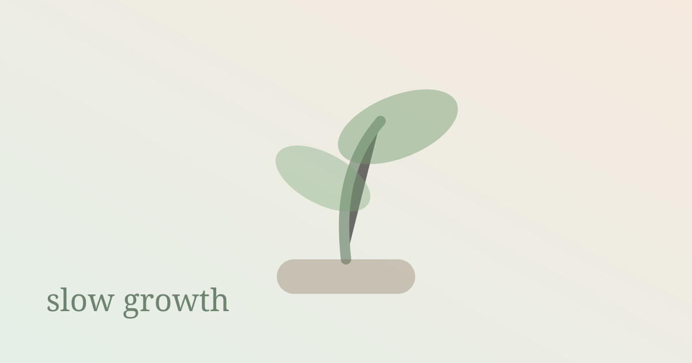

빠르게 성장하고 싶었다. 빨리 이해하고, 빨리 인정받고, 빨리 다음 단계로 넘어가고 싶었다. 그래서 때로는 아직 내 것이 되지 않은 것을 내 것처럼 말했고, 이해보다 결과를 먼저 붙잡으려 했다.

하지만 진짜로 남는 성장은 대체로 느렸다. 한 번에 깨닫는 것보다 여러 번 부딪히며 익히는 것이 오래 갔다. 처음에는 외운 문장이었던 것이 어느 날 내 판단의 기준이 되고, 남의 코드에서만 보이던 구조가 내 손끝에서도 자연스럽게 나오는 순간이 있었다.

느린 성장은 답답하다. 눈에 잘 보이지 않고, 비교하기도 어렵다. 하지만 그 안에는 쉽게 무너지지 않는 밀도가 있다. 천천히 쌓은 것은 흔들릴 때도 완전히 사라지지 않는다.

요즘은 성장의 속도를 조금 덜 의심하려고 한다. 남들보다 늦는 것 같아도, 내가 이해한 방식으로 쌓아가는 시간이 필요하다는 걸 인정하려 한다.

빨리 가는 것도 멋지지만, 오래 남는 사람이 되고 싶다. 그래서 오늘도 조금 느리게, 대신 제대로 지나가고 싶다.
