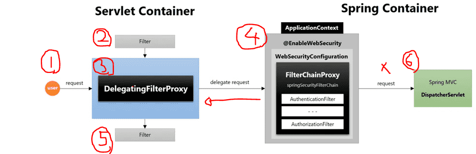
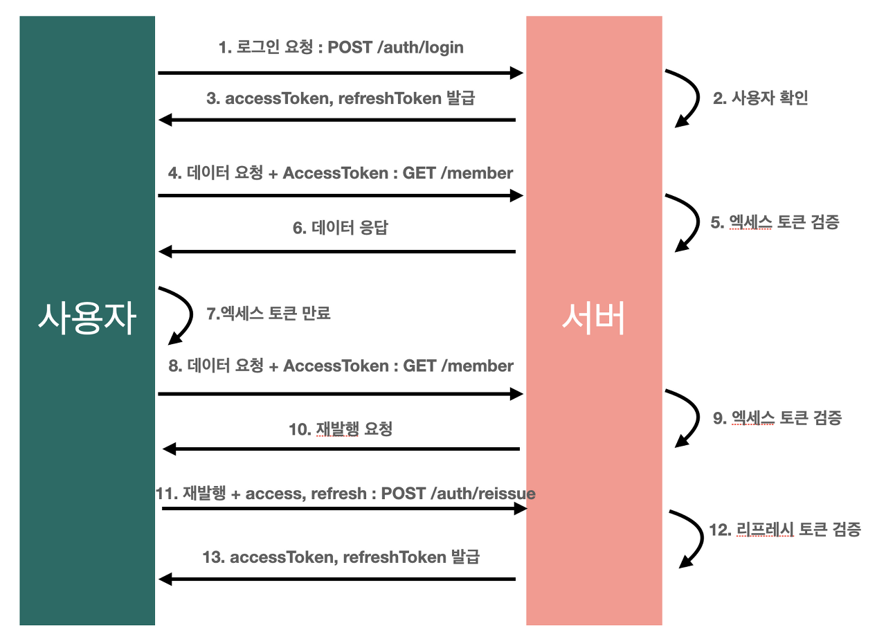
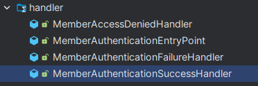

백엔드 팀원 중 한분과 프로젝트를 마치고 코드리뷰를 진행하였다. 말이 거창해서 코드리뷰이고 본인이 구현한 부분에 대해서 서로 이야기를 나누는 시간이였다. 나는 자격증 정보를 어떤식으로 불러오는지와 표출하는 방법등에 대해서 설명을 했고, 팀원분이 궁금해 하셨던 공공데이터 포털 API로 코드값을 넣어서 전달하는 부분을 중심으로 설명했다. 그리고 나는 팀원분이 구현했던 스프링시큐리티쪽에 관해서 질문을 했고 답변을 들었다. 이부분에 대해서 기록을 남기려고 한다.

#### SpringSecurity 설명

- 스프링 시큐리티의 필터체인 내부에서 어떤식으로 동작하는지를 확인


  
- 사용자가 로그인하게 되면 http request가 들어오고 권한을 생성해서 (Authentication)토큰을 발급한다. 권한을 전달하면 PoviderManager를 상속받은 AuthenticationManager에게 전달을 한다.
- AuthenticationProvider로 전달을 하고, UserDetail을 조회를 하고, User의 정보, 이름, 패스워드등을 조회를 한다. 크리덴셜 저장소 -> 데이터베이스와 만나는 부분으로 설명. 즉 MemberRepository이다.  
- 기본적으로 로그인을 했을때, 스프링 시큐리티 자체에서 작동하는 흐름확인

```java
@Bean
public SecurityFilterChain filterChain(HttpSecurity http) throws Exception {
    http
        .headers()
        .frameOptions().sameOrigin()
        .and()
        .csrf()
        .disable()
        .cors()
        .configurationSource(corsConfigurationSource())
        .and()
    .sessionManagement()
    .sessionCreationPolicy(SessionCreationPolicy.STATELESS)
                .and()
                .formLogin().disable()  
                .httpBasic().disable() 
                .exceptionHandling()
                .authenticationEntryPoint(new MemberAuthenticationEntryPoint())
                .accessDeniedHandler(new MemberAccessDeniedHandler())   
                .and()
                .apply(new CustomFilterconfigurer())
                .and()
            .authorizeHttpRequests(authorize -> authorize
            .antMatchers(HttpMethod.POST, "/members/signup")
            .permitAll()
            .antMatchers(HttpMethod.PATCH, "/members/mypage/edit/")
            .hasRole("USER")
            .antMatchers(HttpMethod.PATCH, "/members/mypage/")
            .hasRole("USER")
            .antMatchers(HttpMethod.GET, "/members")
            .hasRole("ADMIN")

                );
        return http.build();
    }
```

  
- 구현을 직접 하는 부분 - SecurityFilterChain을 통해서 구현을 진행한다.  
- CORS 같은 필터를 추가로 넣어줄수 있고, handlerMessage 등을 추가 시킬수있다.

#### JWT



1.  사용자는 URL /auth/login 로 EMAIL 과 PASSWORD를 POST 요청으로 보낸다
2.  스프링 시큐리티의 핵심 로직으로 DB로 이메일과 패스워드를 인증하고 통과하면 Access Token과 Refresh Token을 발급한다.
3.  사용자는 일반 데이터 요청을 Access Token과 함께 보낸다
4.  서버는 Access Token을 검증하고 통과하면 데이터 응답을 보낸다
5.  사용자가 만료된 Access Token을 이용해 요청을 보내면 서버는 재발행요청을 한다
6.  재발행 요청은 만료된 Access Token과 유효한 RefreshToken 값을 URL /auth/reissue 로 POST 요청을 보낸다.
7.  서버에서는 RefreshToken을 검증하고 다시 AccessToken과 RefreshToken 값을 사용자에게 넘겨준다

  
jwt를 통해 로그인을 하게 되면. 사용자를 확인할때 access, refresh 토큰을 발급한다.  그리고 이것이 유효한지 확인하여, 사용자가 승인이되고 아니면 안되게 한다. JwtTokenizer 클래스에서 JWT 토큰을 만들어주는것이다.  엑세스토큰 만료기간도 여기서 설정한다. @value로 설정. 보통 억세스토큰 시간의 적정 시간은 1시간 이내로 하고, 중간보안은 6시간정도, 그이상은 약한 보안이다. 현재 시큐리티에서 제일 보완해야할 부분이다. claims 은 jwt에 저장된 정보로 보면되고, 디코딩할때 사용하는 것이다. 인코딩된 키로부터 키객체 생성..! `jwtAuthenticationFilter`를 통해서 jwt decode했을때 나오는 값등을 넣어 줄수 있다. `jwtVerificationFilter`는 토큰을 어떤식으로 검증할 것인지 확인해주는 필터이다. jwt를 검증할때 권한이 있는지 없는지를 확인. Bearer 값이 빠졌거나, authorization이 null 이거나 이런 값들을 추가해서 검증방식을 설정한다.



- handler는 사실상 예외처리부분이라고 보면되고, 시큐리티에서 발생하는 로그찍기 위해서 작성.  
- 필터는 사용용도에 따라서 끼워주는 곳이 달라진다.  
  

```java
public class MemberDetailsService implements UserDetailsService {

    private final MemberRepository memberRepository;
    private final CustomAuthorityUtils authorityUtils;

    @Override
    public UserDetails loadUserByUsername(String username) throws UsernameNotFoundException {

        // 사용자 이메일로 회원 정보 조회
        Optional<Member> optionalMember = memberRepository.findByEmail(username);
        // 없으면 예외처리 🚨
        Member getMember = optionalMember.orElseThrow(
                () -> new RuntimeException("🚨 회원 정보를 찾을 수 없습니다. 🚨"));
        // MemberDetails 객체를 생성하여 회원 정보 UserDetails로 포장
        return new MemberDetails(getMember);

    }

    // MemberDetails 클래스는 Member 엔티티를 UserDetails로 변환
    private class MemberDetails extends Member implements UserDetails {
        MemberDetails(Member member) {
                setMemberId(member.getMemberId());
                setName(member.getName());
                setEmail(member.getEmail());
                setPassword(member.getPassword());
                setPhone(member.getPhone());
                setRoles(member.getRoles());
        }

        // 권한 정보
        @Override
        public Collection<? extends GrantedAuthority> getAuthorities() {
            return authorityUtils.createAuthorities(this.getRoles());
        }

        // 이메일 반환
        @Override
        public String getUsername() {
            return getEmail();
        }

        // 계정이 만료되지 않았음 -> true
        @Override
        public boolean isAccountNonExpired() {
            return true;
        }

        // 계정이 잠기지 않았음(활성화) -> true
        @Override
        public boolean isAccountNonLocked() {
            return true;
        }

        // credential이 만료되지 않음 -> true
        @Override
        public boolean isCredentialsNonExpired() {
            return true;
        }

        // 계정 활성화 -> true
        @Override
        public boolean isEnabled() {
            return true;
        }
    }
}
```

  
- UserDetailService를 상속받아서, 사용이된다. 이를 통해서 유저디테일이 있으면 멤버를 가져오고, 이런식으로 하여, Member Entity와 스프링시큐리티가 만나는부분이다. 즉 멤버의 정보를 가져와서. MemberDetail을 만들어준다.  
  
- CustomAuthorityUtils -> 유저의 권한을 설정해주는 부분으로, 사용자가 가입을 했을때 권한을 어떤것을 줄지 설정하는 클래스이다.   
  
- 이렇게 해서 비교를 하는건 UserDetails , 로그인한 애가 가진 정보랑 비교를 하는것. 토큰을 풀어서 토큰 자체의 담긴 정보와 지금 접근하려고 하는 정보랑 비교를 한다. 이부분이 verifyAuthorizedUser 이부분을 탄다.  
  
- Outh2로 넘어가보면, 로그인 요청이 들어오면 서버로 들어오는 것이아니고, 정해놓은 서버(카카오, 구글등)으로 요청이넘어가고 authorization 코드를 발급해준다. 그리고 이코드를 프론트에서 받아서 백엔드로 넘겨준다. 그러면 백에서 이코드를 정해놓은 서버(카카오, 구글)에 확인 요청하고 맞다면 프론트에 응답을 해준다. 이상황에서 토큰값이 노출될수 있기 때문에 JWT를사용해서 프론트로 넘겨준다.   
  
- 이 과정은 gradle에 outh2를 추가해주면 자동적으로 구현이 가능하다.  

#### 후기

구현할때는 막힘없이 했던 부분도 설명을 하려니까 굉장히 어려운부분이 많았다. 무언가를 누군가에게 설명할수있는 것이 그것에 대해 진짜 아는것이라고 퇴사한 회사에서 사수분에게 많이 들었던 말이다. 그렇게 할수있게 이유가 있는 코드를 짜야겠다. 그리고 이번 기회를 통해서 팀원분과 함께 성장 할수있는 좋은 경험이였다.