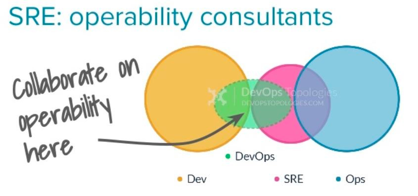
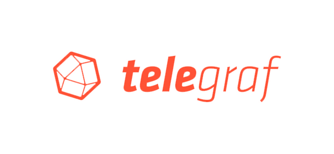
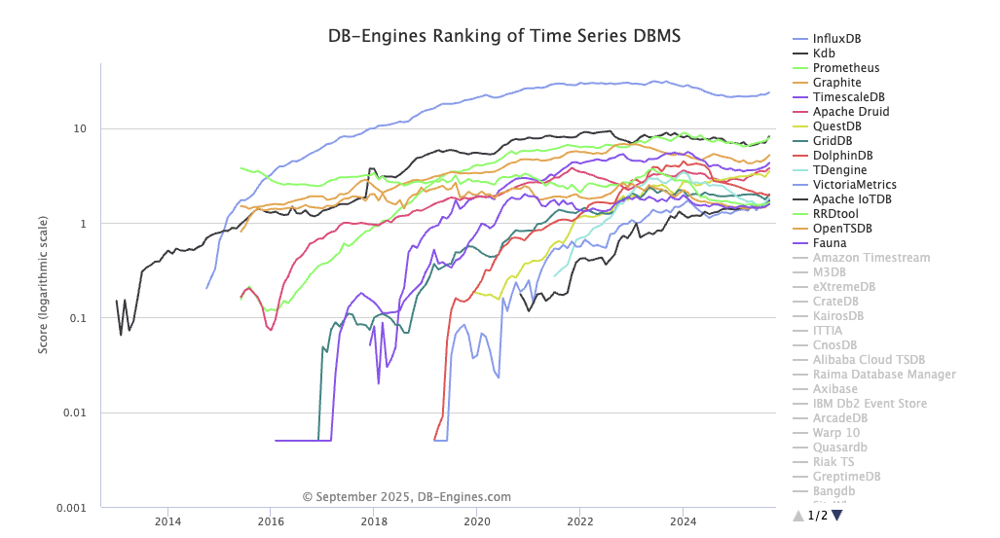
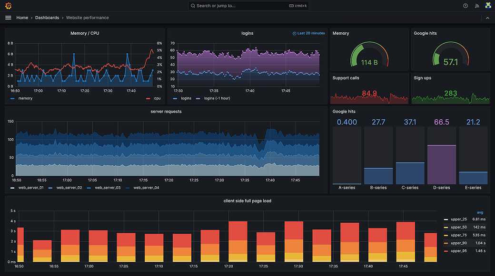
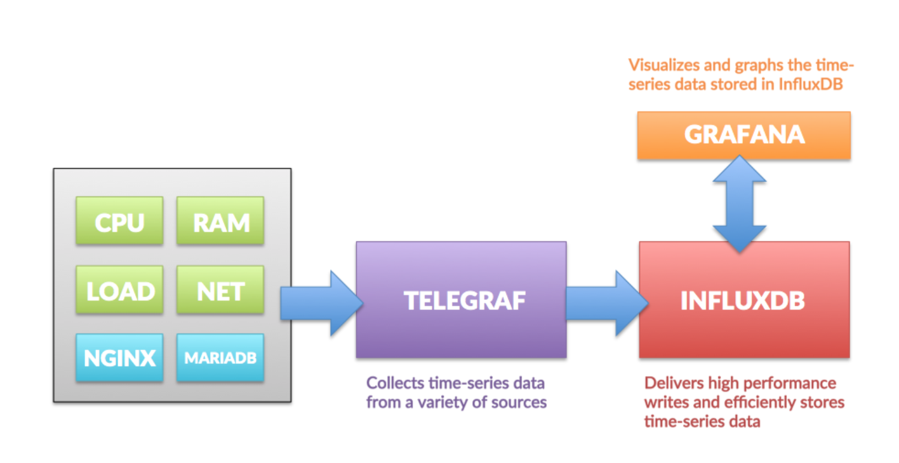
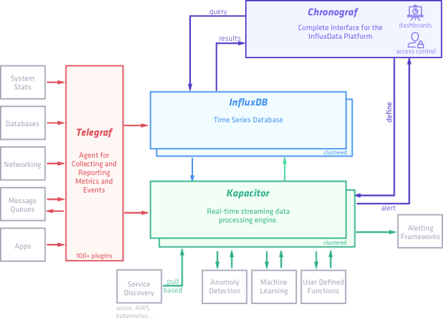

입사 이후 운영중인 환경을 보면서 사내에 모니터링 시스템을 제대로 구축해야되겠다는 생각을 하게 되었다. 모니터링 시스템이 없는 환경에서 서버에 하나씩 `Ping`을 날려보고, 로그를 확인하는 방식으로 운영을 하고 있는 현재 상태를 우선적으로 바꿔야할 필요성을 느꼈다. 

특히 클라이언트측에서 VoC가 들어온뒤, 장애 대응을 진행하는 프로세스가 가장 큰 문제라고 생각된다. 즉 `사후 대응`이 아닌 `사전 대응`이 절대적으로 필요한 상황이였다. 다양한 모니터링을 위한 방법을 고민하면서 그리고 실제로 사내에 도입해가면서 알게되었던 경험을 블로그에 적어보고자 한다.

시스템 운영 환경에서 가장 큰 목표는 **시스템의 정상적인 구동**이다. 인프라팀에서 장애 발생시 해당 팀에서 정한 룰을 기반으로 현장에 방문하거나, 원격을 통하여 대응을 진행하지만 개발자가 만들어낸 환경에서 정상적으로 서비스가 동작 하는지 여부는 파악이 필요하다고 생각한다. 

먼저 시스템 운영에 대해 간단히 알아보자. 과거의 SA(System Administrator) 직무에서 기술의 발전에 따라 다양한 직군(SRE, DevOps 등)이 등장했는데 결국 이들이 추구하는 바는 서비스의 운영과 장애 대응이다. 해당 직군은 개발자와도 맞닿는 부분이 있어 기회가 되면 아래 문서를 참고해서 읽어보면 좋을것같다.

- [Google SRE Book](https://sre.google/sre-book/table-of-contents/)
- [Google SRE Workbook](https://sre.google/workbook/table-of-contents/)

모니터링을 정상적으로 진행하기 위해 다각도로 고민을 하고있었는데 결론적으로 인프라팀에서 가장 우선시 되는 요구사항을 운영환경에 적용하는게 낫다는 판단이 들었다. 먼저 CPU, Memory, Ping 등 메트릭 데이터에 대한 모니터링이 우선시 되야한다는 생각이 들었다. 사내 구조에서 프로그램에 대한 문제나 장애 대응은 로그 분석등을 통해 처리가 가능하지만, On-Premise 환경으로 현장에 구축된 서버들에 대해 1차 적인 파악이 안되기 때문이다.

해당 부분을 우선 구축하고 추후에 ELK와 같은 모니터링 스택을 도입하기로 결정하였다. 그럼 이둘의 차이점을 간단하게 알아보자

##### TIG 스택
TIG 스택은 메트릭 중심의 숫자형 시계열 데이터를 기반으로 응답시간, DB 커넥션, 시스템 상태, 네트워크등을 모니터링하는데 최적화 되어있다. 모니터링 목적이 시스템 모니터링(CPU, Memory, Disk) 이나 서비스 헬스체크, 시계열 분석, 메트릭 알람 등 이라면 TIG 스택의 도입이 필요하다.

##### ELK 스택
문서 / 로그 중심으로 비정형 텍스트 데이터를 검색하고 Json 기반으로 색인하는 경우 유리하다. 즉 ELK는 기본적으로 로그/이벤트 분석 플랫폼이다. 로그분석이나, 문자열 검색, 로그 기반으로 추적/보안 및 대규모 운용 환경에서 로그 중앙집중화가 목적이라면 ELK 스택의 도입이 필요하다.

이러한 이유로 **Telegraf + InfluxDB + Grafana** 도입을 결정했다. 그럼 간단하게 각각 어떤 내용을 담당하는지 알아보자

### 본론으로

#### Telegraf

Telegraf는 에이전트(agent) 역할을 수행한다. 쉽게 말해 서버 곳곳에서 돌아가며 CPU, Memory, Disk, 네트워크, ping 응답 같은 **시스템 지표**를 수집한다. 수집한 데이터는 메트릭 형태로 변환되어 InfluxDB로 전송된다.

Telegraf의 장점은 수많은 플러그인(Inputs, Outputs, Processors, Aggregators)을 제공한다는 점이다. 즉, 단순히 시스템 리소스뿐 아니라 DB 모니터링, 애플리케이션 지표 수집, 심지어 외부 API 호출까지 커버할 수 있다.

Telegraf를 사용하는 방법

#### InfluxDB
InfluxDB는 시계열(time-series) 데이터베이스다. 그럼 시계열 데이터베이스란 무엇일까? 일반적인 RDB와 달리 시간(time)을 기준으로 하는 데이터 처리에 최적화되어 있다. `TSDB`는 일정한 주기를 가지고 수집되는 대량의 데이터를 처리한다. 예시로 [Melon DevOps](https://www.slideshare.net/slideshow/custom-dev-ops-monitoring-system-in-melon/67348779) 구성사례를 확인할수있다.

CPU 사용률이나 메모리 사용량 같은 값은 매 초/분 단위로 쌓이기 때문에, 빠른 읽기·쓰기와 압축·보존정책이 중요하다. InfluxDB는 이런 요구사항을 해결해주는 저장소이며 `TSDB`중 가장 높은 점유율을 가지고있는데자료를 보면 2025년 9월기준 압도적으로 1위이다.

글을 처음 작성할 당시 InfuxDB 2까지 지원을 했었는데 현재는 InfluxDB 3 Core 와 Enterprise 급의 새로운 버전이 나왔다. [공식 문서](https://docs.influxdata.com/influxdb/v2/)가 정말 잘 정리되어 있어 구축시 많은 참고를 할수있었다.

#### Grafana

Grafana는 시각화 도구다. InfluxDB에 쌓인 수많은 숫자 데이터만 봐서는 감이 오지 않는다. Grafana를 통해 대시보드로 CPU/Memory 트렌드를 그래프로 확인하거나, 특정 조건이 발생했을 때 알람을 발송하도록 설정할 수 있다. Grafana는 시각화뿐만 아니라 **Alerting** 기능도 제공하기 때문에, 장애 발생 시 Teams/Slack 같은 협업 툴로 알림을 보낼 수 있다.

다양한 기능은 [공식 문서](https://grafana.com/docs/)에 잘 정리되어있다. Grafana 자체 운용부터 Metics, Logs, Trace 까지 다양한 부분에서 지원하고, 현재 기준으로 V12.1이 최신 버전이다.

TIG 스택은 이름 그대로 세 가지 구성 요소가 합쳐진 모니터링 환경이다. 각각 환경을 살펴보면 

Influx Data사에서 자체적으로 제공하는 Tick Stack 조합으로 구성하는 방법도 있어서 간단하게 설명해보면 다음과 같다.

- **Telegraf** : Metrics와 Events를 수집하고 Reporting 하는 Module
- **InfluxDB** : Time Series Database
- **Chronograf** : 시각화 도구
- **kapacitor** : Real-time 스트리밍 데이터 전송 알람 엔진

이조합으로 사용하는것도 유용하지만 Chronograf를 Grafana로 대체하여 사용하는 조합이 더 많이 사용되는것으로 보인다.

### InfluxDB 좀더 알아보기

### 구축과 세팅

### 결론