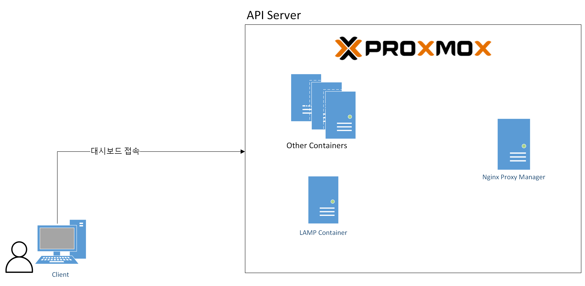
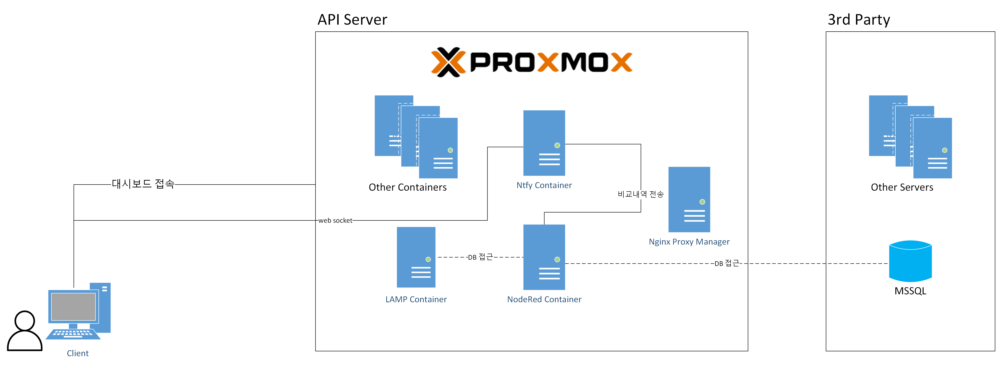
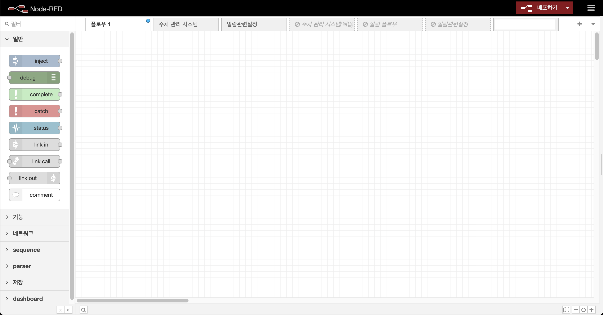
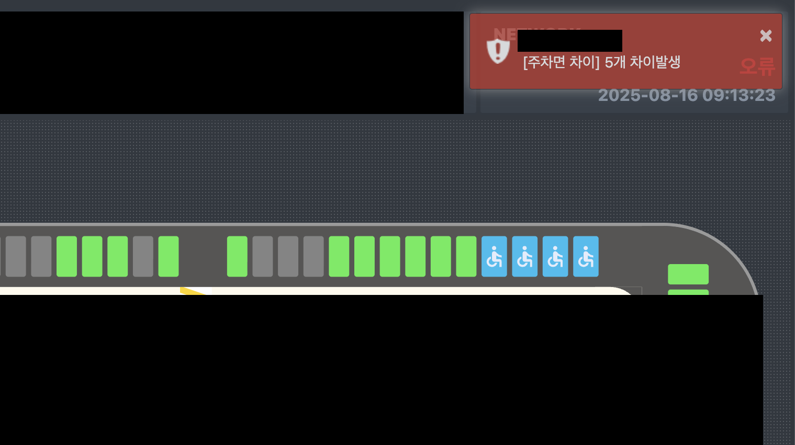

기존에 구축되어있던 레거시 프로젝트에 알림기능 추가가 필요하였다. 하지만 여러가지 이유로 일정이 정말 촉박했고, PHP로 구축된 Backend 서버를 직접 다룰수가 없는 상황 등으로 `NodeRed`, `Ntfy`를 통해 알림기능을 뚝딱 도입했던 경험을 작성해보려고 한다.

### 설계

레거시 서버의 경우 Proxmox로 컨테이너화 되어있으며, LAMP 스택으로 PHP로 구성되어있고, Apache로 대시보드 정적 페이지를 서빙하고 있는 구조다. 이를 간단히 그려보면 아래 이미지와 같다.

알림 기능을 구현하는 방법은 여러가지가 있다. 만약 `LAMP` 가 아닌 Java, Springboot 기반의 서버였다면 알림서버를 구현하여 소켓과 같은 방법으로 구현을 진행했겠지만 현재 구조를 깨뜨릴수가 없는 상황이고, 빠르게 구현이 필요한 상황이였다. 이유를 나열해보자면 아래와 같다.

1. 정말 간단한 알림 기능이다.
2. DB를 조회하여 비교 하는 정도의 서비스 로직이므로 리소스가 거의 없다.
3. 레거시로 구성된 서버는 Java, SpringBoot 기반으로 마이그레이션을 진행 중이다.
4. 레거시 서버의 유지보수는 특정 인원이나 기술에 종속되지않고 누가 보더라도 유지 가능해야한다.
5. 프론트엔드, 백엔드 부분을 빠른시간내에 구현해야한다.

이정도의 이유를 토대로 구현을 진행하였다. NodeRed는 블럭단위로 구성이 가능하여 약간의 Javascript 지식만 있다면 충분히 해당 내용 유지보수가 가능할것이라고 판단하였다. 그리고 `Proxmox` 가 기본적으로 서버에 구성되어있어 `Container` 추가에 대한 부담이 없었다. 그래서 2개의 Container를 추가하여 구성을 진행하였다.

먼저 NodeRed 설치를 진행해보자.

설치는 이 [문서](https://nodered.org/docs/getting-started/local#prerequisites)를 참고하여 구축하였다. 이번 경우에는 Proxmox 기반이라 컨테이너에 글로벌로 설치하였지만, 도커 컨테이너 환경으로도 구축 가능하다. 

설계는 위의 이미지와 같이 동작하도록 작성하였다. Client가 LAMP를 통해 대시보드를 띄우고 Javascript로 `Ntfy` 와 `Websocket`으로 알림을 표출한다. 해당 알림은 Toast 형식으로 노출되었다가 사라지도록 구축하였다.

### 서비스 구현

설치를 완료후에 기본포트를 통해 접속하게 되면 아래와 같은 UI를 만날수있다.

