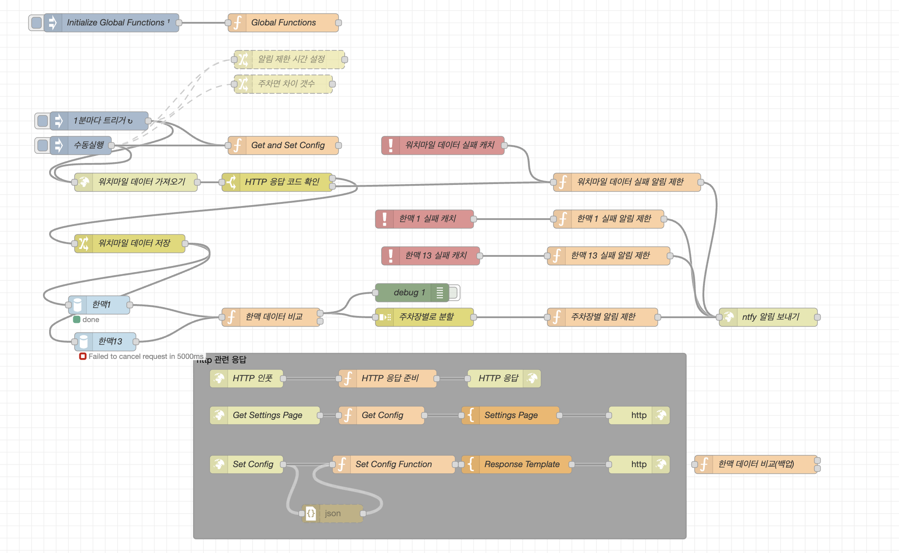
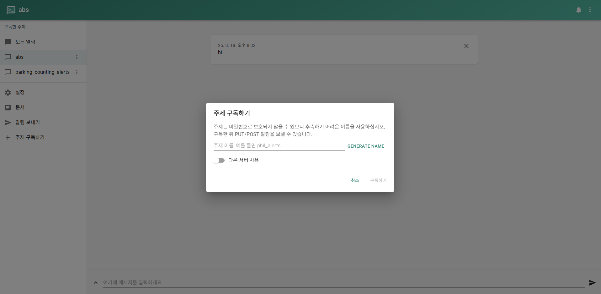

기존에 구축되어있던 레거시 프로젝트에 알림기능 추가가 필요하였다. 하지만 여러가지 이유로 일정이 정말 촉박했고, PHP로 구축된 Backend 서버를 직접 다룰수가 없는 상황 등으로 `NodeRed`, `Ntfy`를 통해 알림기능을 뚝딱 도입했던 경험을 작성해보려고 한다.

## 설계

레거시 서버의 경우 Proxmox로 컨테이너화 되어있으며, LAMP 스택으로 PHP로 구성되어있고, Apache로 대시보드 정적 페이지를 서빙하고 있는 구조다. 이를 간단히 그려보면 아래 이미지와 같다.


알림 기능을 구현하는 방법은 여러가지가 있다. 만약 `LAMP` 가 아닌 Java, Springboot 기반의 서버였다면 알림서버를 구현하여 소켓과 같은 방법으로 구현을 진행했겠지만 현재 구조를 깨뜨릴수가 없는 상황이고, 빠르게 구현이 필요한 상황이였다. 이유를 나열해보자면 아래와 같다.

1. 정말 간단한 알림 기능이다.
2. DB를 조회하여 비교 하는 정도의 서비스 로직이므로 리소스가 거의 없다.
3. 레거시로 구성된 서버는 Java, SpringBoot 기반으로 마이그레이션을 진행 중이다.
4. 레거시 서버의 유지보수는 특정 인원이나 기술에 종속되지않고 누가 보더라도 유지 가능해야한다.
5. 프론트엔드, 백엔드 부분을 빠른시간내에 구현해야한다.

이정도의 이유를 토대로 구현을 진행하였다. NodeRed는 블럭단위로 구성이 가능하여 약간의 Javascript 지식만 있다면 충분히 해당 내용 유지보수가 가능할것이라고 판단하였다. 그리고 `Proxmox` 가 기본적으로 서버에 구성되어있어 `Container` 추가에 대한 부담이 없었다. 그래서 2개의 Container를 추가하여 구성을 진행하였다.

먼저 NodeRed 설치를 진행해보자. 설치는 이 [문서](https://nodered.org/docs/getting-started/local#prerequisites)를 참고하여 구축하였다. 이번 경우에는 Proxmox 기반이라 컨테이너에 글로벌로 설치하였지만, 도커 컨테이너 환경으로도 구축 가능하므로 구성시에 참고하자.


## 서비스 구현

### Node Red 구축

설치를 완료후에 기본포트를 통해 접속하게 되면 아래와 같은 UI를 만날수있다. NodeRed에서 기본적인 개념을 알아보면 Flow와 Global이 있다. 이차이점은 아래에 간단한 기능들에 대해서 표로 정리해보았다. 이내용들을 바탕으로 드래그앤드롭으로 노드를 생성하고 노드와 노드간 라인을 연결하여 다음 흐름을 설정할수있다.

| **구분** | **특징**                                |
| ------ | ------------------------------------- |
| flow   | 동일한 플로우(Tab) 내에서만 공유됨                 |
| global | Node-RED 전체에서 공유 가능 (다른 플로우에서도 접근 가능) |


| **기능명**                 | **설명**                               | **주요 노드 예시**             | **사용 예시**                     |
| ----------------------- | ------------------------------------ | ------------------------ | ----------------------------- |
| **Flow Editor**         | 브라우저에서 플로우를 시각적으로 구성하는 UI            | -                        | 1880 포트로 접속해 UI에서 로직 구성       |
| **Inject**              | 수동 또는 주기적 트리거                        | inject                   | 매 1분마다 상태 확인 요청 보내기           |
| **Function**            | JavaScript 코드 작성 가능                  | function                 | 상태 비교, 알림 조건 처리 등 커스텀 로직      |
| **Change**              | 메시지 수정용 유틸리티                         | change                   | msg.payload 또는 msg.topic 값 설정 |
| **Switch**              | 조건 분기 처리                             | switch                   | 특정 조건에 따라 다른 처리 경로 분기         |
| **Template**            | HTML 또는 텍스트 포맷 지정                    | template                 | 알림 메시지 커스터마이징                 |
| **HTTP Request**        | 외부 API 호출                            | http request             | ntfy 또는 외부 서버에 POST           |
| **WebSocket**           | 실시간 데이터 송수신                          | websocket out/in         | 알림 브라우저 전송, 실시간 통신            |
| **MQTT**                | MQTT 브로커 통신 지원                       | mqtt in/out              | IoT 장비 상태 수신 또는 명령 전달         |
| **Dashboard**           | 웹 대시보드 UI 제공 (node-red-dashboard 필요) | ui_button, ui_chart 등    | 관리자 UI, 실시간 상태 시각화            |
| **Global/Flow Context** | 전역/플로우 레벨 변수 저장                      | flow.set(), global.get() | 알림 간격 저장, 상태 캐싱               |
| **Debug**               | 메시지 확인용 로그                           | debug                    | msg.payload 확인 로그 출력          |
| **Catch**               | 에러 처리 전용 노드                          | catch                    | 특정 노드에서 발생한 예외 처리             |
| **Status**              | 노드 상태 모니터링                           | status                   | 연결 실패 시 사용자에게 알려주기            |
| **Subflow**             | 플로우 재사용 (모듈화)                        | subflow                  | 복잡한 로직을 재사용 가능하게 분리           |

구성 완료된 내용은 아래 그림과 같다. 최초 실행시 Global 변수 세팅을 진행하고, 1분마다 트리거를 통해 `HTTP` Request를 생성한다. 이는 현재 우리 서비스의 API 서버에 주차면에 대한 정보를 요청하여 데이터를 가져오고 이과정에서 에러가 발생시 HTTP 응답코드 확인을 통해 Switch로 데이터를 저장하거나, 실패 알림을 보내도록 한다. 

그리고 성공시 타업체 데이터 베이스에 접속하여 데이터를 가져온뒤, 비교 로직을 수행한다. 그리고 이과정에서도 에러 발생시 실패 알림을 발생시킨다. 만약 데이터 비교가 성공한다면, 주차장 별로 분할을 진행하고 주차장 별로 알림을 발생한다. `Ntfy`로 최종 알림을 전송하며, HTTP `POST`를 통해 전달한다.


Initiallize `Injection`을 통해서 `NodeRed`가 시작되면 Global Functions를 실행하도록 하였다. 그리고 Global Funtions에는 Global로 사용가능한 변수들을 정의하고 담아줬다. 아래의 예시는 `flow`에 담는 부분만 가져왔다. flow에 set을 통해 변수를 `key` : `value` 형태로 담아놓고 지금 탭의 어느 위치에서나 사용가능하도록 할수있다. 아래의 코드를 통해 간단하게 살펴보자.

```javascript
var defaultAlertInterval = flow.get('alertInterval') || 5;
var defaultSlotDiffMax = flow.get('slotDiffMax') || 5;

flow.set('alertInterval', defaultAlertInterval);
flow.set('slotDiffMax', defaultSlotDiffMax);
flow.set('alertServer', "http://serverURL");

flow.set('base64Encode', function (str) {
return Buffer.from(str).toString('base64');
});

flow.set('encodeHeader', function (value) {
var base64Encode = flow.get('base64Encode');
	return "=?UTF-8?B?" + base64Encode(value) + "?=";
});

return msg;
```

```js
var encodeHeader = flow.get('encodeHeader');
var alertServer = flow.get("alertServer");
var currentTime = new Date().getTime();
var alertInterval = flow.get("alertInterval") || 30;
var envTest = flow.get('envTest');
if(envTest){
alertServer+=`dev_`;
}
```


### Ntfy 구축

ntfy 는 간단한 HTTP 기반 Pub-Sub 알림 서비스이다. 무료로  어떤 컴퓨터에서든 스크립트를 통해 휴대폰이나 데스크톱으로 알림을 보낼 수 있고, 오픈 소스로 셀프호스팅으로 구축해서 사용이 가능하다. 사용방법도 정말 간단해서 [문서](https://docs.ntfy.sh/install/)를 참고해서 구축한다면 쉽게 가능하다. 그리고 [깃허브 링크](https://github.com/binwiederhier/ntfy)를 통해서 확인도 가능하다.



설치 완료후 웹으로 접속하게 되면 다음과 같은 화면을 볼수있다. Ntfy를 살펴보기 전에 잠깐 NodeRed를 통해서 Ntfy로 전송하는 부분을 먼저 살펴보자. 아래의 코드를 통해서 확인 가능하다.

```js

var alertInfo = {
    spaceNo: spaceNo,
    alertInterval: alertInterval,
    currentTime: currentTime,
    lastAlertTime: lastAlertTime,
    timeSinceLastAlert: currentTime - lastAlertTime,
    alertNeeded: flow.get('envTest')===true || (currentTime - lastAlertTime > alertInterval * 60 * 1000)
};

if (alertInfo.alertNeeded) {
    flow.set(lastAlertTimeKey, currentTime);
    msg.url = alertServer+"ntfy에 등록한 Topic";
    msg.headers = {
        "title": encodeHeader(`제목`),
        "priority": "urgent",
        "tags": "rotating_light",
        "click": "클릭시 이동할 위치"
    };
    return msg;
} else {
    return null;
}
```

Ntfy는 Topic을 보내는 식으로 알림을 등록하는데 이때 HTTP를 통해 PUT / POST로 전송을 하면된다. 위에 작성된 코드를 통해서 Topic으로 Post방식으로 데이터를 전송하게 된다. 테스트를 해보려면 `curl` 명령어로 간단하게 가능하다.

```bash
curl -d "안녕하세요" ntfy URL/Topic이름
```

이렇게 해서 전달이 가능한데, 이때 기본적으로 작성시 전달되야하는 구조에 대해서 간단히 알아 보면 다음과 같다. 이미지 첨부도 가능하고, 태그도 부여할수있다.

```js
{
    "id": "sPs71M8A2T",
    "time": 1643935928,
    "expires": 1643936928,
    "event": "message",
    "topic": "mytopic",
    "priority": 5,
    "tags": [
        "warning",
        "skull"
    ],
    "click": "https://homecam.mynet.lan/incident/1234",
    "attachment": {
        "name": "camera.jpg",
        "type": "image/png",
        "size": 33848,
        "expires": 1643946728,
        "url": "https://ntfy.sh/file/sPs71M8A2T.png"
    },
    "title": "Unauthorized access detected",
    "message": "Movement detected in the yard. You better go check"
}
```


그럼 위의 이미지처럼 메세지가 정상적으로 올라오게된다. 이를 앱이나 데스크톱에서도 확인가능하고 API 연동을 통해 다양한 방식으로 구독이 가능하다. 지원하는 방식으로는 HTTP로 `Json`, `SSE` 연동이 가능하고 Websocket 도 연동 가능하다. 나는 특정 페이지에서 `Alert`로 동작해야하므로 Websocket을 통해 프론트엔드에 연결하였다. 프론트엔드에서 구현하는 방법도 아주 간단한데 일부만 아래에 작성해보았다.

```js
//웹소켓 연결 생성
const ws = new WebSocket('wss://ntfy주소/topic이름/ws');

//메세지 파싱
ws.onmessage = function (event) {
    const data = JSON.parse(event.data);
    showNotification(data.message.replace(/\n/g, "<br />"));
};

//Toast로 알림 출력
toastr.options = {
  "closeButton": true,
  ...
  "timeOut": "30000",
};
toastr.error(message ? message : '알림이 켜졌습니다.');
```


이렇게 쉽게 작성한 결과 위 이미지처럼 깔끔하게 알림이 표출된다. 구현까지 반나절정도 걸려서 완성했고 지금까지 정상적으로 동작하고있다. 만약 PHP에 알림 기능을 구현하거나 다른방식으로 구현을 진행했다면 시간이나 구현 난이도 면에서 공수가 꽤나 들어갔을 상황에 새로운 방법을 도입해서 시간을 아낄수있었다.

특히 NodeRed를 사용하면서 드래그앤 드롭으로 굉장히 편리하게 개발이 가능하고, 유지보수 시에 Javascript에 대한 이해도가 어느정도만 있다면 사용할수있다는 생각이 들었다. 중요도가 낮은 프로젝트에서 적은 리소스로 기능구현이라는 결과를 내고싶으면 NodeRed와 Ntfy 조합은 충분히 사용할만 한것같다.