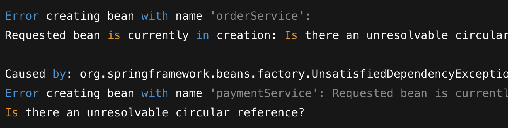

### 의존성 주입

Spring Framework에서 의존성을 주입하는 방법은 3가지가 있다.
	1. 생성자 주입(Constructor Injection)
	2. 필드 주입(Field Injection)
	3. 수정자 주입(Method-Setter Injection)

그럼 이중 어떤 방법이 가장 권장될까?  
결론이 **생성자 주입** 이라는 것은 아마 스프링 사용자라면 대부분 알고있다. 하지만 왜 생성자 주입이 가장 권장되는지 정확히 알고있지 못하다. 지금부터 이부분에 대해서 파악해보자.
#### 1. 생성자 주입
```java
@Component
public class OrderService {

    private final PaymentService paymentService;

    @Autowired
    public OrderService(PaymentService paymentService) {
        this.paymentService = paymentService;
    }

    public void processOrder() {
        paymentService.pay();
    }
}
```

#### 2. 필드 주입
```java
@Component
public class OrderService {

    @Autowired
    private PaymentService paymentService;

    public void processOrderPay() {
        paymentService.pay();
        paymentService.pay();
    }
}
```

#### 3. 수정자 주입

- **Method(Setter) 주입**
```java
@Component
public class OrderService {

    private PaymentService paymentService;

    @Autowired
    public void setPaymentService(PaymentService paymentService) {
        this.paymentService = paymentService;
    }

    public void processOrder() {
        paymentService.pay();
    }
}
```


### 생성자 주입을 사용해야 하는 이유

생성자 주입 사용을 권하는 이유는 다음과 같다.  

1. 순환 참조 방지
2. final 선언이 가능
3. 테스트 코드 작성 용이

#### 순환 참조 방지

객체에 의존성을 추가 하게 되면 순환 참조 문제가 발생한다. 즉 A가 B를 참조, B가 A를 참조 와 같은 경우가 발생하는 것이다. 예를 한번 들어보자.

필드 주입을 통해서 순환 참조를 구성해보자.
Order / Payment `Bean`을 생성하고 서로 필드 주입을 진행한다.
```java
@Component
public class OrderService {

    @Autowired
    private PaymentService paymentService;

    public void processPay() {
        paymentService.pay();
    }
}

@Component
public class PaymentService {

    @Autowired
    private OrderService orderService;

    public void processOrder() {
        orderService.order();
    }
}
```

그리고 이 두개의 `Bean`을 주입해보자.
```java
@Component
public class OrderPayService {

    @Autowired
    private OrderSerivce orderService;
	
	@Autowired
    private PaymentService paymentService;

    public void processPayOrder() {
        orderService.order();
        paymentService.pay();
    }
}
```

그리고 해당 서버를 구동하면, 정상적으로 동작을 한다, 하지만 `processPayOrder()`를 호출하게 되면 순환참조로 인해 서버가 죽는 상황이 발생한다.

결과를 보면 메소드 실행 전까지 순환참조가 있더라도 해당 문제를 빌드 시점에서 알수없다.

이 예제를 생성자 주입을 통해 진행하면 서버 실행 시점에서 바로 에러를 `catch`할수있다.
```java
@Component
@RequiredArgsConstructor
public class OrderService {

    private final PaymentService paymentService;

    public void processPay() {
        paymentService.pay();
    }
}

@Component
@RequiredArgsConstructor
public class PaymentService {

    private final OrderSerivce orderService;

    public void processOrder() {
        orderService.order();
    }
}

@Component
@RequiredArgsConstructor
public class OrderPayService {

    private final PaymentService paymentService;
    private final OrderSerivce orderService;

    public void processPayOrder() {
        orderService.order();
        paymentService.pay();
    }
}

```


이렇게 서버자체가 구동되지 않아 순환참조를 빌드 시점에서 방지 가능하다.

**이런차이가 발생하는 이유?**
- 필드 주입, 수정자 주입은 빈을 생성한후, 주입하려는 빈을 찾아 주입
- 생성자 주입은 생성자의 인자에 사용되는 빈을 찾거나 빈 팩토리에서 생성됨, 그리고 찾은 인자 빈으로 주입하려는 빈의 생성자를 호출, 즉 먼저 빈을 생성하지 않고 주입하려는 빈을 찾음
- 해당 이유로 객체 생성 시점에서 빈을 주입하기 때문에, 서로 참조하는 객체가 생성되지 않은 상태에서 그 빈을 참조하기 때문에 오류가 발생


#### final 선언 가능
필드 주입과 수정자 주입을 통해서는 주입하려는 필드를 `final` 로 선언이 불가능 하다. 즉, 추후에 해당 값이 변경될 수도 있다는 의미이다.

생성자 주입은 필드를 `final`로 선언이 가능하며, **런타임 시점에 객체의 불변성을 보장**한다.

#### 테스트 코드 작성 용이
생성자 주입을 사용하면 스프링 컨테이너의 도움 없이 테스트 코드를 편리하게 작성이 가능하다. 


https://jackjeong.tistory.com/entry/Spring-%EC%83%9D%EC%84%B1%EC%9E%90-%EC%A3%BC%EC%9E%85-vs-%ED%95%84%EB%93%9C-%EC%A3%BC%EC%9E%85-Autowired