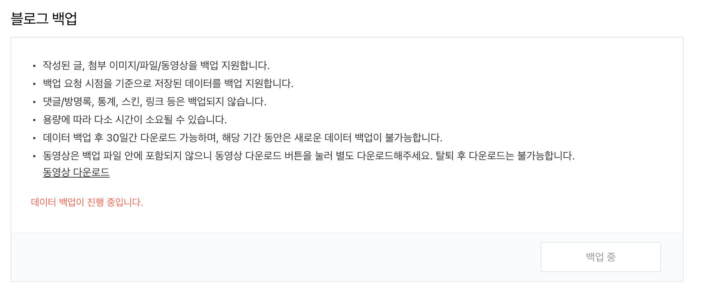
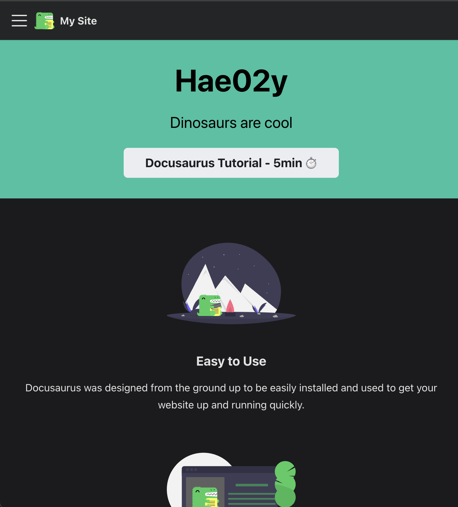
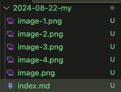
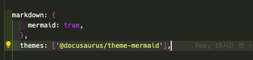
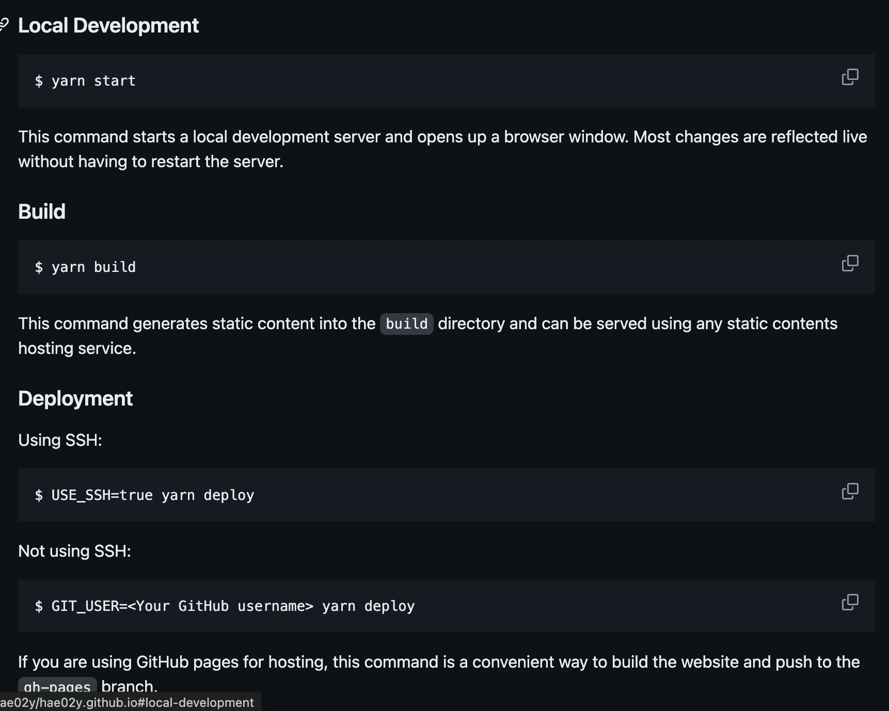
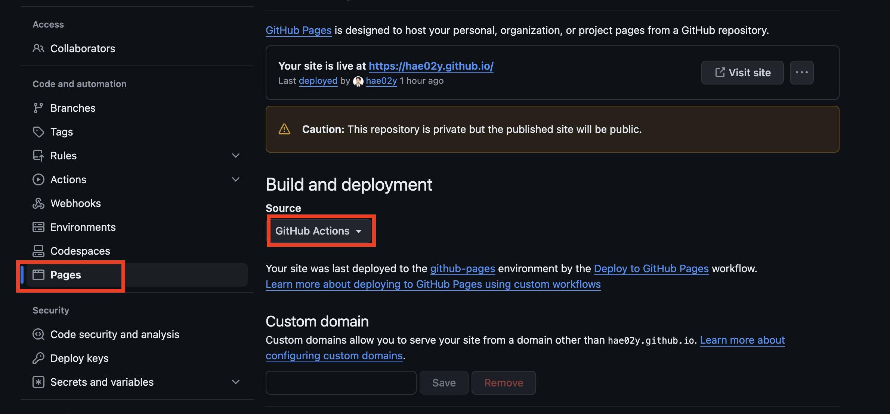

블로그 플랫폼을 옮기면서 여러 문제를 마주했다. 



일단 글의 양이 꽤되서 그런지 백업에 시간이 걸리는 중이다...! 하루전에 눌러놨는데 아직도 안됐음

옮기는 작업이 완료되고 나면 티스토리 블로그는 폐쇄할 예정이다.

#### Blog or Docs
Docusaurus 는 docs 와 blog 모드가 각각 존재하며, docs 는 기술 문서를 위한 포맷이다. 개발 블로그는 blog mode 만 있어도 충분했기 때문에 blog only 로 설정하여 docs 페이지를 제거해버릴까 고민했다. 하지만 이럴 경우 메인 랜딩 페이지가 없어지기 때문에 뭔가 아쉬웠다.



고민 끝에 랜딩 페이지를 유지하기 위해 blog only 는 포기하고 docs 만 다른 형태로 바꿔주기로 했다.

그럼 기본적으로 설치하면 좋을 부분만 기록해보자.


#### 프로젝트 세팅

```
npx create-docusaurus@latest my-website classic --typescript
```

### 꿀팁

Docusaurus는 폴더 기준으로 데이터 관리가 가능하다. 



현재 작성하고 있는 글도 위의 그림과 같이 데이터를 관리한다.

### Docusaurus.config.ts

처음 배포전에 세팅해두면 좋을 라이브러리들을 알아보자.

#### Package Manager

다양한 패키지매니저가 존재하고 Docusaurus에서도 이에 맞춰서 npm, yarn, pnpm 등을 지원한다. 일단 첫번째 시도는 pnpm을 사용해봤지만 githubaction을 설정할때 정말 많은 에러가 발생했다. 또한 토스에서 패키지 매니저 관련하여 작성한 글을 보고 yarn을 도입해보자고 생각하였다.

[참고 : 토스](https://toss.tech/article/lightning-talks-package-manager)

```js
yarn start
```

#### Mermaid
Mermaid 는 다이어그램을 코드로 간단하고 빠르게 그리는데 적합하여 평소에 자주 쓰는 도구다. Docusaurus 에서는 플러그인으로 지원하니 포함시켜주도록 하자.
```
yarn add @docusaurus/theme-mermaid
```

```
const config: Config = {
    markdown: {
        mermaid: true,
    },
    themes: ['@docusaurus/theme-mermaid'],
};
```



자세한 내용은 [공식 문서](https://docusaurus.io/docs/markdown-features/diagrams) 참고.

#### Code Block Highlight
java 가 기본지원이 아니기 때문에 prism 설정을 통해 java 추가. 겸사겸사 bash 도 추가해주었다. 만약 본인이 자주 쓰는 언어가 하이라이팅되지 않는다면 적당히 추가해주면 되겠다.

```
const config: Config = {
    themeConfig: {
        prism: {
            theme: prismThemes.github,
            darkTheme: prismThemes.dracula,
            additionalLanguages: ['java', 'bash'],
        },
    },
};
```

### 배포


docusaurus에서 기본적으로 추천하는 방식.

위의 이미지와 같은 방식을 포함한 다양한 방법으로 배포가 가능하지만 docusaurus에서 추천하는 방식은 배포되는동안 블로그 접근이 중단된다. 그리고 나는 github.io를 살리고 싶어서 github pages를 사용하기로 했다. 블로그 글을 작성후 push 하면 자동으로 배포되도록 CI/CD를 구성했다. 일단 `/.github/workflows/ 하위에 yaml을 하나 작성하자.

```yaml
name: Deploy to GitHub Pages

on:
  push:
    branches:
      - main
    # Review gh actions docs if you want to further define triggers, paths, etc
    # https://docs.github.com/en/actions/using-workflows/workflow-syntax-for-github-actions#on

jobs:
  build:
    name: Build Docusaurus
    runs-on: ubuntu-latest
    steps:
      - uses: actions/checkout@v4
        with:
          fetch-depth: 0
      - uses: actions/setup-node@v4
        with:
          node-version: 20
          cache: yarn

      - name: Install dependencies
        run: yarn install --frozen-lockfile
      - name: Build website
        run: yarn run build

      - name: Upload Build Artifact
        uses: actions/upload-pages-artifact@v3
        with:
          path: build

  deploy:
    name: Deploy to GitHub Pages
    needs: build

    # Grant GITHUB_TOKEN the permissions required to make a Pages deployment
    permissions:
      pages: write # to deploy to Pages
      id-token: write # to verify the deployment originates from an appropriate source

    # Deploy to the github-pages environment
    environment:
      name: github-pages
      url: ${{ steps.deployment.outputs.page_url }}

    runs-on: ubuntu-latest
    steps:
      - name: Deploy to GitHub Pages
        id: deployment
        uses: actions/deploy-pages@v4
```



`Settings > Pages`
에서 Source 를 GitHub Actions 으로 설정 
이후에는 main 브랜치에 커밋이 push 될 때마다 자동으로 배포 작업이 진행된다.


#### 추가 진행 예정

1. 다국어 지원 추가
2. 댓글 기능 추가
3. 검색엔진 추가 -> 기본 
4. SEO 추가
5. 기존 블로그 데이터 마이그레이션