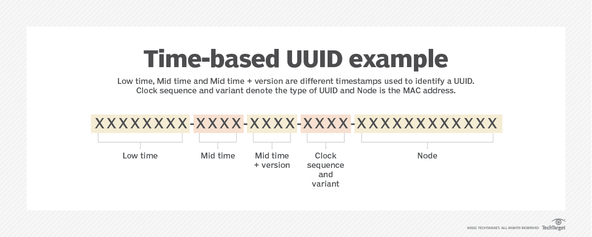

회사에서 레거시 코드를 보던 도중 PK를 `UUID`로 관리하고 있다는 것을 알게 되었다. `UUID`를 사용하는 이유에 대해 찾아보던 중 새롭게 알게된 내용과 어떻게 사용하는 것이 효율적인지 기록해보려고 한다.

### UUID 란?



UUID(Universally Unique Identifier) 는 전세계적으로 고유한 식별자를 생성하는 표준화된 방법이다. 분산시스템 등에서 중복되지 않는 유일한 값을 구성할때 사용되는 고유한 식별자이다. 128bit의 길이를 가지고, 32자리의 16진수로 표현된다. 일반적으로 8-4-4-4-12 형식으로 구분된 문자열로 나타난다.

#### UUID 구성

UUID는 다양한 방법으로 생성이 가능한데, 표준에 따르면 다양한 버전을 가지고 있다. 총 5개의 버전으로 출시년도에 따라서 버전이 존재한다.

1. **UUID Version 1.**  
    - "현재시간" / "랜덤한 MAC주소"를 기반으로 생성
    - 유일성이 보장되지만 보안에 취약
    - 시간과 노드를 기반으로 생성
      - 60bit : UTC Time
      - 48bit : node(MAC 주소)
      - 16bit : Sequence 번호(중복방지를 위해)
2. **UUID Version 2.**
    - UUID Version 1.의 확장 버전
    - POSIX UID / GID 등의 정보를 포함
    - 일반적으로 사용되지 않음
3. **UUID Version 3.**
    - 이름 기반의 UUID
    - 이름과 네임스페이스를 `해시함수(MD5)`로 해싱하여 생성
    - 동일한 입력에 대해 동일한 출력을 보장
    - 암호화 해시함수를 사용하여 보안성이 높음
4. **UUID Version 4.**
    - 랜덤한 무작위 숫자발생기를 사용해 생성
    - 완전한 무작위 값으로 생성되며 생성속도가 빠름
    - 보안성이 높고 이론적으로 중복될 가능성이 낮음
5. **UUID Version 5.**
    - Version 3.와 유사하지만 `SHA-1` 해시함수를 사용하여 이름기반으로 생성


#### UUID 사용

관계형 DB에서 데이터를 식별하기 위해 PK를 사용한다. 클라이언트와 서버 간의 데이터 확인을 위해 보통 PK를 주고 받지만 해당 방법은 보안적인 측면에서 위험성이 존재한다. 한번 예를 들어보자.

```java
https://www.hae02y.com/user?id=1
```

위의 URL에서 파라미터에 들어가는 `id` 값을 바꿔줌으로써, 다른 사람의 정보를 확인할수있음을 예측할수있다. 이렇게 예측가능한 모델이 된다면 (Insecure Direct Object Reference, IDOR)의 위험성에 노출되게 되고, PK값을 그대로 파라미터로 사용함은 문제가 될수있다. 즉, 고유값을 같는 특정한 값으로 해당 데이터를 식별 할 필요가 있다.

서버내에서 특정한 키를 발급하거나, 세션등을 사용하여 특정 클라이언트에 한정된 고유값을 사용한다면 이를 해결할수있다. 즉, PK는 내부 시스템의 식별용으로만 사용하고, 클라이언트에게는 비즈니스용 식별자를 노출하여 해결이 가능하다. 이때 선택할수있는 옵션이 `UUID`이다. 또한 `UUID`는 고유성을 지니고 있어 여러 서버 및 프로세스에서 동시에 발급해도 겹칠 확률이 적으며, 분산 시스템 환경에서도 충돌없이 사용이 가능하다. 또한 `UUID`는 Stateless 한 성질을 가지고 있다. 즉, Increment PK는 데이터베이스 조회를 통해 `Unique`한 Key 확인이 필수이다. 이러한 방식은 분산데이터 베이스에서 SPOF(Single-Point-Of-Failure)를 발생시킬 수 도있다. 이에반해 `UUID`는 해당 과정을 생략하고 insert query 호출이 가능하다.

하지만 그에 반해 단점도 존재 한다. 먼저 크기가 컬럼의 데이터 사이즈가 증가한다. 기존 PK를`AUTO_INCREMENT`로 생성하였다면 Int(4byte) 크기에서 `UUID` 적용시 16byte로 증가한다. 이에 따라 인덱스의 사이즈가 증가하고 메모리부담이나 성능 저하가 발생할수있다. 또한 랜덤한 값이므로 클러스터형 Index 정렬을 방해하고, `Insert` 과정에서 디스크 I/O에 성능 저하를 발생 시킬수있다. 그리고 URL 요청 과정에서 UUID로 인해 URL이 길어진다.

이에 대한 첫번째 대안으로 `UUID`를 PK로 직접 쓰지않고, Database PK는 `AUTO_INCREMENT`로 두고, 클라이언트에 노출 할수있는 `UUID`를 설계 하는 방식 사용이 가능하다. 아니면 `ULID`, `KSUID` 등 정렬이 가능한 고유 ID를 사용하여 랜덤성과 정렬성을 모두 잡을수있다. 위 내용을 표로 간단하게 정리해보자.

| 항목     | AUTO_INCREMENT | UUID     |
| ------ | -------------- | -------- |
| 성능     | 빠름             | 느려짐 (랜덤) |
| 보안     | 예측 가능          | 예측 불가    |
| 분산 시스템 | 어려움            | 충돌 거의 없음 |
| 가독성    | O              | X        |

#### ULID / KSUID 란?

둘 다 UUID의 단점을 보완하기 위해 나온 고유 ID 생성 규격이다.

**Universally Unique Lexicographically Sortable Identifier**
- **의미**: UUID처럼 유니크하지만, 문자열이 시간 순 정렬 가능
- 형식: `01FZV9YJ00X4M2YH6Y3M1QGJVT`
- 내부 구조: 상위 비트: 타임스탬프 / 하위 비트: 랜덤값
- 시간 순서대로 생성 → DB 인덱스 정렬 효율적
- 보통 `26`자 Base32 문자열
- 공간 효율성: UUID와 비슷하지만, 읽고 쓸 때 더 빠름
- 사용 예: Firebase Firestore, 일부 NoSQL, 이벤트 소싱
    

**K-Sortable Unique Identifier**
- **의미**: 쿠팡/Stripe 등에서 사용, UUID처럼 유니크하면서도 정렬 가능한 ID
- 형식: `0o5Fs0EELR0fUjHjbCnE8v0X9Ey`
- 내부 구조: 첫 4바이트: 생성 시간 (Unix epoch) / 나머지 16바이트: 랜덤값
- 결과적으로 시간순 정렬 가능 & UUID와 동일한 20바이트
- 고유성 보장 + 시간 순 정렬성
- RDB → INT PK + UUID 외부 노출 or ULID/KSUID
- NoSQL/분산 → ULID/KSUID 더 적합

### 사용 예시
내가 주로 사용하는 Java에서는 UUID Version 1,3,4를 지원한다. 이를 사용하는 예시를 작성해보았다.   
[참고 : UUID Java Docs](https://docs.oracle.com/javase/7/docs/api/java/util/UUID.html)
#### UUID Version 3.

```java
import java.util.UUID;

public static UUID generateType3UUID() {
    String name = "example name";
    UUID uuid3 = UUID.nameUUIDFromBytes(name.getBytes());
    System.out.println("Version 3 UUID: " + uuid3);
    return uuid3;
}
```

#### UUID Version 4.

```java
import java.util.UUID;

public static UUID generateType4UUID() {
    // 버전 4 UUID 생성하기
    UUID uuid4 = UUID.randomUUID();
    System.out.println("Version 4 UUID: " + uuid4); // Version 4 UUID: c48b2aef-9d79-44fe-bd97-46fd31361069
    return uuid4;
}
```


#### UUID Version 5.

```java
import java.util.UUID;

String name = "example_name";
UUID namespace = UUID.fromString("00000000-0000-0000-0000-000000000000");
UUID uuid = createUUIDv5(name, namespace); // 함수를 호출합니다

public static UUID createUUIDv5(String name, UUID namespace) {

    UUID uuid = createUUIDv5(name, namespace); // 함수를 호출합니다

    byte[] nameBytes = name.getBytes(StandardCharsets.UTF_8);
    byte[] namespaceBytes = namespace.toString().getBytes(StandardCharsets.UTF_8);
    byte[] bytesToHash = new byte[nameBytes.length + namespaceBytes.length];

    System.arraycopy(nameBytes, 0, bytesToHash, 0, nameBytes.length);
    System.arraycopy(namespaceBytes, 0, bytesToHash, nameBytes.length, namespaceBytes.length);

    try {
        MessageDigest md = MessageDigest.getInstance("SHA-1");
        byte[] hash = md.digest(bytesToHash);
        hash[6] &= 0x0f;
        hash[6] |= 0x50;
        hash[8] &= 0x3f;
        hash[8] |= 0x80;
        return UUID.nameUUIDFromBytes(hash);
    } catch (NoSuchAlgorithmException e) {
        throw new RuntimeException("Error creating UUID v5", e);
    }
}
```


### 결론
우리 회사에서 레거시에 사용된 `UUID`는 어쩌면 잘못 사용 되고 있을수도 있다는 생각이 들었다. 모든 테이블에 


#### Ref.

[UUID에 의존하면 안되는 이유](https://hackernoon.com/lang/ko/%EC%9D%B8%EC%A6%9D-%EC%83%9D%EC%84%B1-%EC%B7%A8%EC%95%BD%EC%A0%90-%EB%B0%8F-%EB%AA%A8%EB%B2%94-%EC%82%AC%EB%A1%80%EB%A5%BC-%EC%9C%84%ED%95%B4-uuid%EC%97%90-%EC%9D%98%EC%A1%B4%ED%95%98%EC%A7%80-%EB%A7%88%EC%8B%AD%EC%8B%9C%EC%98%A4.)
[UUID를 기본키로 사용시 주의 사항](https://tomharrisonjr.com/uuid-or-guid-as-primary-keys-be-careful-7b2aa3dcb439)
[참고자료](https://chanos.tistory.com/entry/MySQL-UUID%EB%A5%BC-%ED%9A%A8%EC%9C%A8%EC%A0%81%EC%9C%BC%EB%A1%9C-%ED%99%9C%EC%9A%A9%ED%95%98%EA%B8%B0-%EC%9C%84%ED%95%9C-%EB%85%B8%EB%A0%A5%EA%B3%BC-%ED%95%9C%EA%B3%84)
[참고자료2](https://stackoverflow.com/questions/52414414/best-practices-on-primary-key-auto-increment-and-uuid-in-sql-databases)
[참고자료3](https://americanopeople.tistory.com/378)
