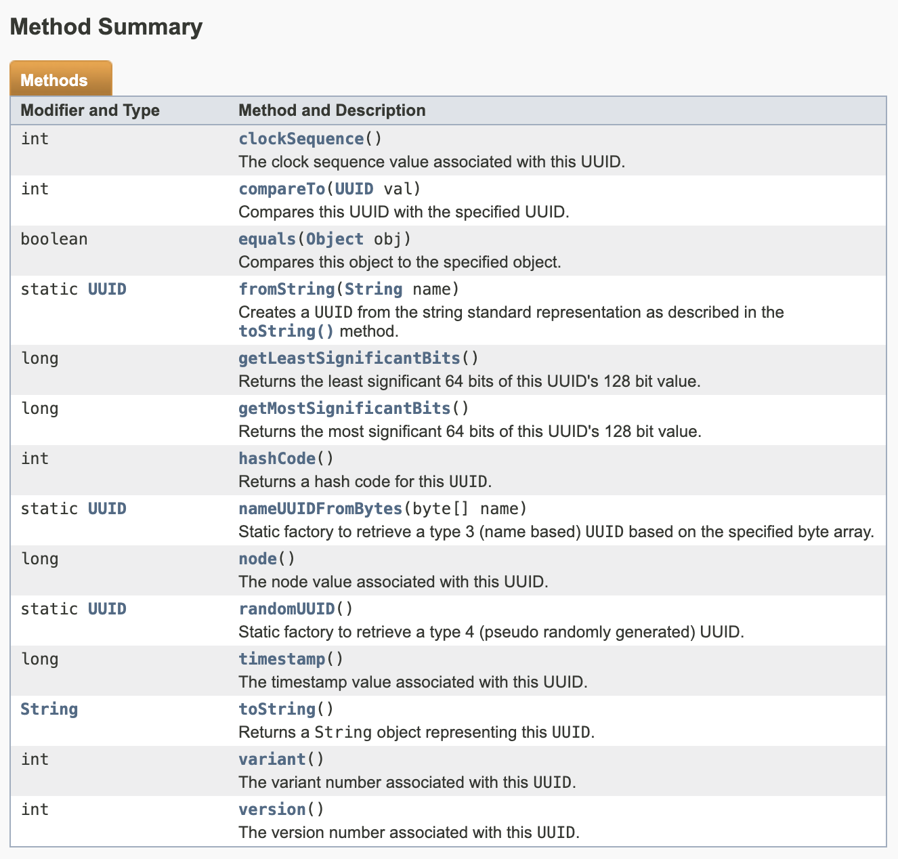

## UUID 란?


UUID(Universally Unique Identifier) 는 전세계적으로 고유한 식별자를 생성하는 표준화된 방법이다. 분산시스템 등에서 중복되지 않는 유일한 값을 구성할때 사용되는 고유한 식별자이다. 128bit의 길이를 가지고, 32자리의 16진수로 표현된다. 일반적으로 8-4-4-4-12 형식으로 구분된 문자열로 나타난다.

### 그래서 왜?

현재 회사의 DB Schema에서 PK를 UUID로 관리하는 DB도 있고, sequentially하게 관리하는 DB도 있어서 어떤 이유로 이렇게 적용됐는지 궁금했다. 

<details>
    <summary>
    요약 보기
    </summary>
    - UUID에 대한 이해
    - DB에서 PK로 UUID를 사용하는 장단점
</details>

### UUID 구성

UUID는 다양한 방법으로 생성이 가능한데, 표준에 따르면 다양한 버전을 가지고 있다. 총 5개의 버전으로 출시년도에 따라서 버전이 존재한다.

1. **UUID Version 1.**  
    - "현재시간" / "랜덤한 MAC주소"를 기반으로 생성
    - 유일성이 보장되지만 보안에 취약
    - 시간과 노드를 기반으로 생성
      - 60bit : UTC Time
      - 48bit : node(MAC 주소)
      - 16bit : Sequence 번호(중복방지를 위해)
2. **UUID Version 2.**
    - UUID Version 1.의 확장 버전
    - POSIX UID / GID 등의 정보를 포함
    - 일반적으로 사용되지 않음
3. **UUID Version 3.**
    - 이름 기반의 UUID
    - 이름과 네임스페이스를 `해시함수(MD5)`로 해싱하여 생성
    - 동일한 입력에 대해 동일한 출력을 보장
    - 암호화 해시함수를 사용하여 보안성이 높음
4. **UUID Version 4.**
    - 랜덤한 무작위 숫자발생기를 사용해 생성
    - 완전한 무작위 값으로 생성되며 생성속도가 빠름
    - 보안성이 높고 이론적으로 중복될 가능성이 낮음
5. **UUID Version 5.**
    - Version 3.와 유사하지만 `SHA-1` 해시함수를 사용하여 이름기반으로 생성


#### UUID 사용 사례
- 데이터베이스의 기본키로 설정하여 레코드의 고유성을 보장
- 파일시스템이나 디렉터리의 고유한 식별자로 사용
- API 설계시에 자원의 고유 식별자로 사용되어 분산 시스템에서 자원의 충돌없는 식별이 가능하게 함
- 트랙잭션의 고유 식별자로 사용되어 분산된 여러 시스템간의 충돌을 방지


### JAVA로 테스트 해보자


:::note
[**java.util Class UUID**](https://docs.oracle.com/javase/7/docs/api/java/util/UUID.html)


확인결과 Version 1,3,4를 지원한다.
:::

#### UUID Version 3.

```java
import java.util.UUID;

public static UUID generateType3UUID() {
    String name = "example name";
    UUID uuid3 = UUID.nameUUIDFromBytes(name.getBytes());
    System.out.println("Version 3 UUID: " + uuid3);
    return uuid3;
}
```

#### UUID Version 4.

```java
import java.util.UUID;

public static UUID generateType4UUID() {
    // 버전 4 UUID 생성하기
    UUID uuid4 = UUID.randomUUID();
    System.out.println("Version 4 UUID: " + uuid4); // Version 4 UUID: c48b2aef-9d79-44fe-bd97-46fd31361069
    return uuid4;
}
```


#### UUID Version 5.

```java
import java.util.UUID;

String name = "example_name";
UUID namespace = UUID.fromString("00000000-0000-0000-0000-000000000000");
UUID uuid = createUUIDv5(name, namespace); // 함수를 호출합니다

public static UUID createUUIDv5(String name, UUID namespace) {

    UUID uuid = createUUIDv5(name, namespace); // 함수를 호출합니다

    byte[] nameBytes = name.getBytes(StandardCharsets.UTF_8);
    byte[] namespaceBytes = namespace.toString().getBytes(StandardCharsets.UTF_8);
    byte[] bytesToHash = new byte[nameBytes.length + namespaceBytes.length];

    System.arraycopy(nameBytes, 0, bytesToHash, 0, nameBytes.length);
    System.arraycopy(namespaceBytes, 0, bytesToHash, nameBytes.length, namespaceBytes.length);

    try {
        MessageDigest md = MessageDigest.getInstance("SHA-1");
        byte[] hash = md.digest(bytesToHash);
        hash[6] &= 0x0f;
        hash[6] |= 0x50;
        hash[8] &= 0x3f;
        hash[8] |= 0x80;
        return UUID.nameUUIDFromBytes(hash);
    } catch (NoSuchAlgorithmException e) {
        throw new RuntimeException("Error creating UUID v5", e);
    }
}
```

:::info

sha-1 보안취약점으로 인해 보안에 취약해짐

[관련기사 보기](http://blog.plura.io/?p=6619)
:::


## 결론

보안을 위해서 우리 회사에서 사용하는 UUID중 하나임 

보면 1버전을 사용하고 있음. 

`6dfXXXX-2XXX-1XXX-XXXX-b25b27XXXXXX`


---
참고자료

(1)[https://chanos.tistory.com/entry/MySQL-UUID%EB%A5%BC-%ED%9A%A8%EC%9C%A8%EC%A0%81%EC%9C%BC%EB%A1%9C-%ED%99%9C%EC%9A%A9%ED%95%98%EA%B8%B0-%EC%9C%84%ED%95%9C-%EB%85%B8%EB%A0%A5%EA%B3%BC-%ED%95%9C%EA%B3%84]