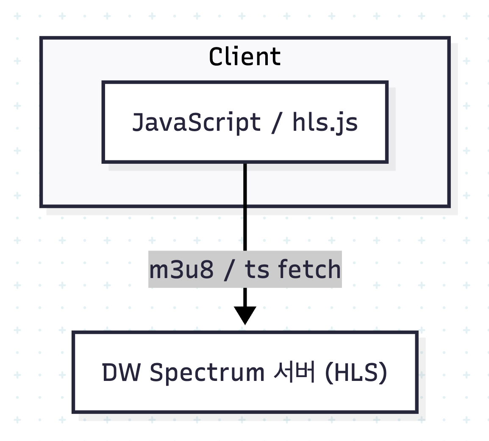
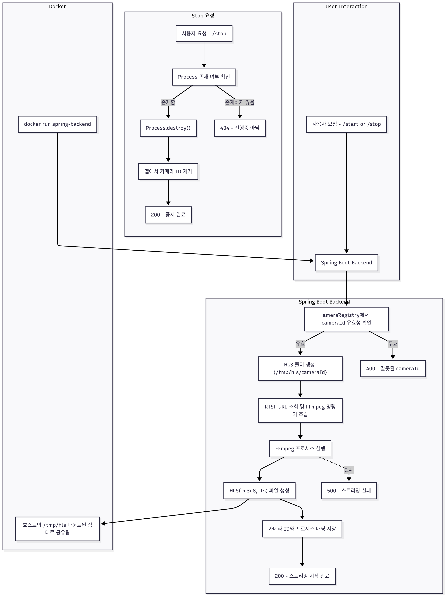

회사에서 LPR 기반의 대시보드 구현 PoC를 진행하면서 대시보드에 CCTV 영상을 Live로 송출해야하는 요구사항이 있었다. 하지만 문제는 `RTSP` 프로토콜을 통해 제공되는 CCTV 영상이 브라우저에서 직접 재생되지 않아 다양한 접근 방식을 고민했었고, 이문제를 해결했던 내용을 기록하고자 작성하였다.

이글에서는 아래 내용을 다루고자 한다.

1. NVR에서 제공하는 HLS를 직접 사용하는 방법
2. `RTSP` 를 받아 HLS로 변환하는 방법
3. 이외의 선택 가능했던 방법

### NVR에서 제공하는 HLS를 직접 사용해보자

이전에 구축한 대시보드에도 CCTV가 연동되어있지만, Live로 영상을 스트리밍 하는방식이 아닌 1~3초 단위로 스냅샷을 `Polling`하는 구조로 구성이 되어있었다. 이 방식에서는 현장에 CCTV 네트워크에 간단한 소프트웨어 기반 `NVR`을 구축하고 해당 `NVR`의 스냅샷 기능을 사용해서 이미지를 불러오는 방식으로 구축해 놓았다. 

하지만 이번엔 현장에 소프트웨어기반 `NVR`구축이 불가능하고, 이미지가 아닌 영상이 필요하기 때문에 해당 방식으로 진행이 불가능 하였다.

다양한 방법을 찾아보다 간단한 방법을 발견했다. 가장 먼저 떠오른 접근 방식은 현장 CCTV 관리 프로그램, NVR에서 직접 제공하는 HLS API를 사용하는 방식이었다. 현장이 미국에 있고 PoC로 진행하다보니 현장 정보에 대해 제한된 부분이 많은 어려움이 있었지만 Export하는 API를 지원함을 알아낼수있었다. 

`CCTV ID`, `Mac` 등을 통해 `Key`를 발급받고 영상을 추출해낼수있는 방법이다. 이방식을 통해 프론트엔드에서 `hls.js` 와같은 라이브러리를 통해 진행을 하면 된다. 간단하게 flow chart를 그려보면 아래와 같다.



하지만 CCTV/NVR과 Frontend 사이에 도메인이 다르다보니 `CORS`가 발생하게 되고, `AuthKey`를 프론트에서 직접 요청하는 과정에서 보안적인 위험과 사용자에게 `URL`이 직접적으로 노출되어 문제가 발생할수있었고, 이를 위해 프록시 서버를 구축하는 방법을 고려하였다. 백엔드는 `Java` , `SpringBoot`, `Docker`로 진행하였다.

#### Proxy 구현 코드
```java
@RestController  
@RequestMapping("/proxy/v1")
@RequiredArgsConstructor  
public class ProxyController {  
  
    private final WebClient webClient;  
  
    @GetMapping("/{cctvName}/master.m3u8")  
    public Mono<ResponseEntity<String>> getM3u8Hill(@RequestParam("entry") String entry, @PathVariable String cctvName) {  

		// Header용 Key값 갱신로직
		...
			
        return webClient.get()  
                .uri(...)  
                .header(...)
                .retrieve()  
                .bodyToMono(String.class)  
                .map(response -> {  
                    HttpHeaders headers = new HttpHeaders();  
                    headers.add(HttpHeaders.CONTENT_TYPE, "application/vnd.apple.mpegurl");  
                    return new ResponseEntity<>(response, headers,HttpStatus.OK);  
                });  
    }  
}
```

프론트에서 `entry` : 현재시간, `cctvName` 을 받아 위에 구현한 Proxy서버가 CCTV/NVR로 요청을 보내 Header에 사용되는 key를 갱신하고, 해당 key로 다시한번 HLS를 위한 데이터를 API로 요청해 프론트에 넘겨 주는 방법으로 구현하였다. 이방법으로 CCTV의 정보나 `CORS`와 같은 부분이 해결되었다.

하지만 문제는 금방 다시 드러났다.`NVR`의 리소스가 굉장히 적었던게 문제였다. 우리쪽에 구성된 영상분석 서버에서는 해당 `NVR`에서 영상을 저장한뒤 영상분석을 진행하도록 하였는데, 여기서 사용되는 리소스와 대시보드에서 사용하는 리소스가 합쳐져 대시보드 이용자가 몇명만 늘어나도 부하로 인해 영상 프레임이 누락되거나, `NVR`이 재부팅 되버리는 문제가 발생하였다. 

`NVR`은 우리쪽에서 구축한게 아니다보니 직접적으로 다루는게 불가능했고, 다른 방법을 구상해야했다. 내가 생각한 방법은 CCTV에서 `RTSP`를 통해 직접 HLS를 생성하는 방법이였다.


###  RTSP를 받아 HLS로 변환해서 사용하자

위에서 설명했던것처럼 `RTSP` 변환을 통해 직접 클라이언트에서 사용하도록 변환하는 스트리밍 서버를 구축하는 방식으로 진행하기로 결정하였다. 이를 위해 자료를 리서치했고, 결과적으로 `ffmpeg`를 통해 `RTSP`를 HLS로 변환하여 사용하도록 구축하였다.

#### Streaming 구현 코드
```java
package com.example.demo.controller;  
  
@RestController  
@RequestMapping("/rtsp/v1")  
@Slf4j  
public class RtspController {  
  
    private final CameraRegistry cameraRegistry;  
  
    public RtspController(CameraRegistry cameraRegistry) {  
        this.cameraRegistry = cameraRegistry;  
    }  
  
    private final Map<String, Process> cameraProcesses = new ConcurrentHashMap<>();  
  
  
    @GetMapping("/cameras")  
    public ResponseEntity<Map<String, String>> listCameras() {  
        return ResponseEntity.ok(cameraRegistry.getAllCameras());  
    }  
  
    @PostMapping("/start")  
    public ResponseEntity<String> startStream(@RequestParam("cameraId") String cameraId) {  
  
        if (!cameraRegistry.contains(cameraId)) {  
            return ResponseEntity.status(HttpStatus.BAD_REQUEST).body("해당하는 카메라가 없습니다. " + cameraId);  
        }  
  
        if (cameraProcesses.containsKey(cameraId) && cameraProcesses.get(cameraId).isAlive()) {  
            return ResponseEntity.status(HttpStatus.CONFLICT).body("해당 카메라 스트리밍 진행중입니다. " + cameraId);  
        }  
  
        File hlsDir = new File("/tmp/hls/" + cameraId);  
        if (!hlsDir.exists()) {  
            hlsDir.mkdirs();  
        }  
  
        String rtspUrl = cameraRegistry.getCameraUrl(cameraId);  
        String outputPath = String.format("/tmp/hls/%s/stream.m3u8", cameraId);  
  
        String[] command = {  
                "ffmpeg",  
                "-rtsp_transport", "tcp",  
                "-i", rtspUrl,  
                "-c:v", "libx264",  
                "-preset", "ultrafast",  
                "-tune", "zerolatency",  
                "-f", "hls",  
                "-hls_time", "1",  
                "-hls_list_size", "3",  
                "-hls_flags", "delete_segments",  
                outputPath  
        };  
  
        try {  
            ProcessBuilder pb = new ProcessBuilder(command);  
            pb.redirectErrorStream(true);  
            pb.inheritIO();  
            Process process = pb.start();  
            cameraProcesses.put(cameraId, process);  
            log.info("Started camera [{}] at [{}]", cameraId, rtspUrl);  
            return ResponseEntity.ok("카메라 스트리밍이 시작되었습니다. " + cameraId);  
        } catch (IOException e) {  
            log.error("카메라 스트리밍이 실패하였습니다. {}", cameraId, e);  
            return ResponseEntity.status(HttpStatus.INTERNAL_SERVER_ERROR).body("카메라 스트리밍이 실패하였습니다. " + cameraId);  
        }  
    }  
  
    @PostMapping("/stop")  
    public ResponseEntity<String> stopStream(@RequestParam("cameraId") String cameraId) {  
        Process process = cameraProcesses.get(cameraId);  
        if (process != null && process.isAlive()) {  
            process.destroy();  
            cameraProcesses.remove(cameraId);  
            log.info("Stopped camera [{}]", cameraId);  
            return ResponseEntity.ok("카메라 스트리밍이 정상적으로 중지되었습니다. " + cameraId);  
        } else {  
            return ResponseEntity.status(HttpStatus.NOT_FOUND).body("카메라 스트리밍이 진행중이지 않습니다. " + cameraId);  
        }  
    }  
}
```


이렇게 컨트롤러를 구성하였다. 물론 패키징 구조가 있지만 해당 구조를 생략하고 컨트롤러에 직접 구현된 상태로 가져왔다. 이방법을 flow chart로 그려보면 아래와 같다.



이구성으로 CCTV에 직접 접근하여 영상을 가져오고 이 요청은 `/start`를 통해 단 1회만 진행된다. 그리고 여러명의 클라이언트가 대시보드를 통해 영상에 접근하더라도 스트리밍 서버의 `/tmp/hls` 내부의 리소스를 참고하여 영상을 가져오게 된다. 

그리고 영상 요청의 주체가 `NVR`을 통하지 않고, 스트리밍서버에서 진행되어, 우리쪽에서 지정해놓은 커스텀한 `cameraId`만으로 영상을 HLS로 불러올수있게 되었다. 

#### 프론트엔드 대응

HLS를 백엔드에서 정상적으로 Response로 전달할수있게 됐다. 그럼 다음으로 프론트엔드에서 어떻게 구현했는지 알아보자. 목표는 여러대의 CCTV 스트리밍을 하나의 페이지에서 선택적으로 재생하고, 실시간 스트리밍 상황에서 오류 발생시 복구처리 하고, safari 나 chrome등 브라우저에 맞도록 해야했다. `hls.js`, `JQuery`, `Js`를 사용하여 구현하였다. 사용방법은 아래의 링크를 참고하자.    

[hls.js Docs](https://github.com/video-dev/hls.js) 

  
```html
<script type="text/javascript" src="https://cdn.jsdelivr.net/npm/hls.js@latest"></script>
```

```javascript

function selectCCTV(evt) {
  const cctvNumber = $(evt.target).attr('id');
  const cctvSrc = CCTV_MAP[cctvNumber];
  if (!cctvSrc) {
    console.warn("잘못된 CCTV 선택: " + cctvNumber);
    return;
  }

  const video = document.getElementById('cctvContainer');
  $('.cctvImage').show();

  if (Hls.isSupported()) {
    if (window.hls) window.hls.destroy();

    const hls = new Hls();
    window.hls = hls;

    hls.attachMedia(video);
    hls.on(Hls.Events.MEDIA_ATTACHED, () => hls.loadSource(cctvSrc));
    hls.on(Hls.Events.ERROR, (event, data) => handleHLSError(hls, 'video', data));
  } else if (video.canPlayType('application/vnd.apple.mpegurl')) {
    video.src = cctvSrc;
    video.addEventListener('canplay', () => video.play());
  }
}

function handleHLSError(hls, videoId, data) {
  console.error(`HLS 오류 (${videoId}): ${data.type}, ${data.details}`);
  if (data.fatal) {
    switch (data.type) {
      case Hls.ErrorTypes.NETWORK_ERROR:
        console.log(`NETWORK_ERROR: 복구 시도 중...`);
        hls.startLoad();
        break;
      case Hls.ErrorTypes.MEDIA_ERROR:
        console.log(`MEDIA_ERROR: 복구 시도 중...`);
        hls.recoverMediaError();
        break;
      default:
        console.log(`치명적 오류: 스트리밍 종료`);
        hls.destroy();
        break;
    }
  }
}
```


### Ref.
- [Spring-Streaming-Server Github Repository](https://github.com/hae02y/Spring-Streaming-Server)