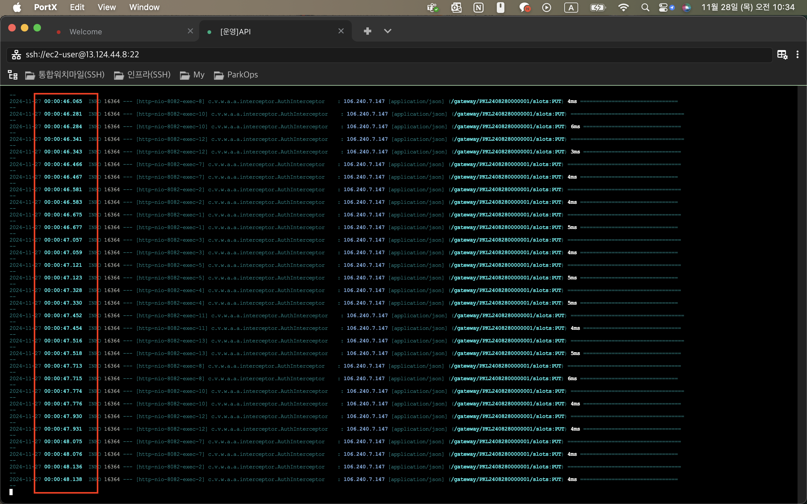
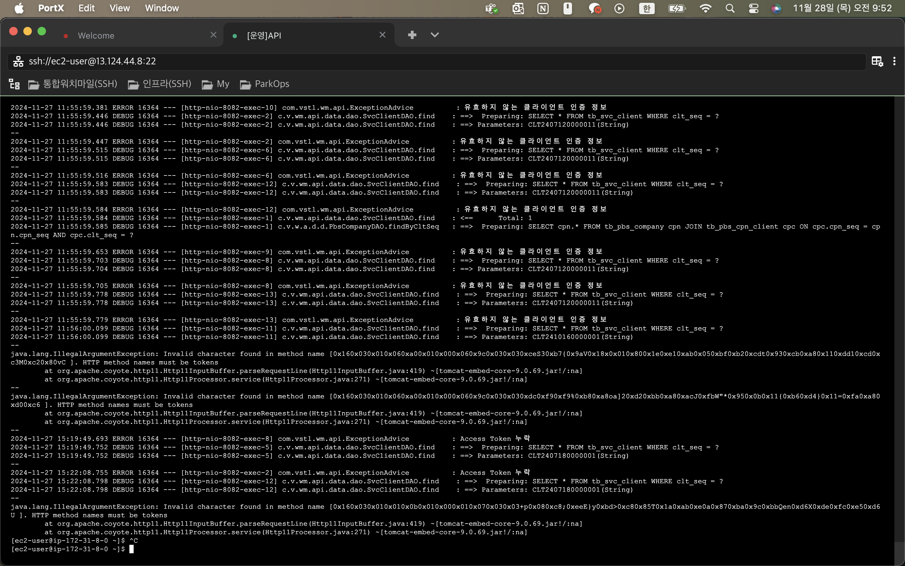
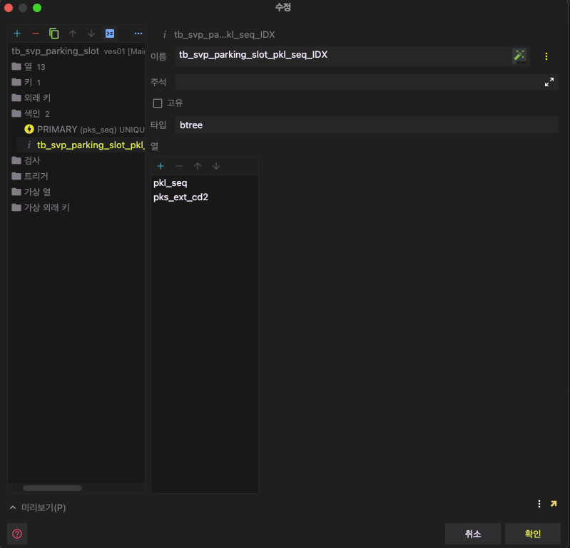
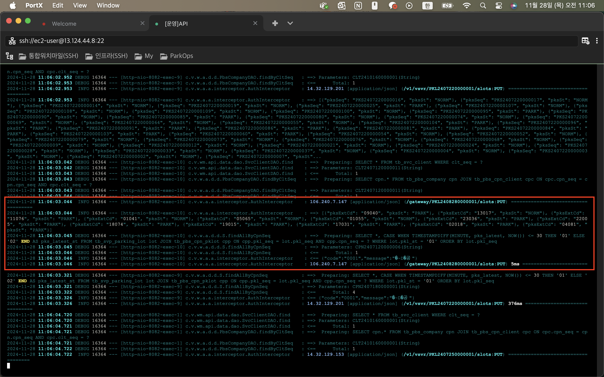

## 1. 요약

  

> 트러블 슈팅 내용 요약

<aside>

  

### 장애 내용 요약

  

- (11/28) 웹 앱 서버에 연동된 서비스 이용 불가 (롯데잠실점 워치마일, 비콘 페이지 등)

</aside>

  

<aside>

  

발생 원인

  

- **티미 연동간 만공정보 API 호출 빈도 증가**:

- 주차면 만공정보를 개별로 전달하여 API 호출이 높은 빈도로 발생

- API 호출 시 Main DB와의 다수의 동시 연결 요청을 생성

- 현재 설정된 Connection Pool 크기가 해당 부하를 처리하기에 부족

- 연결이 과도하게 생성되면서 Pool이 고갈되고, 대기 중인 요청이 타임아웃 발생

</aside>

  

<aside>

  
**영향 범위**

  

- **영향받은 시스템**:

- (11/28) 웹 앱 서버에 연동된 서비스 이용 불가 (롯데잠실점 워치마일, 비콘 페이지 등)

</aside>

  

### 상세 조치 내용

  

- API 서버 로그 분석 결과 티미측에서 만공정보를 ms 단위로 서버로 요청을 보내는 상태

- List 형태로 만공정보를 한번에 전달하기로 하였으나 개별 주차면 마다 API 요청을 보냄

- 티미측 담당자(김주엽 대리 010-6525-8682)에게 해당 상황 전달

- List형태로 변환하여 4s 간격으로 데이터를 전달하기로 함

- 해당 조치 전까지 임시로 티미측 API Key를 만료

- DB Index 처리 ⇒ 티미 연동의 경우 extcd(타업체 관리코드)를 통해 DB Update 쿼리를 진행

- (11/28) 동일 증상 발생으로 티미측에 내용 전달

- 조치 결과 확인 완료

  

---

  

## 2. 결과

  

> 결과 작성

>

- 티미 만공정보 API List형태로 4초 단위 요청 확인

- 앱정상 작동 확인

- Webapp server 연동 서비스 정상동작 확인

  

<aside>

  

### **근본적인 해결 방안**

  

- 타업체 연동시 API 호출수 제한 등을 고려

- Connection Pool을 증가시키는 방법등을 고려가 필요 (서버 스펙 증가)

</aside>
