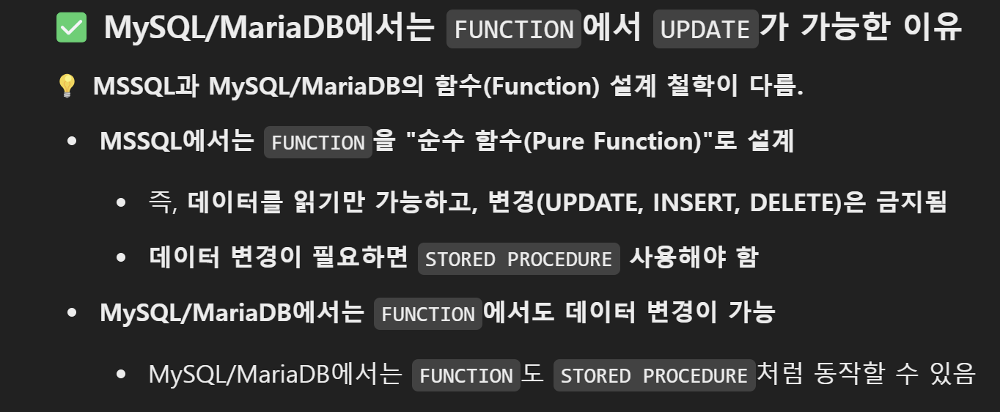

mssql을 이번에 사용하게 되었는데 내용을 정리해보려한다.


DB 정보 변경
```sql
SELECT name, collation_name
FROM sys.databases
WHERE name = 'ansan-daemin';
```

```sql
ALTER DATABASE [ansan-daemin] 
      COLLATE Latin1_General_100_CI_AS_SC_UTF8;
```

**데이터베이스를 사용 중이면 변경할 수 없음**

- 해당 데이터베이스가 사용 중이면 변경이 불가능합니다. 다른 데이터베이스(`master`)로 이동한 후 실행해야 합니다.

- **테이블과 컬럼의 콜레이션은 자동 변경되지 않음**
    
    - 데이터베이스의 **기본 콜레이션**만 변경되며, 기존 테이블과 컬럼의 콜레이션은 변경되지 않습니다.
    - 기존 테이블의 개별 컬럼을 변경하려면 추가 작업이 필요합니다.
- **개별 테이블의 인코딩 변경** 특정 테이블의 `VARCHAR`, `TEXT`, `NVARCHAR`, `NTEXT` 컬럼도 인코딩을 변경하려면:

```sql
ALTER TABLE [users] 
ALTER COLUMN [name] NVARCHAR(255) 
      COLLATE Latin1_General_100_CI_AS_SC_UTF8;
```


