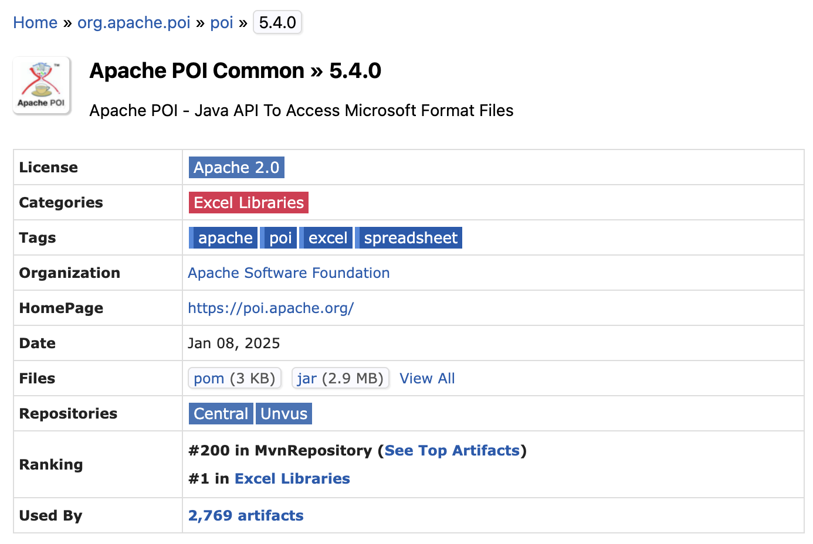

### 엑셀 라이브러리 Searching

- Apache POI
- 라이브러리 버전
    - `implementation 'org.apache.poi:poi'`
    - `implementation 'org.apache.poi:poi-ooxml'`

1. **`poi` (`org.apache.poi:poi`)**:
    - 이 라이브러리는 **HSSF** (Horrible Spreadsheet Format)로 알려진 **.xls** 파일 형식을 처리하는 데 사용됩니다.
    - 주로 **엑셀 2003 이하 버전**의 파일을 다룰 때 사용됩니다.
    - `poi` 의존성만 있으면 `.xls` 파일을 읽고 쓸 수 있지만, `.xlsx` 파일을 다루는 데는 제한적입니다.
2. **`poi-ooxml` (`org.apache.poi:poi-ooxml`)**:
    - 이 라이브러리는 **XSSF** (XML Spreadsheet Format)로 알려진 **.xlsx** 파일 형식을 처리하는 데 사용됩니다.
    - **엑셀 2007 이상** 버전에서 사용되는 `.xlsx` 파일을 다룰 때 필요합니다.

- [https://poi.apache.org/components/spreadsheet/index.html](https://poi.apache.org/components/spreadsheet/index.html)

### 라이브러리

- 적용버전
    ```java
        implementation 'org.apache.poi:poi:5.4'  // .xls 파일 처리
        implementation 'org.apache.poi:poi-ooxml:5.4'  // .xlsx 파일 처리
    ```
    
- 이유
    - 최신 버전
	    

### 엑셀 입력

- 엑셀 입력 요청 → 엑셀 처리 → DTO 변환 처리 → DB 저장

### 엑셀 출력

- 엑셀 출력 요청 → DB 조회 → DTO 변환 처리 → DB 저장
- 호출하는 곳에 따라서 조회하는 DB 테이블이 달라짐 → DTO로 던져서 출력 하도록
    1. Json으로 변환해서 진행
    2. 리플렉션으로 각각을 매핑함
    3. Excel DTO를 Interface로 만들어 필요한 부분에 implment 하는 방식

- [ ] 엑셀이 그대로 업로드 되는가?