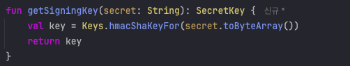

#### parserBuilder()는 왜 사용이 안될까?

```java
import io.jsonwebtoken.JwtException  
import io.jsonwebtoken.Jwts  
import io.jsonwebtoken.SignatureAlgorithm  
import io.jsonwebtoken.security.Keys  
import org.springframework.stereotype.Component  
import java.util.*  
  
@Component  
class TokenProvider(  
    private val jwtProperties : JwtProperties,  
) {  
   
    fun validateToken(token: String): Boolean = try {  
        Jwts.parserBuilder()  
            .setSigningKey(getSigningKey(jwtProperties.secret))  
            .build()  
            .parseClaimsJws(token)  
        true  
    } catch (ex: JwtException) {  
        false  
    }  
  }
```

JWT 토큰 검증을 위해서 `JJWT` 라이브러리를 사용하는 과정에서 `parserBuilder()`가 정의되지 않았다는 컴파일 오류가 발생하였다.


`parserBuilder`는 0.12버전 부터 `parser()` 형태로 변경되었다. 현재 기준으로 가장최신 버전인 `0.12.6` 버전을 바탕으로 아래와 같이 변경되었다.

```java
Jwts.parser()
  .verifyWith(secretKey or publicKey) // <----
  .build()
  .parseSignedClaims(jwsString);
```

또한 기존의 `setSigningKey()` 가 `verifyWith()` 로 변경되면서 `Key` 타입을 `publicKey` / `secretKey` 타입중 일치하는 걸로 명시해줘야한다. 결과적으로 기존에 `Key`로 반환되던 타입을 SecretKey로 특정하여 생성하도록 변경하였다.



#### 최종결과

```java
fun validateToken(token: String): Boolean =   
    try {  
    Jwts.parser()  
        .verifyWith(getSigningKey(jwtProperties.secret))  
        .build()  
        .parseSignedClaims(token)  
    true  
} catch (ex: JwtException) {  
    false  
}
```

---
#### 참고
- [JJWT github docs](https://github.com/jwtk/jjwt?tab=readme-ov-file#reading-a-jwt)