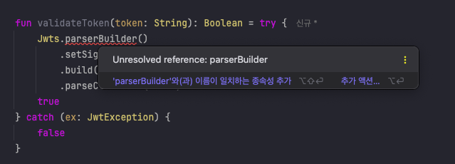

### ParserBuilder 가 없다는데..?

```java
import io.jsonwebtoken.JwtException  
import io.jsonwebtoken.Jwts  
import io.jsonwebtoken.SignatureAlgorithm  
import io.jsonwebtoken.security.Keys  
import org.springframework.stereotype.Component  
import java.util.*  
  
@Component  
class TokenProvider(  
    private val jwtProperties : JwtProperties,  
) {  
   
    fun validateToken(token: String): Boolean = try {  
        Jwts.parserBuilder()  
            .setSigningKey(getSigningKey(jwtProperties.secret))  
            .build()  
            .parseClaimsJws(token)  
        true  
    } catch (ex: JwtException) {  
        false  
    }  
  }
```

JWT 토큰 검증을 위해서 `JJWT` 라이브러리를 사용하는 과정에서 `parserBuilder()`가 정의되지 않았다는 컴파일 오류가 발생하였다.




---
#### 참고
- [망규블로그](https://mangkyu.tistory.com/217)