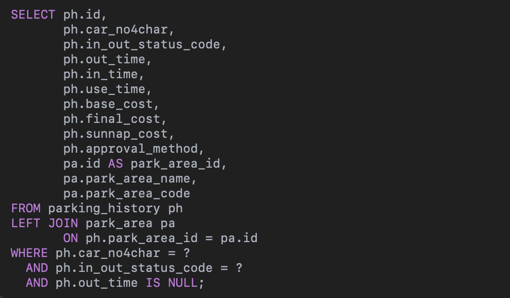

실무에서 `N+1`가 발생하여 해결했던 경험에 대해서 작성해보고자 한다.

### N+1 이란?

N+1 문제는 데이터를 1번의 Query로 조회한 후, 각 데이터의 연관된 데이터를 추가로 N번 Query 하는 비효율적인 데이터 조회 패턴이다. 보통 연관관계에서 주로 발생하게 되고, 코드 설계에 따라 `for`문  등을 돌면서 발생가능하다.

예를 들어 아래와 같은 코드가 있다고 가정해보자.
```java
@Entity

public class Post {

    @Id
    private Long id;

    private String title;

    @OneToMany(mappedBy = "post", fetch = FetchType.LAZY)
    private List<Comment> comments;
}
```

게시글과 댓글은 1:N 관계 이고, 댓글 컬렉션은 `LAZY` 로딩으로 설정되어있다. 이때 아래와 같이 `Service`에서 동작한다고 해보자.

```java
List<Post> posts = postRepository.findAll();

for (Post post : posts) {
    System.out.println(post.getComments().size());
}
```

이로인해 발생하는 `Query`는 다음과 같다.
```sql
-- 게시글 목록 조회 (1번)
SELECT * FROM post;

-- 게시글 1번의 댓글 조회
SELECT * FROM comment WHERE post_id = 1;

-- 게시글 2번의 댓글 조회
SELECT * FROM comment WHERE post_id = 2;

...

-- 게시글 N번의 댓글 조회
SELECT * FROM comment WHERE post_id = N;
```

이렇게 총 N+1 번의 Query가 발생하게 된다. N번 조회되는 데이터가 많지 않다면 큰 문제는 없겠지만 만약 게시글이 40만건이라면...? 40만 1번의 Query가 발생하는 것이다. 거기다가 댓글에서도 대댓글이 만약 연관되어 또다시 N+1이 발생한다면..? 이로인해 네트워크 비용과 DB부하가 증가하게 되고, 페이지 로딩속도나 트래픽에서 병목이 생길 수 있다.   

보통 `JPA`를 사용하다보면 일어나는 경우가 많지만 아래와 같은 경우에서 충분히 발생 가능하다.    

1. for, stream, map 등으로 연관 엔티티를 루프 돌며 조회하는 경우
2. JPA, Hibernate, QueryDSL 등 JPA 기반 ORM에서 `LAZY`연관을 접근하는 경우
3. Mybatis에서 `<Collection>`과 select 조합으로 매핑하여 사용하는 경우    


그럼 내가 실무를 진행하면서 겪었던 문제와 이에 대한 해결 방법까지 자세히 알아보자.

### 실무에서의 N+1

프로젝트를 진행하면서 API 호출을 하니 스크롤 5번 분량의 로그가 찍혔다.

```sql
Hibernate: select ... from parking_daily ...

Hibernate: select ... from parkarea_master where park_area_code=?
Hibernate: select ... from parkarea_master where park_area_code=?
Hibernate: select ... from parkarea_master where park_area_code=?
...
Hibernate: select ... from parkarea_master where park_area_code=?
```


그럼 이렇게 되는 이유는 뭐였을까? 바로 아래의 코드에서 발생했다.

```java
// List<ParkingHistory> 조회 후 
for (ParkingHistory history : historyList) {     history.getParkArea().getParkAreaName();
}
```

ParkingHistory 테이블과 parkArea 테이블이 `FetchType.LAZY)` 로 매핑되어있는 상태에서, 위의 코드를 실행하면 JPA는 ParkingHistory 목록을 먼저 Query 한 후, 각 row마다`getParkArea().getParkAreaName()` 같은 접근이 있을때 별도로 Query를 생성해 parkArea 테이블을 조회한다. 지금 부터 이를 방지하는 방법을 하나씩 알아보자.


#### FetchType.EAGER
첫번째로, FetchType을 `EAGER`로 설정하는 방법이 있다. 이를 통해서 연관된 `Entity`를 항상 즉시 로딩하도록 설정이 가능하고, 해당하는 테이블을 조회하는 `SQL` 실행 시 항상 `JOIN`을 통해 가져오도록 한다. 이방식을 사용하면 항상 연관데이터가 로딩되므로 `LazyInitializationException` 방지가 가능하다.

```java
@Entity  
@Table(name = "parking_history")  
public class ParkingHistory {  
	...
  
    @ManyToOne(fetch = FetchType.EAGER)  
    private ParkArea parkArea;  
}
```

하지만 항상 연관된 데이터까지 로딩 되므로 성능저하가 발생할수있고, 어디서든 로딩이 되기때문에 `Query`의 예측이 어려워진다. 이방식을 사용할때는 반드시 연관데이터가 필요한경우나 연관 엔티티의 데이터가 적은경우가 적합하다. `N+1` 문제 해결만을 목적으로 사용하기는 적합한 방법이 아니다.

#### @EntityGraph
`EntityGraph`는 JPA 메서드 레벨에서 특정 연관 엔티티를 EAGER처럼 로딩하도록 힌트를 주어, SQL에 JOIN을 붙여 실행하도록 한다. 즉 `Fetch Join`을 적용할수있도록 JPA에서 지원하는 기능으로 `JPQL`으로 `Join`을 작성하지않고 사용이 가능하다.

이방법은 `Left Outer Join` 만을 지원한다. 그러므로 다른 방식이 필요하다면 `JPQL`을 통해 직접 `JOIN`을 작성해야한다. 또한 동적인 조건이 있는 경우 사용이 어려우며 복잡한 연관 `Entity`가 많은 경우 관리 측면에서 어려움이 생긴다. 일반적으로 아래 `Query`처럼 `findByXXX` 같은 정적 쿼리에만 사용하는 것을 추천한다.   

이방법은 `QueryDSL` 도입이 안되어있고, `JPA`만을 사용하는 프로젝트나, 정적쿼리를 많이 사용하고 선언적으로 동작하는 경우에 사용하면 이점이 있다.

```java
@Repository
public interface ParkingHistoryRepository extends JpaRepository<ParkingHistory, Long> {
    @EntityGraph(attributePaths = {"parkArea"})
    List<ParkingHistory> findByCarNo4charAndInOutStatusCodeAndOutTimeIsNull(
        Short carNo4char,
        Byte inOutStatusCode,
        LocalDateTime outTime
    );
}
```

이로 인해 발생하는 결과는 아래 이미지와 같다.



[참고 : Spring Docs](https://docs.spring.io/spring-data/jpa/reference/jpa/query-methods.html#jpa.entity-graph)


#### BatchSize 설정

`BatchSize`를 조절하는 방법도 있다. `JPA`의 `default_batch_fetch_size` 설정으로, 지연 로딩을 할 때 요청되는 연관 `Entity`를 모아서 `IN (?,?,…)`로 한 번에 조회하는 방법이다.

application.yml 파일에 다음 설정을 추가하자.
```yaml
spring:
  jpa:
    properties:
      hibernate.default_batch_fetch_size: 100
```

실제 동작하는 코드는 다음과 같다.
```java
List<ParkingHistory> histories = parkingHistoryRepository.findAll(predicate);

histories.forEach(history -> {
    String name = history.getParkArea().getParkAreaName(); 
});
```

이방법을 사용하면 코드수정이 아닌 설정 적용 만으로, `Lazy` 전략을 유지한채 동작하도록 할수있다. 또한 여러 엔티티 타입에 동시에 적용되도록 할수있다. 

하지만 `Query`의 사이즈는 N/size + 1 회 발생하고, `Fetch Join`보다 성능상에서 떨어진다. 그리고 연관 데이터가 많다면 `IN` 절에 길이가 길어지는 단점이 있다.

이방식은 코드 변경이 힘든 상황에서 레거시 시스템의 성능 개선을 위해 적용하거나, `Lazy`전략은 유지하면서 최소한의 최적화를 하는 경우에 사용하는 이점이 있다.


#### DTO 직접 조회

이방법은 애초에 엔티티를 로딩하지 않고, 쿼리 결과를 `DTO` 형태로 바로 매핑하는 방법으로 `JPA` 영속성 컨텍스트에 올라가지 않으며 필요한 데이터만 가져오는 방법이다. 이 방법을 통해 `entity`의 불필요한 로딩을 방지하고, 메모리를 효율적으로 사용할수있으며, 클라이언트가 불필요한 정보는 배제하여 성능상으로 큰 이점이있다. 

하지만 `Entity`구조가 아니므로 `Dirty Checking`이 불가능하여 `Update` 와 같은 요청은 별도로 처리를 해야한다. 또한 `DTO`구조가 바뀌는 경우 `Query`도 변경 되므로 유지보수에 부담이 있고, 복잡한 `DTO` 매핑에서 가독성이 하락할수있다.

```java
public List<ParkingHistoryResponseDto> findInoutByCarNumDto(String carNum) {
    QParkingHistory ph = QParkingHistory.parkingHistory;
    QParkAreaMaster pa = QParkAreaMaster.parkAreaMaster;

    return queryFactory
            .select(Projections.constructor(
                    ParkingHistoryResponseDto.class, //DTO로 설정
                    ph.ticketNo,
                    ph.carNo4char,
                    pa.parkAreaName
            ))
            .from(ph)
            .join(ph.parkArea, pa)
            .where(
                ph.carNo4char.eq(Short.valueOf(carNum))
                .and(ph.inOutStatusCode.eq((byte) 1))
                .and(ph.outTime.isNull())
            )
            .fetch();
}
```

이방법은 `Update` / `Delete` 가 아닌 조회 전용으로 사용하는 API거나 대량 데이터 처리 및 성능이 중요한 상황에서 `Fetch Join` 대신 사용 할수있는 방법이다.


#### QueryDSL + fetchJoin

위에서 봤던 방법과 마찬가지로 `Fetch Join`을 SQL에 포함시켜 연관 데이터를 한 번의 `Query`로 로딩하는 방법이다. `JPA`는 연관 엔티티를 `Lazy Proxy`를 대신해 실제 객체로 채워서 넣는다.

이방법을 통해서 `Query` 1번으로 N+1을 해결하고, 동적인 조건의 `Query`도 가능해지게 된다. 또한 영속성 컨텍스트에 `Entity`가 관리되므로 이후 변경 감지 가능해진다.

하지만 `@OneToMany` 컬렉션 연관에서 중복 데이터 발생 가능성이 있고, 페이징 불가하거나 성능 저하가 발생할수있다. 또한 조회결과가 메모리에 모두 올라와서 대량 데이터가 있는 테이블에서는 주의가 필요하다. 그리고 `Distinct` 를 명시하지 않으면 중복된 엔티티가 리스트에 포함될수있다.
 
```java
public List<ParkingHistoryResponseDto> findInoutByCarNum(String carNum) {
    QParkingHistory ph = QParkingHistory.parkingHistory;
    QParkAreaMaster pa = QParkAreaMaster.parkAreaMaster;

    List<ParkingHistory> histories = queryFactory
            .selectFrom(ph)
            .join(ph.parkArea, pa).fetchJoin()
            .where(
                ph.carNo4char.eq(Short.valueOf(carNum))
                .and(ph.inOutStatusCode.eq((byte) 1))
                .and(ph.outTime.isNull())
            )
            .fetch();

    return histories.stream()
            .map(ParkingHistoryMapper::CarInfoToCarInfoResponseDto)
            .toList();
}
```

이방법은 동적 조건이 많고, 연관 데이터를 반드시 함께 가져와야 하는 상황이나, `@ManyToOne`, `@OneToOne`처럼 단건인 경우 사용이 유리하다.또한 연관 데이터를 `DTO`로 매핑하지 않고 `Entity`로 처리하는 경우 적합하다.


### 결과
최근 회사에서 신입지원자분의 이력서를 확인하다가 토이프로젝트에서 `JPA` 대신  `Mybatis` 를 도입한 이유를 N+1 문제 방지를 위해 사용했다는 것을 보고 한번더 이 포스팅의 필요성을 느꼈다.
 단순조회만 필요하고 `QueryDSL`를 적용하여 사용하던 프로젝트여서 마지막 방법을 선택하여 문제를 해결하였다. 그럼 지금까지 작성했던 내용을 요약해보자.

- 단순조회를 하는 경우라면 `QueryDSL+Fetch Join`
- 정적인 쿼리만을 한다면 `EntityGraph`
- 불필요한 엔티티 관리가 필요없다면 `DTO 직접 조회`
- Lazy 유지가 필요하고, 쿼리수를 줄이는 정도의 상황이라면 `BatchSize` 적용   


>  N+1 문제는 단순히 JPA의 연관관계 이슈가 아니라, 데이터 접근 패턴이 비효율적으로 작성돼 쿼리가 N+1번 발생하는 성능 문제이다. 연관관계에서 주로 발생하지만, 연관관계가 아닌 경우에도 동일한 패턴으로 나타날 수 있다. 해결책이 명확히 정해져 있다기 보다 상황에 맞춰 적절한 선택을 하는것이 중요하다.