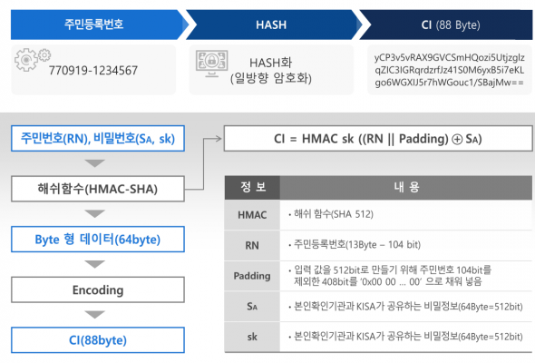
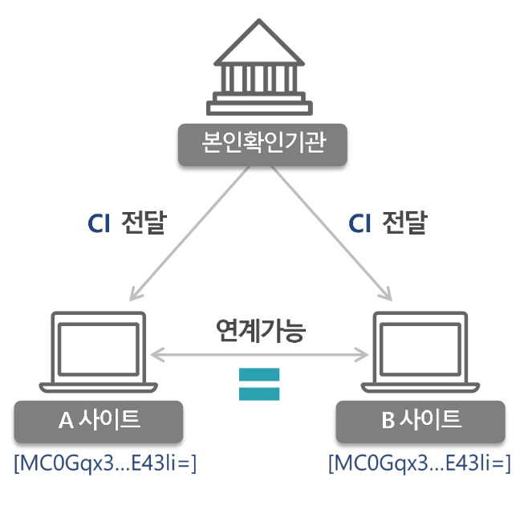
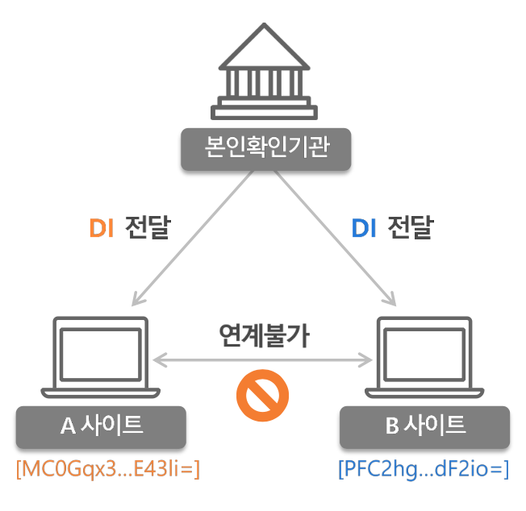
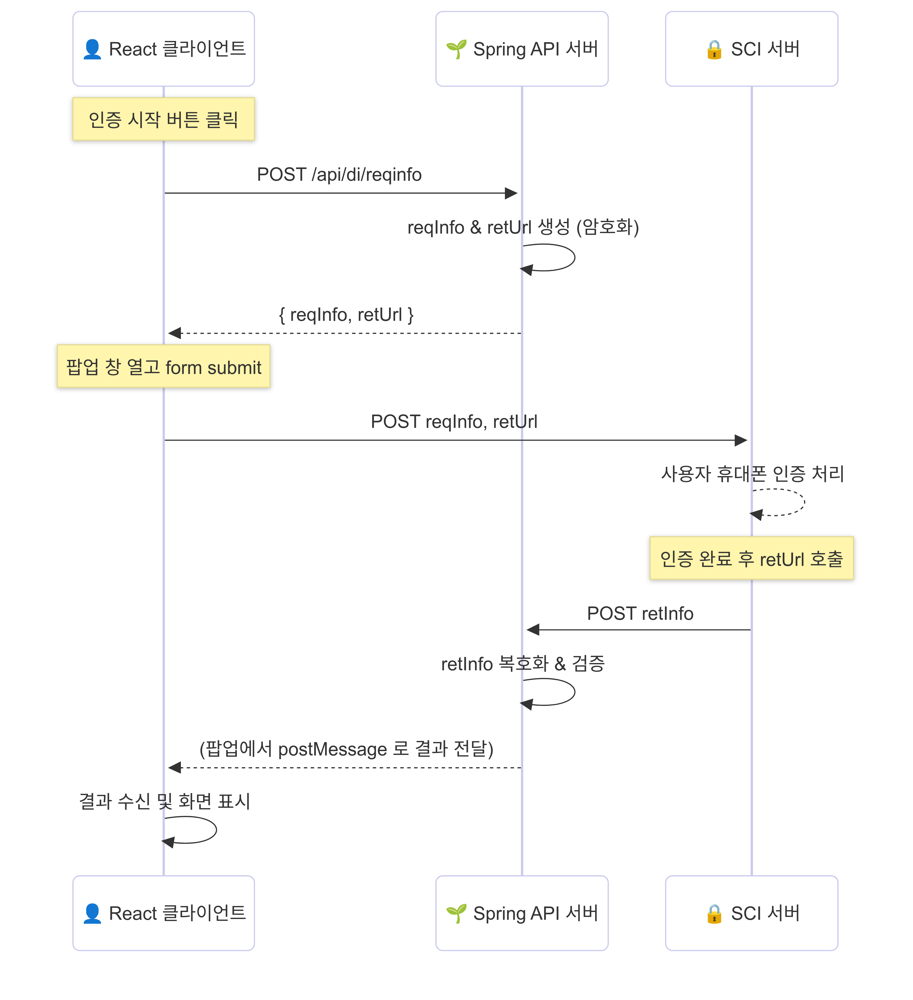

프로젝트를 진행하면서 본인인증 기능을 직접 구현해 볼수있는 좋은 기회가 생겼다. 기능 구현을 하면서 겪었던 문제들과 새롭게 알게된 내용을 공유해보고자 글을 작성하게 되었다. 구현에 대한 내용에 들어가기전 본인인증에 대해 찾아본 내용을 먼저 전달한다.

## 본인 인증

본인인증에 관해서는 해외와 한국의 상황이 많이 다르다. 한국은 실명 기반 인터넷 정책이 강하게 밀어 붙여진 국가로 휴대폰번호, 아이핀, 공인인증서, 본인확인기관제도 등을 통해 본인에 대한 식별 키가 도입되어있다. 즉 법 적으로 한개인에 대해 온라인에서 1:1로 매핑하는 구조이다. 

이러한 이유로 이전까지 한국에서는 개인을 식별할수있는 가장 좋은 수단인 `주민등록번호`를 통해 회원가입을 진행하는 경우가 많았으나 2014년 8월 주민등록번호 수집 금지 제도가 시행 되면서 회원가입 시 주민등록번호를 입력하는 방식은 더이상 찾아보기 힘들다. 

이렇게 주민등록번호를 수집할수없는 상황에서 사용자 개인을 식별해야하는 경우 어떻게 개인을 식별할수있을까? 이름, ID, Email 등으로 식별이 가능하겠지만 실제로는 여러가지 한계가 존재한다. 이름은 중복이 수없이 많고, 전화번호는 언제든 변경이 가능하다. 이메일도 여러개 발급이 가능하여 앞의 식별자로는 서비스간의 공통 식별자로써 사용이 어렵다.

이러한 공백을 매꾸기 위해서 한국에서는 본인확인기관을 통한 CI(Connecting Information)과 DI(Duplication Information) 체계가 도입되었다. 이 두값은 주민등록번호처럼 단일한 사용자를 식별 가능하게 하지만 서비스 운영자가 직접 저장하지 않아도 되며, 유출 위험이 대폭 줄어든다.

### CI / DI

먼저 **CI에 대해**서 알아보면 온라인에서 개인 식별을 위해 주민등록번호에 기반하여 생성된 값이다. NICE와 같은 인증 업체에서 발급되며 88Byte의 해시값으로 구성된다. 아래 그림은 KISA에서 제공하는 CI생성 예시이다.

이렇게 생성된 CI는 개인이 1개의 고유한 값을 가지며, 주민등록번호가 바뀌지않는 이상 변경되지 않는다. 주민등록번호 기반이기 때문에 유일성이 보장되고 단방향 암호화로 복호화가 불가능하다. 즉 어떠한 서비스에서 사용을 하더라도 같은 값이 보장되어 서비스간 연계시 큰 장점을 가진다.

다음으로 DI에 대해서 알아보자. DI는 중복 가입을 방지하기 위한 목적으로 만들어졌다. CI가 주민등록번호를 해시화 한 값이라면 DI는 주민등록번호와 각 서비스의 식별번호를 가지고 생성하는 방식이다. 66Byte로 구성되어있으며 해당 기관에 종속되어 인증 업체마다 같은 개인에 대해서 다르게 발급된다. 즉, 타 서비스와 연계시 동일성이 보장되지 않는다.

## 설계와 구현

고객사에서 원하는 요구사항을 중심으로 구현하는 서비스와 타 서비스와의 연계는 없을 예정이고, 사이트 자체에서 중복가입을 불가능하게 만들어야 하는 상황이었다. 위에서 알아본 내용을 바탕으로 본인인증에 대한 설계를 진행하였고 DI를 사용해서 회원에 대한 정보를 식별하는 것이 가장 알맞다고 결정했다. 이 결정을 기반으로 고객사측과 소통한 결과 **서울정보평가원**의 본인확인 서비스를 통해 본인인증을 진행하기로 하였다.

1. 회원가입시 본인인증 진행
2. 회원정보 변경시 본인인증 진행
3. 모바일 네이티브앱 지원

우리가 구현할 서비스에서 중요하게 생각해야할 부분은 3가지정도가 있었다. 이를 위해 웹 프론트에서는 인증 자체를 하나의 컴포넌트로 진행하기로 하였다. 즉 인증이 완료된 경우에만 다음 로직을 진행할수있게 구현이 필요했다.

서울정보평가원 도입을 위해 SCI측에서 제공하는 암호화 라이브러리를 사용해야했다. 연계 방법에 대한 문서와 함께 제공되어 사용 과정에서의 어려움은 없었다. 하지만 문서가 꽤나 오래된 내용이고 JSP 기반 이여서 변경이 필요한 부분이 있었다. 또한 평소의 요청방식과는 조금 다른점이 있어서 내용을 전달해보고자 한다.

