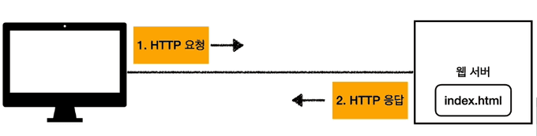
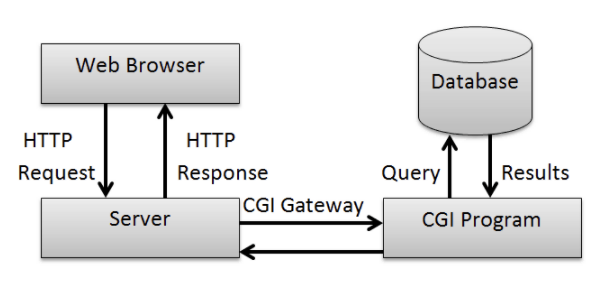
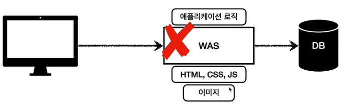
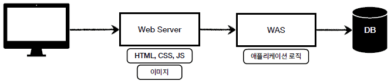
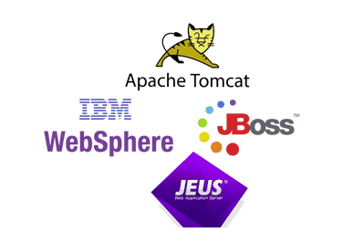
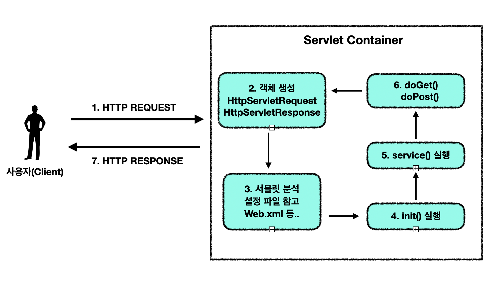
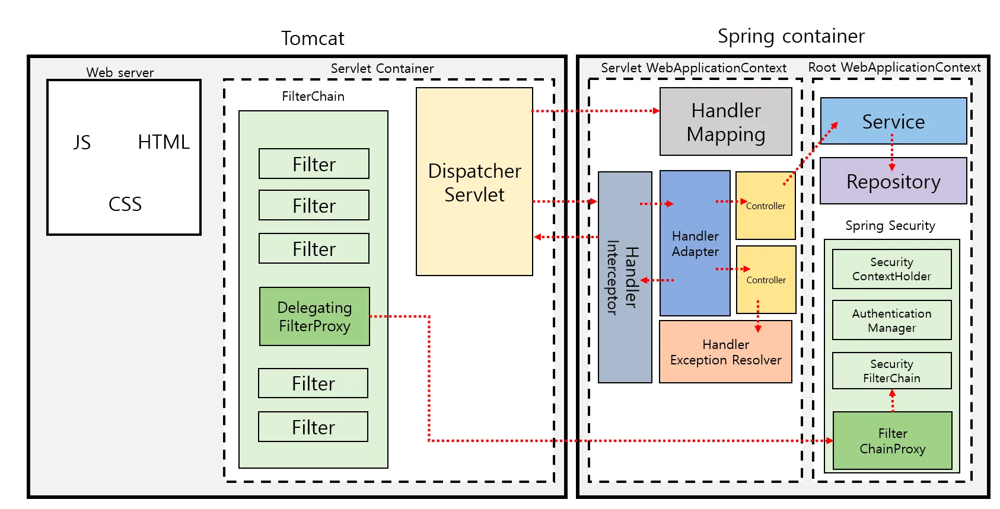

Spring을 통해 코드를 작성하다가 `HttpServletRequest`와 `HttpServletResponse`은 어디서 온걸까 하는 의문이 생겼다. `HTTP`를 통해 전송된 내용이 톰캣과 같은 WAS를 통해 변환된다는 것 까지는 알고있었지만 자세하게 알아보고싶어 블로그 작성을 시작하게 되었다. 

자 그럼 서블릿에 대해 깊이 알아보기 전에 정적페이지의 한계와 WAS의 등장이유에 알아보며 글을 시작해본다.

### 정적 웹페이지의 한계와 WAS


초창기의 웹의 출현 이후 정적(Static) 웹페이지가 대부분이였다. 웹서버는 요청한 HTML 파일을 그대로 내려주는 방식으로 동작한다. 


클라이언트가 브라우저에 `URL`을 입력하여 페이지를 요청하게 되면 `HTTP`요청을 받아 정적인(저장된) 콘텐츠를 사용자에게 전달하고, 클라이언트로 부터 콘텐츠를 받아 저장하거나 처리한다. 위의 그림에서 보이는 것처럼 대표적인 웹서버로는 `Apache`, `Nginx`, `IIS`등이 있다.

하지만 이러한 정적 웹페이지의 내용이 이미 정해져있다. 예를 들어 사용자별 맞춤 정보나 DB 연동이 불가능하여 각각의 사용자의 요구를 맞출수 없어 동적(Dynamic)인 웹페이지가 필요하게 되었다. 


이때 등작한것이 CGI(Common Gateway Interface)이다. 가장 오래된 표준 방식으로 웹서버에서 요청을 받으면 `PHP`,`Perl` , `C++` 등의 언어를 지원하면서 웹서버를 통해 요청을 받고 실행한 결과를 다시 웹서버를 거쳐 클라이언트에게 보낸다. 이에 대한 자세한 정보는 [링크](https://bentist.tistory.com/40)를 참고하자.

프로그래밍 언어로 CGI 규격을 준수하는 코드를 작성하면, 웹서버는 클라이언트의 요청에 대해 개별로 프로세스를 생성하는 방식으로 동작한다. 하지만 이부분에서 CGI의 한계가 발생하는데 클라이언트의 요청이 많아지면 각 요청마다 독립 프로세스(멀티 프로세싱)를 생성하는 점이다.

이러한 점을 보완하기위해 다양한 방법이 제시되었고, 그중 몇가지를 알아보자.

첫번째로 웹서버에 **스크립트 엔진을 내장**시켜 하나의 프로세스에서 여러 요청을 처리하는 방법이다. 웹서버 내장 모듈 방식이라고 불린다.


두번째로 사용자의 요청을 처리하는 프로그램을 **WAS(Web Application Server)로 실행**하는 방법이 있다.  백그라운드 프로세스로 HTTP 기반의 사용자의 요청을 기다리다가 요청이 발생하면 내부에서 스레드로 처리하여 로직을 실행 한다.




세번째로 **Reverse Proxy & 로드밸런싱** 방법이 있다. 이방법은 웹서버가 클라이언트 대신 WAS의 앞단에서 트래픽을 관리하고 정적파일은 웹서버가 직접 내려주고, 동적요청은 WAS로 포워딩 하는 방식으로, 여러대의 WAS로 분산처리가 가능하다.



그럼 WAS는 무엇일까? WAS는 웹에서 HTTP 프로토콜을 통해 사용자의 컴퓨터나 장치에 애플리케이션을 수행해주는 미들웨어로 주로 동적 서버 컨텐츠를 수행한다. 

즉, DB 조회나 로직 처리를 요구하는 동적 컨텐츠를 제공하기 위해 만들어졌으며 웹 컨테이너, 서블릿 컨테이너 등의 이름으로 불린다. 

여기서 Servlet이라는 개념이 등장한다. 서블릿은 1997년 자바 진영에서 웹개발을 위해 Servlet API를 정의했다. [tomcat docs](https://tomcat.apache.org/tomcat-5.5-doc/servletapi/index.html), [orcale docs](https://docs.oracle.com/javaee/7/api/javax/servlet/Servlet.html), [jakarta docs](https://jakarta.ee/specifications/servlet/4.0/apidocs/) 등에서 확인이 가능하고 C언어 기반의 CGI를 대체할수있는 자바 웹 애플리케이션의 표준이라는 목적으로 탄생한 서블릿은 자바의 표준 컴포넌트로 자리잡았다.(CGI가 꼭 C로만 만들어지는건 아님)

위의 이미지에 있는 Tomcat이나 Jetty와 같은 WAS 서버들이 `Servlet API`스펙의 구현체이다.`HttpServletRequest` , `HttpServletResponse` 와 같은 자바 인터페이스를 구현해서 자바 코드로 작성한 서블릿 / 스프링 같은 애플리케이션을 실행 시켜준다.

자바진영에서는 경량 WAS로 Tomcat, Jetty 등을 사용하고, 엔터프라이즈 급으로 IBM WebSphere, JEUS, JBoss 등을 사용한다. 엔터프라이즈 급은 Servlet Container와 J2EE 엔터프라이즈 기능 전체를 구성한다.

다른 진영에서는 `Servlet`을 사용하진 않지만 각 언어별로 표준 인터페이스를 구현하는 WAS가 존재하고 간단하게 살펴보면 다음과 같다.

- Python : WSGI 스펙을 구현한 WAS 사용
- Node.js : 자체 이벤트 루프 기반 HTTP 서버 내장, 대규모 서비스시 PM2, Nginx 등 함께 사용
- Go : WAS기능 내장


### Servlet을 알아보자

> 클라이언트의 요청을 처리하고, 그 결과를 반환하는 자바로 만든 HTTP 애플리케이션의 표준 인터페이스

간단하게 말해 서블릿이란 **자바를 사용하여 웹을 만들기 위한 기술**이다. 웹서버가 파싱한 요청과 응답을 개발자가 작성한 클래스로 넘겨주고, 그 클래스가 비즈니스 로직을 수행하여 응답을 만들어낸다. Spring MVC도 결국 서블릿 위에 올라가는 프레임워크이고, 핵심 컨트롤러가 바로 `DispatcherServlet` 이다.

먼저 서블릿의 특징과 장점을 나열해보면 다음과 같다.

- 클라이언트의 요청에 대해 동적으로 작동하는 웹 어플리케이션 컴포넌트
- Servlet API는 javax.servlet.* 또는 jakarta.servlet.* 패키지로 제공
- Servlet Container(Tomcat, Jetty, Undertow 등)가 요청/응답 객체를 만들어 서블릿에 전달
- Java Thread를 이용하여 동작
- MVC 패턴에서 `Controller` 담당
- `HTTP`프로토콜 서비스를 지원하는 HttpServlet 클래스를 상속
- TCP 위에서 동작하는 HTTP를 기반으로 요청/응답 처리 UDP 같은 비연결형보다 느리지만 신뢰성 제공
- 자바 언어의 이식성(OS 독립적) 
- 멀티스레딩 지원 → 동시 요청 처리 가능    
- 명확한 API 제공 (HttpServletRequest, HttpServletResponse)
- 웹 애플리케이션 개발의 표준

아래의 그림을 통해 Spring이 없는 상태의 순수 서블릿의 동작 흐름을 살펴보자.


브라우저에서 사용자가 http://example.com/hello라는 주소로 요청을 보낸다고 해보자. 이 순간 브라우저는 HTTP 프로토콜 규격에 맞는 요청 메시지를 만들어 네트워크를 통해 서버로 전달한다. 이 요청은 결국 TCP/IP를 타고 들어와 톰캣(Tomcat) 같은 서블릿 컨테이너가 수신하게 된다.

  컨테이너가 요청을 받으면 제일 먼저 개발자가 다룰 수 있도록 자바 객체를 만들어준다. 바로 HttpServletRequest와 HttpServletResponse이다. 요청 객체에는 클라이언트가 보낸 요청 라인, 헤더, 파라미터, 바디 데이터 등이 들어있고, 응답 객체에는 서버가 작성한 결과를 다시 클라이언트에게 보낼 수 있도록 출력 스트림이 포함되어 있다. 덕분에 개발자는 네트워크 소켓을 직접 건드리지 않고 객체 메서드 호출만으로 요청과 응답을 다룰 수 있다.

  이제 컨테이너는 해당 요청이 어느 서블릿 클래스에 매핑되어야 하는지 확인한다. 예전에는 web.xml 파일에 servlet-mapping이라는 설정을 적어 두었고, 현대에는 @WebServlet("/hello") 같은 애노테이션을 사용해 특정 URL과 서블릿 클래스를 연결한다. 이 과정을 통해 어떤 서블릿이 이 요청을 처리할지 정해진다.

  서블릿이 처음 호출되는 경우에는 준비 작업이 필요하다. 이때 한 번만 실행되는 것이 init() 메서드다. 서블릿이 메모리에 로드될 때 DB 연결이나 리소스 초기화 같은 작업을 여기서 처리한다. 이미 로드되어 있는 서블릿이라면 이 과정은 건너뛰고 곧바로 요청 처리로 넘어간다.

  요청이 들어올 때마다 컨테이너는 서블릿의 service(HttpServletRequest req, HttpServletResponse resp) 메서드를 호출한다. 이 메서드는 들어온 요청이 어떤 HTTP 메서드인지(GET, POST, PUT, DELETE 등) 확인한 뒤에 적절한 메서드를 실행한다.

  예를 들어 클라이언트가 GET 요청을 보냈다면 doGet()이, POST 요청이라면 doPost()가 실행된다. PUT과 DELETE 요청도 각각 doPut()과 doDelete()로 연결된다. 개발자는 이 메서드들 안에 비즈니스 로직을 작성한다. 예를 들어 resp.getWriter().write("Hello");와 같이 코드를 작성하면 클라이언트는 “Hello”라는 문자열을 응답으로 받게 된다.

  마지막으로 서블릿에서 작성한 응답이 HttpServletResponse 객체에 담긴다. HTML, JSON, 혹은 다른 데이터일 수 있다. 이 응답은 다시 톰캣을 거쳐 TCP 소켓을 통해 네트워크로 전송되고, 최종적으로 클라이언트 브라우저가 이를 수신해 화면에 표시한다.


### Servlet + Spring

자그럼 여기 Spring MVC를 얹어보자. 

사용자가 브라우저에서 어떤 주소를 입력하면 가장 먼저 톰캣 같은 서블릿 컨테이너가 요청을 받는다. 요청은 단순히 컨트롤러 메서드로 직행하지 않고 여러 단계를 거치면서 처리된다.

먼저, 요청은 톰캣 내부의 FilterChain을 통과한다. 필터는 보안 검증, 로깅, CORS 처리 같은 공통 기능을 수행하기 위해 존재한다. 여러 개가 등록될 수 있으며, 체인 형태로 순서대로 실행된다. 필터는 서블릿보다 더 앞단에서 동작하기 때문에, 컨트롤러에 도달하기 전에 요청을 가로채거나 수정할 수 있다.

필터를 통과한 요청은 이제 Spring MVC의 진입점인 DispatcherServlet으로 전달된다. DispatcherServlet은 모든 요청을 중앙에서 받아 Spring MVC의 핵심 처리 흐름으로 흘려보내는 역할을 한다.

다음 단계는 HandlerMapping이다. 여기서 Spring은 들어온 요청 URL과 HTTP 메서드를 기준으로, 어떤 컨트롤러의 어떤 메서드를 실행해야 할지 결정한다. 예를 들어 /users라는 요청이 들어왔다면 @GetMapping("/users")가 붙은 메서드를 찾아내는 것이다.

컨트롤러를 찾았으면 이제 HandlerAdapter가 실행된다. 이 단계에서는 컨트롤러 메서드를 실제로 호출할 수 있도록 준비한다. 파라미터 바인딩이 여기서 일어난다. 예를 들어 @RequestParam, @PathVariable, @RequestBody와 같은 애노테이션을 기반으로 클라이언트가 보낸 데이터를 메서드 파라미터 객체로 변환해준다.

그 후 드디어 컨트롤러 메서드가 실행된다. 컨트롤러는 내부적으로 서비스(Service)를 호출하고, 서비스는 다시 리포지토리(Repository)를 거쳐 DB에 접근한다. 즉, 실제 비즈니스 로직은 이 단계에서 수행된다.

비즈니스 로직이 끝나면 결과가 컨트롤러로 반환되고, 다시 DispatcherServlet으로 돌아온다. 반환값이 뷰 이름이라면 ViewResolver가 동작해서 JSP, Thymeleaf 같은 뷰를 찾아 렌더링한다. 만약 `@RestController`라면 반환 객체를 그대로 JSON으로 변환해 응답 본문에 담는다.

마지막으로 DispatcherServlet은 완성된 응답을 HttpServletResponse에 작성한다. 이 응답 객체는 톰캣에 의해 TCP 소켓으로 `flush`되고, 최종적으로 클라이언트 브라우저가 수신하여 사용자 화면에 결과가 나타난다.

이렇게 순수 서블릿으로 구현했을때 보다 Spring을 통해 추상화하여 편리하게 구현가능한 장점이있다. 이내용을 하단에 표로 정리해보았다.

| 구분      | 순수 서블릿                                   | Spring MVC                                            |
| ------- | ---------------------------------------- | ----------------------------------------------------- |
| 매핑      | web.xml / @WebServlet                    | @Controller + @RequestMapping                         |
| 요청 분배   | 컨테이너가 직접 서블릿 찾아 호출                       | DispatcherServlet (Front Controller)                  |
| 파라미터 처리 | request.getParameter(“id”) 직접 호출         | @RequestParam, @ModelAttribute, @RequestBody 등 자동 바인딩 |
| 응답 작성   | response.getWriter().write(“HTML”) 직접 작성 | 뷰 리졸버, 메시지 컨버터가 자동 처리                                 |
| 난이도     | 로우레벨, 번거로움                               | 추상화 ↑, 생산성 ↑                                          |


### 마지막으로 복습

브라우저는 사용자가 주소창에 입력한 URL을 기반으로 **HTTP 요청 메시지**를 생성

```
GET /hello HTTP/1.1
Host: example.com
User-Agent: Chrome/...
```

이 요청은 TCP/IP 소켓을 통해 서버의 80(HTTP) 또는 8080(Spring Boot 내장 톰캣 기본 포트)으로 전달된다.

##### 톰캣 Connector가 요청 수신

Spring Boot는 내부적으로 톰캣(서블릿 컨테이너)을 실행한다.

톰캣의 **Connector**(예: Http11NioProtocol)가 8080 포트를 리스닝 중이고, 요청이 들어오면 소켓에서 데이터를 읽는다.
- InputStream으로 Raw HTTP 데이터 수신
- Request Line(GET /hello), Header(User-Agent 등), Body(JSON, Form 데이터 등) 파싱
    

##### HttpServletRequest / Response 객체 생성

톰캣은 파싱한 데이터를 자바 객체로 추상화한다. 하지만 개발자가 직접 다루는 건 HttpServletRequest, HttpServletResponse 인터페이스이다. 그래서 톰캣은 **Facade 패턴**을 적용해 다음과 같은 객체를 만든다.

```java 
HttpServletRequest req = new RequestFacade(catalinaRequest);
HttpServletResponse res = new ResponseFacade(catalinaResponse);
```
- RequestFacade / ResponseFacade : 개발자에게 노출되는 껍데기
- catalinaRequest / catalinaResponse : 내부적으로 실제 동작하는 구현체
    
##### 서블릿 매핑
톰캣은 URL 패턴(/hello)을 보고 어떤 서블릿이 처리해야 하는지 결정한다. 결과적으로 /hello 요청은 결국 DispatcherServlet이 처리하게 된다.

- web.xml 설정
- @WebServlet 어노테이션
- Spring Boot : 자동으로 **DispatcherServlet**에 모든 요청이 매핑 `(/ pattern)`
    

##### DispatcherServlet 동작

이제 요청은 Spring MVC 안으로 들어온다. DispatcherServlet은 스프링에서 가장 중요한 Front Controller 역할을 수행한다. 이 흐름을 살펴보면 아래와 같다.

1. service() 실행 → doDispatch() 호출
2. **HandlerMapping** : URL과 매핑된 컨트롤러 메서드 검색
    ex) /hello → HelloController.hello()
3. **HandlerAdapter** : 컨트롤러 실행 준비
    - 파라미터 바인딩 (@RequestParam, @RequestBody)
    - 데이터 변환
4. **컨트롤러 실행** : 실제 비즈니스 로직 수행
```java
@GetMapping("/hello")
public String hello() {
    return "hello.html";
}
```
5. **ViewResolver 처리**
    - String 반환 시 : 템플릿 엔진(Thymeleaf 등)으로 HTML 렌더링
    - @RestController 반환 시 : 객체 → JSON 직렬화
        
##### HttpServletResponse 채우기

컨트롤러 결과가 나오면, DispatcherServlet은 응답을 HttpServletResponse에 작성한다. 예시는 아래와 같다.
- 상태 코드 (200 OK)
- 헤더 (Content-Type: text/html; charset=UTF-8)
- 바디 (HTML, JSON 등)
    

##### 톰캣이 응답 전송

응답이 준비되면 DispatcherServlet은 제어권을 톰캣에게 반환한다. 톰캣은 ResponseFacade 내부 버퍼에 있는 내용을 TCP 소켓의 OutputStream으로 `flush` 한다.

##### 클라이언트 수신

브라우저는 서버로부터 전달된 HTTP 응답을 받고, HTML이라면 화면에 렌더링하고, JSON이라면 개발자도구의 Network 탭에서 확인할 수 있게 된다.


### 결과

서블릿에 대해 깊게 알아볼수있는 좋은 기회였다. 자바와 스프링부트를 통해 작성하는 코드는 웹의 정말 일부분이라는 것을 다시한번 확인할수있었다. 부분이 아닌 전반을 알고 이해하는 개발자가 되자.

### Ref.
[Servlet Spec](https://javaee.github.io/servlet-spec/downloads/servlet-4.0/servlet-4_0_FINAL.pdf)
[geeks](https://www.geeksforgeeks.org/java/what-is-dispatcher-servlet-in-spring/)
[stackoverflow](https://stackoverflow.com/questions/5930795/difference-between-servlet-and-web-service)