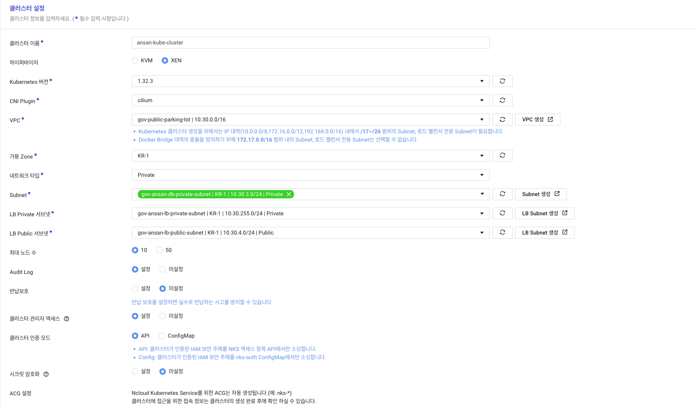
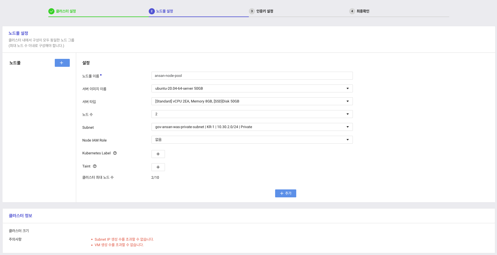
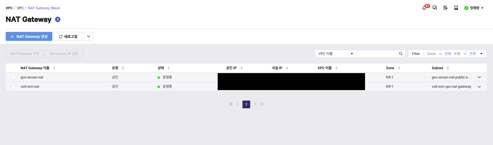
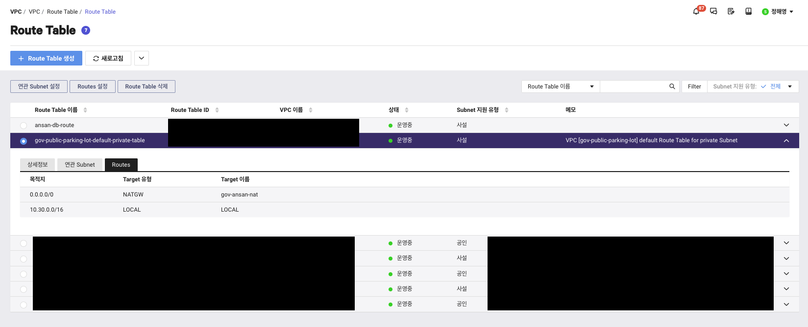
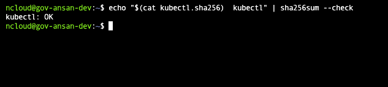
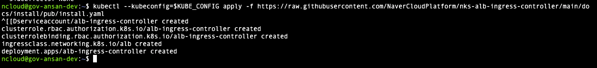
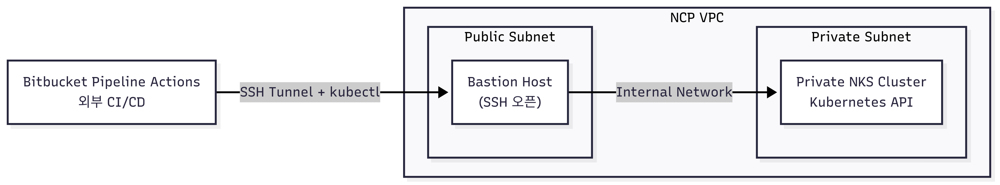

### 구축 순서

1. VPC 준비
2. Subnet 생성
3. NKS클러스터 생성
4. 노드풀 생성
5. 도메인 및 LB 설정
6. 관리용 시스템 생성
7. Bastion Host 구축
8. KubeCtl 설치 

### NCP 설정

#### VPC 준비
VPC 및 서브넷을 생성한다.







#### BastionHost 생성
kubectl을 사용하기 위해서는 bastionHost가 필요하다.

#### NAT 설정
NKS 클러스터가 Private 서브넷에 구성되어있어 노드가 Public Internet에 접근할수없다. NKS 노드에 외부 인터넷이 열려야지 `Docker Registry`등의 서비스를 사용 가능하다. NAT Gateway 설정으로 노드는 외부에 노출하지 않고, 인터넷이 가능한 환경을 구축한다.

먼저 NAT Gatway를 생성하고, NAT Gateway를 Private 서브넷의 Route Table에 등록해준다.




### BastionHost 설정
#### KubeCtl 설치

이번에 구축한 서버의 경우 `X86-64` 이고, 혹시 ARM 기반 으로 구축을 하는경우 아래 링크를 참고하자.

- [kubectl 구축](https://kubernetes.io/docs/tasks/tools/install-kubectl-linux/#installusingnativepackagemanagement)

1. 최신 릴리스 다운로드
```bash
   curl -LO "https://dl.k8s.io/release/$(curl -L -s https://dl.k8s.io/release/stable.txt)/bin/linux/amd64/kubectl"
```

2. 바이너리 검증
```bash
   curl -LO "https://dl.k8s.io/release/$(curl -L -s https://dl.k8s.io/release/stable.txt)/bin/linux/amd64/kubectl.sha256"
```
    
```bash
echo "$(cat kubectl.sha256)  kubectl" | sha256sum --check
```

명령어를 통해 정상 출력시 아래와 같은 내용이 표출 된다.



3. kubectl 설치
```bash
sudo install -o root -g root -m 0755 kubectl /usr/local/bin/kubectl
```

4. 설치된 버전 확인
```bash
kubectl version --client
```

5. ncloud 접속을 위한 Config 설정
```bash
## ~/.ncloud/configure

[DEFAULT]
ncloud_access_key_id = AK_XXX
ncloud_secret_access_key = SK_XXX
ncloud_api_url = https://ncloud.apigw.gov-ntruss.com
```

```bash
chmod 600 ~/.ncloud/configure
```


6. 

현재 프로젝트에서 `Docker Hub`가 아닌 `NCP`에서 지원하는 Docker Registry를 사용중이여서 해당 부분을 Secret으로 만들어 설정해줘야한다.

7. 도커 레지스트리 설정
```bash

```


#### Ingress 설치

Ingress Controller의 사용 방식은 2가지가 있다. 이중 내가 사용할 방식은 `ALB`를 생성하여 Ingress로 컨트롤 하는 방식이다.

1. Nginx Ingress
2. ALB Ingress


3. Ingress Controller 설치 확인
```bash
kubectl get pods -n kube-system | grep ingress
```

2. 없으면 설치를 진행
- ALB 방식
```bash
kubectl --kubeconfig=$KUBE_CONFIG apply -f https://raw.githubusercontent.com/NaverCloudPlatform/nks-alb-ingress-controller/main/docs/install/pub/install.yaml
```

설치 완료시 아래와 같은 응답을 받을수 있다.



- Nginx 방식
```bash
kubectl apply -f https://raw.githubusercontent.com/kubernetes/ingress-nginx/controller-v1.10.1/deploy/static/provider/cloud/deploy.yaml
```


설치가 완료되면 이제 Ingress를 세팅해서 실제로 `apply`하는 작업을 수행해야 한다. 이를 위해 Ingress.yml을 작성하자. 자세한 설명은 하단의 링크를 참고하자.
[NCP - ALB Ingress 설정 방법](https://guide.ncloud-docs.com/docs/k8s-k8suse-albingress)

3. Ingress.yml
```yaml
ncloud@vstl-wm-kubectl:~$ cat watchmile-api-ingress.yaml 
apiVersion: networking.k8s.io/v1
kind: Ingress
metadata:
  name: ansan-gov-ingress
  annotations:
    alb.ingress.kubernetes.io/listen-ports: '[{"HTTP":80}, {"HTTPS":443}]'
    alb.ingress.kubernetes.io/ssl-certificate-no: "26109"
    alb.ingress.kubernetes.io/ssl-redirect: "443"
    alb.ingress.kubernetes.io/load-balancer-name: ansan-kube-alb
    alb.ingress.kubernetes.io/load-balancer-type: "alb"
    alb.ingress.kubernetes.io/network-type: public
    alb.ingress.kubernetes.io/load-balancer-size: small
    alb.ingress.kubernetes.io/healthcheck-path: /actuator/health
spec:
  ingressClassName: alb
  tls:
    - hosts:
        - api.ansanuc.net
      secretName: dummy-tls
  rules:
#    - host: api.aidt.live
    - host: gov.watchmile.net
      http:
        paths:
          - path: /
            pathType: Prefix
            backend:
              service:
                name: watchmile-api
                port:
                  number: 80
#    - host: ansan-ppl.aidt.live
    - host: ansan-gov.watchmile.net
      http:
        paths:
          - path: /
            pathType: Prefix
            backend:
              service:
                name: watchmile-dashboard
                port:
                  number: 80
    - host: payment-gov.watchmile.net
      http:
        paths:
          - path: /
            pathType: Prefix
            backend:
              service:
                name: payment-api
                port:
                  number: 80
```

### 파이프 라인

사용중인 레포지토리는 `Bitbucket` 인데, `Pipeline`이라는 좋은 기능을 제공한다. Github Action 처럼 Bitbucket 자체에 내장되어 `CI/CD`를 간편하게 해줄수있는 도구이다. 이를 통해 구축 하려고 하는 방식은 다음과 같다.



### Bitbucket 설정

`CI/CD`를 적용할 레포지토리에 해당 `yml`을 세팅한다.

#### kube-deploy.yml
```yaml
apiVersion: v1
kind: Service
metadata:
  name: ansan-daemin-api
spec:
  selector:
    app: ansan-daemin-api
  type: ClusterIP
  ports:
    - port: 80
      targetPort: 7070
---
apiVersion: apps/v1
kind: Deployment
metadata:
  name: ansan-daemin-api
spec:
  replicas: 1
  selector:
    matchLabels:
      app: ansan-daemin-api
  template:
    metadata:
      labels:
        app: ansan-daemin-api
    spec:
      imagePullSecrets:
        - name: registry
      containers:
        - name: ansan-daemin-api
          image: {{image}}
          ports:
            - containerPort: 7070
```
`kube-deploy.yml`은 관리의 편의성과 안정성을 위해서 필요하다. 만약 해당 `yml`파일이 없더라도

```bash
kubectl set image deployment/ansan-daemin-api ansan-daemin-api=이미지명
```

위의 CLI 명령어를 통해서 배포하는것도 가능하지만, 이렇게 하면 전체 Deployment에 대한 정의가 코드로 남지 않는다. `kube-deploy.yml`을 만듦으로써, 클러스터 초기화 / 재배포 상황에서 사용이 가능하고, 다른 환경을 구성 하더라도 재사용이 가능하다. 그리고 `kubectl` apply 를 통해 선언적으로 배포가 가능해진다.

#### bitbucket.yml
```yaml
image: atlassian/default-image:4

options:
  docker: true
  size: 2x

definitions:
  services:
    docker:
      memory: 2048

pipelines:
  branches:
    main:
      - step:
          name: Docker build & push
          size: 2x
          script:
            - export IMAGE_NAME=$NCLOUD_CR_URL/$APPLICATION_NAME:$BITBUCKET_COMMIT
            - docker build -t $APPLICATION_NAME .
            - docker tag $APPLICATION_NAME $IMAGE_NAME
            - echo "$NCLOUD_KEY" | docker login -u $NCLOUD_ID $NCLOUD_CR_URL --password-stdin
            - docker push $IMAGE_NAME
          services:
            - docker
          caches:
            - docker
      - step:
          name: Deploy to NKS via Bastion (GitOps style)
          deployment: production
          script:
            - export IMAGE_NAME=$NCLOUD_CR_URL/$APPLICATION_NAME:$BITBUCKET_COMMIT
            - apt-get update && apt-get install -y sshpass openssh-client
            - ssh-keyscan -H $DEV_SERVER_HOST >> ~/.ssh/known_hosts

            # YAML에 이미지 치환
            - sed -i "s|{{image}}|$IMAGE_NAME|g" kube-deployment.yml

            # Bastion에 접속해서 apply
            - cat kube-deployment.yml | sshpass -p "$SERVER_PASS" ssh -o StrictHostKeyChecking=no $SERVER_USER@$BASTION_HOST "
              export PATH=\$PATH:/home1/ncloud/bin &&
              kubectl --kubeconfig /home1/ncloud/kubeconfig-ansan.yaml apply -f -
              "

    ## Develop
    develop:
      - step:
          name: Docker build & push
          size: 2x
          script:
            - export IMAGE_NAME=$NCLOUD_CR_URL/$APPLICATION_NAME:latest
            - docker build -t $APPLICATION_NAME .
            - docker tag $APPLICATION_NAME $IMAGE_NAME
            - echo "$NCLOUD_KEY" | docker login -u $NCLOUD_ID $NCLOUD_CR_URL --password-stdin
            - docker push $IMAGE_NAME
          services:
            - docker
          caches:
            - docker

      - step:
          name: Deploy to Server
          deployment: test
          script:
            - export IMAGE_NAME=$NCLOUD_CR_URL/$APPLICATION_NAME:latest
            - apt-get update && apt-get install -y sshpass openssh-client
            - ssh-keyscan $DEV_SERVER_HOST >> ~/.ssh/known_hosts

            - echo "$SERVER_PASS" | sshpass -p "$SERVER_PASS" ssh -o StrictHostKeyChecking=no $SERVER_USER@$BASTION_HOST "
              cd $DOCKER_COMPOSE_PATH &&
              
              echo -n \"$NCLOUD_KEY\" | docker login -u \"$NCLOUD_ID\" --password-stdin \"$NCLOUD_CR_URL\" &&
              
              docker-compose stop ansan-daemin-api || true &&
              docker-compose rm -f ansan-daemin-api || true &&
              
              docker-compose pull ansan-daemin-api &&
              docker-compose up -d ansan-daemin-api &&
              
              docker image prune -f --filter=\"until=24h\"
              "
```


### 내가 만난 문제

#### Pull 이 안땡겨짐
```bash
ncloud@server:~$ kubectl get pods
NAME                                READY   STATUS             RESTARTS   AGE
ansan-daemin-api-7578988667-ptkqw   0/1     InvalidImageName   0          15h
```

### Ref.
- [NCP 가이드](https://guide.ncloud-docs.com/docs/k8s-k8sprep)
- 