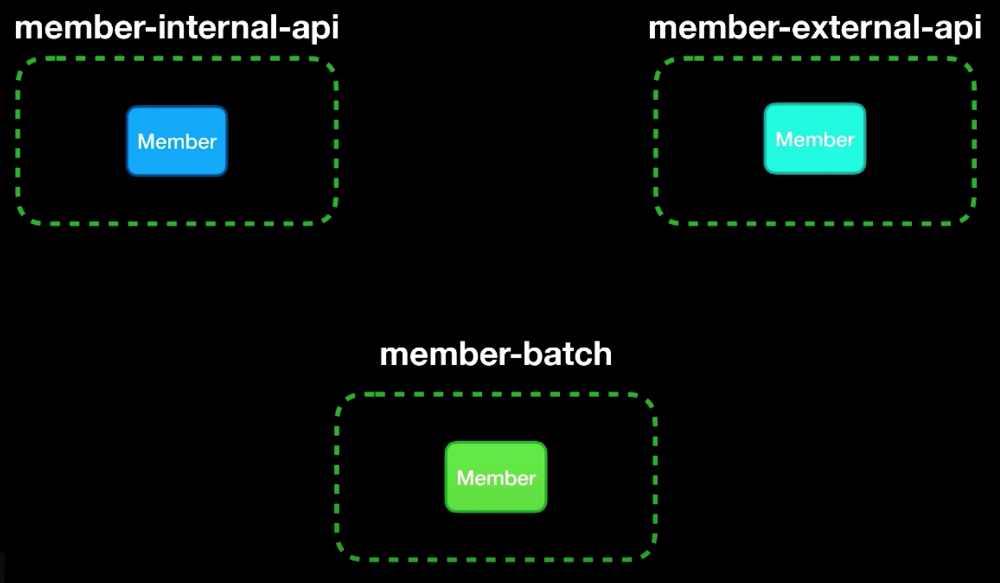
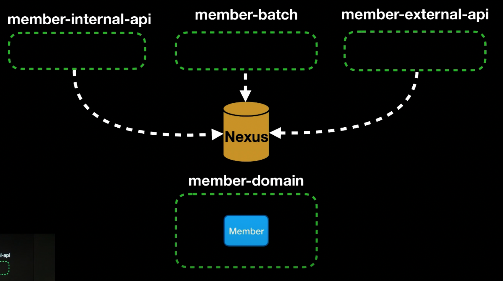
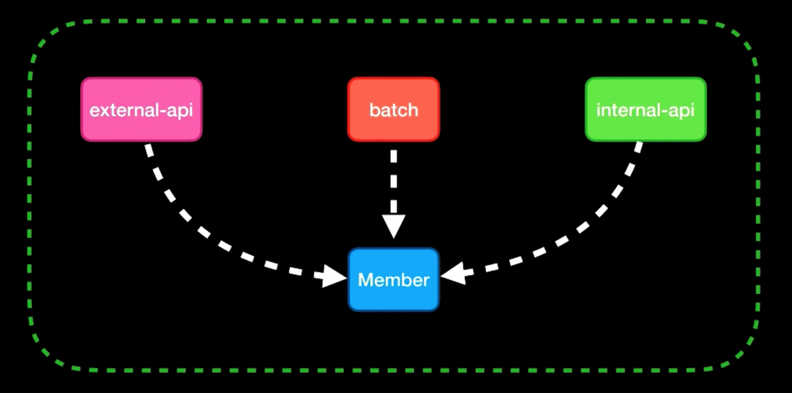

MSA 전환을 염두해둔 상태에서 첫번째 스텝으로 멀티모듈에 대해서 공부하고 적용해보자.

## MSA / 멀티모듈

사내의 서비스는 다음과 같이 나눠진다.
1. API
2. ADMIN
3. BATCH(Gateway)
4. WEB
5. Cache 등


> 좋은 아키텍처는 시스템이 모놀리틱 구조로 태어나서 단일 파일로 배포되더라도, 이후에는 독립적으로 배포 가능한 단위의 집합으로 성장하고, 독립적인 서비스나 마이크로 서비스 수준까지 성장할수있도록 만들어져야한다. 또한 좋은 아키텍처라면 상황에 의해 진행방향을 거꾸로 돌려 원래 형태인 모놀리틱 구조로 되돌릴수 있어야한다.

## 멀티 모듈의 구조

먼저 멀티모듈의 구조에 대해서 살펴보자. 멀티모듈은 **단일 모듈 멀티프로젝트**, **단일모듈 멀티프로젝트 + 저장소** , **멀티모듈 단일 프로젝트**로 나눠볼수있다.

### 단일 모듈 멀티 프로젝트

- 각각의 프로젝트 단위
    - IDE를 쓴다면 3개의 IDE 화면을 띄워둔 상태로 개발을 진행하는 형태
- `Member` 라는 클래스가 공유(중복)되고 있다.
    - member-internal-api에서 `Member`가 수정되면 나머지 프로젝트에도 수정이 필요

### 단일 모듈 멀티 프로젝트 + 내부 Maven 저장소

- Nexus와 같은 사설 Maven Repository를 만들어서 각각의 프로젝트에서 공유하고 있는 DTO나 도메인 클래스들을 분리 후 프로젝트화 시켜서 Nexus에 업로드하는 방식
- `member-domain`의 `Member` 수정 1회로 각각 프로젝트에 적용 가능해져 일관성이 보장
- 개발시 귀찮은 작업이 발생
	- membr-internal-api 수정하여 Nexus 배포하고 member-domain에서 Nexus에 배포된 내용을 다운로드
	- 기능 개발 과정에서 리소스가 많이들게 됨

### 멀티 모듈 단일 프로젝트

- 프로젝트는 하나고, 그안에 여러개의 모듈을 설치 가능한 방법
- IDE 하나만 사용하여 시스템적으로 보장되는 일관성, 빠른 개발 사이클 확보가 가능

결국 세번째 방식인 **멀티 모듈 단일 프로젝트**가 가장 현실적이라고 판단했다. IDE 하나로 전체를 관리할수있고, 모듈간 의존성도 Gradle로 명확하게 관리되니까.

## 모듈 설계

사내 서비스 구조에 맞춰서 모듈을 다음과 같이 나눴다.

```
root
├── module-core         # 공통 Entity, DTO, 유틸
├── module-api          # API 서버 (외부 클라이언트 대상)
├── module-admin        # ADMIN 서버 (내부 관리자 대상)
├── module-batch        # Batch 처리
└── module-web          # 웹 프론트엔드 서빙
```

모듈을 나누는 기준이 좀 고민됐는데, 핵심은 **공유 코드를 어디에 둘것인가**였다. `Entity`, `Repository`, 공통 `DTO` 같은건 모든 모듈이 필요로 하니까 `module-core`에 넣고, 나머지 모듈들이 `core`를 의존하는 구조로 잡았다.

## Gradle 설정

### settings.gradle.kts

```kotlin
rootProject.name = "my-project"

include("module-core")
include("module-api")
include("module-admin")
include("module-batch")
```

### 루트 build.gradle.kts

```kotlin
plugins {
    java
    id("org.springframework.boot") version "3.2.0"
    id("io.spring.dependency-management") version "1.1.4"
}

subprojects {
    apply(plugin = "java")
    apply(plugin = "org.springframework.boot")
    apply(plugin = "io.spring.dependency-management")

    group = "com.vstl"
    version = "0.0.1-SNAPSHOT"

    java {
        sourceCompatibility = JavaVersion.VERSION_17
    }

    repositories {
        mavenCentral()
    }

    dependencies {
        implementation("org.springframework.boot:spring-boot-starter")
        compileOnly("org.projectlombok:lombok")
        annotationProcessor("org.projectlombok:lombok")
        testImplementation("org.springframework.boot:spring-boot-starter-test")
    }
}
```

`subprojects` 블록에 공통 설정을 넣으면 모든 모듈에 적용된다. 모듈별로 추가 의존성이 필요하면 각 모듈의 `build.gradle.kts`에서 개별로 추가하면 된다.

### module-core/build.gradle.kts

```kotlin
// core는 독립 실행하지 않으므로 bootJar 비활성화
tasks.bootJar { enabled = false }
tasks.jar { enabled = true }

dependencies {
    implementation("org.springframework.boot:spring-boot-starter-data-jpa")
}
```

여기서 중요한게 `bootJar`를 비활성화하는 부분이다. `core` 모듈은 단독으로 실행되는 애플리케이션이 아니라 라이브러리처럼 동작해야하므로, `bootJar` 대신 일반 `jar`로 패키징해야한다. 이거 안 해주면 빌드할때 메인 클래스를 찾을수없다는 에러가 발생한다.

### module-api/build.gradle.kts

```kotlin
dependencies {
    implementation(project(":module-core"))
    implementation("org.springframework.boot:spring-boot-starter-web")
    implementation("org.springframework.boot:spring-boot-starter-security")
}
```

`implementation(project(":module-core"))`로 `core` 모듈을 의존하면 `Entity`, `Repository` 등을 바로 사용할수있다.

## 적용 중 마주한 문제들

### 1. Entity Scan 안되는 문제

`module-api`에서 `module-core`의 `Entity`를 인식하지 못하는 문제가 발생했다. 원인은 `@SpringBootApplication`이 자신의 패키지 하위만 스캔하기 때문이다.

```java
// module-api의 메인 클래스
@SpringBootApplication(scanBasePackages = "com.vstl")
@EntityScan(basePackages = "com.vstl.core")
@EnableJpaRepositories(basePackages = "com.vstl.core")
public class ApiApplication {
    public static void main(String[] args) {
        SpringApplication.run(ApiApplication.class, args);
    }
}
```

`scanBasePackages`, `@EntityScan`, `@EnableJpaRepositories`를 명시적으로 지정해줘야 다른 모듈의 `Bean`과 `Entity`를 인식한다. 처음에 이걸 몰라서 한참 헤맸다.

### 2. 순환 의존 주의

모듈간 의존 방향은 반드시 한쪽으로만 흘러야한다.

```
module-api → module-core  (O)
module-core → module-api  (X)
```

`core`가 `api`를 의존하게 되면 순환이 발생하고, Gradle 빌드 자체가 실패한다. 실무에서 가끔 `core`에 특정 API 전용 로직을 넣고 싶은 유혹이 생기는데, 그러면 안된다. `core`는 정말 공통으로 쓰이는 것만 넣어야한다.

### 3. 각 모듈별 application.yml 분리

모듈마다 `application.yml`을 가질수있다. 하지만 `core`에 DB 설정을 넣으면 모든 모듈이 같은 DB 설정을 쓰게되므로, DB 설정은 실행 모듈(`api`, `admin` 등)에 두는게 맞다.

```
module-core/src/main/resources/
    └── (yml 없음 또는 공통 설정만)

module-api/src/main/resources/
    └── application.yml  (DB, 서버 포트 등)

module-admin/src/main/resources/
    └── application.yml  (다른 포트, 다른 설정)
```

### 4. 빌드 및 배포

각 모듈을 개별로 빌드하려면 다음과 같이 실행한다.

```bash
# API 모듈만 빌드
./gradlew :module-api:bootJar

# 전체 빌드
./gradlew build
```

Docker 이미지도 모듈별로 만들수있다.

```dockerfile
# module-api/Dockerfile
FROM eclipse-temurin:17-jre
COPY build/libs/module-api-0.0.1-SNAPSHOT.jar app.jar
ENTRYPOINT ["java", "-jar", "app.jar"]
```

```bash
cd module-api
docker build -t my-project-api .
```

## 적용 후 느낀점

모듈을 나누니까 확실히 좋아진 부분이 있다.

1. **코드 중복 제거**: `Entity`, `DTO`를 한곳에서 관리하니까 수정이 한번으로 끝난다
2. **빌드 속도**: 변경된 모듈만 빌드하면 되니까 전체 빌드보다 빠르다
3. **배포 독립성**: API만 수정했으면 API만 배포하면 된다
4. **관심사 분리**: 어떤 코드가 어디에 속하는지 명확해졌다

하지만 주의할 점도 있다. 모듈을 너무 잘게 나누면 오히려 관리가 복잡해진다. 처음에는 `core` + 실행 모듈 정도로 시작하고, 필요에 따라 점진적으로 분리하는게 좋다. 그리고 모듈간 의존 방향을 항상 의식하면서 개발해야한다. 한번 꼬이면 나중에 풀기가 정말 어렵다.
