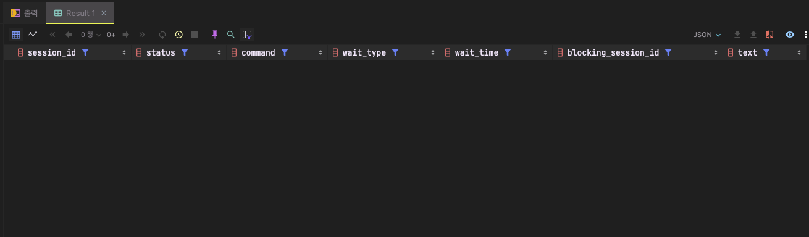

프로젝트 QA중 특정 기능에서 조회 성능이 굉장히 떨어져 타임아웃까지 응답이 불가능한 문제가 발생하였다. 조회 요청을 보내는 테이블에 데이터가 꽤나 많았고, 추후 최적화를 진행하려고 했던터라 개발 단계에서 신경쓰지 못했었지만, 이번 오류 대응 과정을 통해서 배웠고, 앞으로도 주의해야할 내용을 공유해 보고자 한다.

## 문제점

```java
InOutDTO agoInOut = inOutDAO.selectInOut(inoutModifyRequest.getTicketNo());
```

`TicketNo`를 통해 이전 데이터를 가져온후 다양한 service에 변경 사항을 `update`해야하는 내용이 있었고, `update` 할곳이 꽤나 많다보니 여기서 문제가 발생한다고 생각했었는데 알고보니 `select` 자체에서 문제가 발생하고 있었다. 형변환도 정상적으로 되고 있고, 조회도 느리긴하지만 되기 때문에 큰문제가 아니라고 생각했지만 오산이였다. DB Lock 이슈를 유발하는 SQL 문은 아래와 같다.

```sql
 <select id="selectInOut"
            resultType="com.vstl.ansan.api.dto.InOutDTO">
        SELECT
        PH.ticketNo,
        PM.parkAreaName,
        PH.carNo,
        PH.parkingDay,
        DM.discountName AS discountName,
        ...
        FROM parking_history PH
        INNER JOIN ...
        ...
        WHERE PH.ticketNo = #{ticketNo}
        AND PH.useOk = 1
    </select>
```

해당 Query를 모니터링 해보니 CPU를 많이 소모 하고있었다.  WHERE 절에 걸려있는 `#{ticketNo}`는 parking_history 에서 `Primary Key`로 주요 INDEX가 걸려있다. DB에서 정의된 `ticketNo`는 `char(13)` 타입으로 정의되어있다. 

`SQL Server JDBC Driver` 는 String 파라미터를 모두 `NVARCHAR`로 매핑한다. PreparedStatement.set 호출시 명시적으로 `VARCHAR` 매핑을 지정해도 `NVARCHAR로` 변환하여 매핑한다. 조회요청 이후 Lock된 session의 상태를 살펴보자.

```java
[ 
{ "session_id": 71, 
"status": "runnable", 
"command": "SELECT", 
...
"text": 
"
(@P0 nvarchar(4000))
SELECT\n 
...
WHERE PH.ticketNo = @P0 \n AND PH.useOk = 1" 
} ]
```

 위의 내용에서 `(@P0 nvarchar(4000))` 부분을 살펴보자. SQL Server JDBC Driver는 `String` type의 파라미터를 유니코드 타입인 nvarchar(4000) 형식으로 전달한다. [MSSQL Data Type 우선순위](https://learn.microsoft.com/ko-kr/sql/t-sql/data-types/data-type-precedence-transact-sql?view=sql-server-2017)를 보면 NVARCHAR가 VARCHAR / CHAR 보다 높기 때문에 `char(13)`컬럼에 대해 조회조건으로 `String` 파라미터를 사용하게 되면, NVARCHAR로 형변환이 일어나게 되고, 이상태로 조건을 비교한다. 이때 `PK` 에 걸려있는 `CHAR` INDEX도 무시된다. 

1. CHAR - NVARCHAR 형변환 비용 발생
2. NVARCHAR 변환으로 인한 INDEX 무시

이 두가지 이유로 비용이 크게 증가되고, 성능 저하가 발생한다. 특히 조회하고 있는 `parking_histroy`테이블에는 1억건 이상의 데이터가 존재하여 많은 CPU소모가 일어나게 된것이다.


## 문제 해결

### sendStringParametersAsUnicode=false 추가

가장 쉬운 해결방법은 아래와 같이 JDBC URL 에 `sendStringParametersAsUnicode=false` 를 추가하는 방법이다. 
```yml
spring:
  datasource:
    type: org.apache.tomcat.jdbc.pool.DataSource
    driverClassName: com.microsoft.sqlserver.jdbc.SQLServerDriver
    url: jdbc:sqlserver://myhost:1234;database=SbSvc;sendStringParametersAsUnicode=false
```

이설정을 통해 모든 String 파라미터를 VARCHAR 타입으로 매핑 한다.

### NVARCHAR 파라미터에 Cast 사용

NVARCHAR 파라미터에 CAST를 사용해서 VARCHAR / CHAR로 변경 시켜주면, VARCHAR, CHAR 간의 비교여서 형변환이 일어나지 않는다.

```xml
 <select id="selectInOut"
            resultType="com.vstl.ansan.api.dto.InOutDTO">
        SELECT
        PH.ticketNo,
        PM.parkAreaName,
        PH.carNo,
        PH.parkingDay,
        DM.discountName AS discountName,
        ...
        FROM parking_history PH
        INNER JOIN ...
        ...
        WHERE PH.ticketNo = CAST(#ticketNo# AS VARCHAR)
        AND PH.useOk = 1
    </select>
```


### JPA인 경우

NVARCHAR 컬럼을 매핑한 필드에 `@Nationalized`를 사용하면, 해당 컬럼에 대한 조회 조건만 NVARCHAR로 쿼리가 만들어지고, 나머지 컬럼들은 VARCHAR로 매핑하게 된다.

```java
@Nationalized
@Column(name = "ticketNo", length = 50)
private String ticketNo;
```

JPQL, Querydsl-JPA 모두 이규칙을 따르고 있지만, `EntityManager.createNativeQuery`는 이규칙을 따르지않는다. (@Query(native=true)인 경우) 그래서 이경우에는 NVARCHAR 매핑시, CONVERT(NVARCHAR, ?)를 사용해서 변환을 해줘야한다. 아니면 JdbcTemplate를 직접 사용한다.

JdbcTemplate에서 NVARCHAR를 매핑하는 방법은 아래와 같이 `setNString()`을 사용한다.

```java
jdbcTemplate.query("select * from sqlserver_with_java.dbo.books where book_type = ? and title like ?",
     ps -> {
         ps.setString(1, bookType.name()); // VARCHAR 매핑
         ps.setNString(2, title); // NVARCHAR 매핑
     },
     rs -> {
         log.info("id , title, bookType", rs.getLong("id"), rs.getString("title"), rs.getString("book_type"));
     });
```


## 보너스

### SQL Server에서 Session 확인 쿼리

```sql
SELECT r.session_id, r.status, r.command, r.wait_type, r.wait_time, r.blocking_session_id,  
       t.text  
FROM sys.dm_exec_requests r  
         CROSS APPLY sys.dm_exec_sql_text(r.sql_handle) t  
WHERE r.session_id <> @@SPID;
```



### NVARCHAR로 조회가 필요한 경우는?

이경우에는 이전처럼 INDEX가 무시되거나, 성능저하가 발생하는 문제는 없을것이다. INDEX 가 NVARCHAR 인 컬럼에 VARCHAR 조건이 매핑된 경우라면, 우선순위에 따라 조건으로 들어온 Parameter 가 형변환이 일어나기 때문에 INDEX 에는 영향을 주지 않게 된다. 

즉, NVARCHAR 의 경우에는 컬럼들이 모두 형변환이 일어나는 것이 아니라 파라미터만 VARCHAR 에서 NVARCHAR 로 형변환이 일어난 후 조건을 비교하기 때문에, INDEX 도 유지되고 성능에도 큰 문제가 되지 않는다. 


### 마무리

사소해 보이는 내용이라도 한번더 확인하고 점검하자.