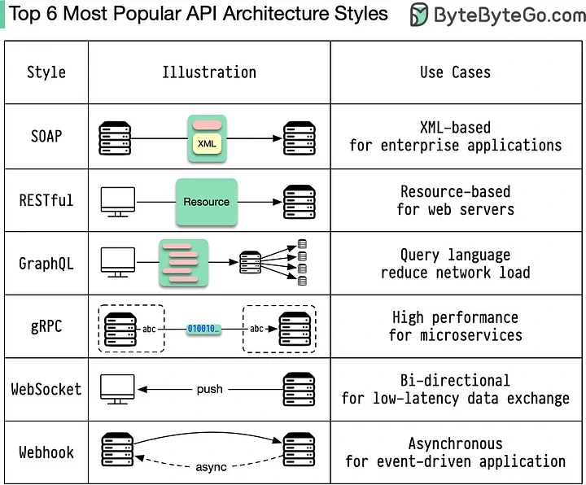

백앤드 개발을 하면서 `RESTful`한 API에 대해서 많이 배웠지만 모든 API가 `REST`하지 않아도 된다는 것을 모르고 있었다. 최근에 진행한 프로젝트에서 타사 프로그램을 연동하는 과정에서 `SOAP`를 통해 연동을 진행했는데 이때 알게된 내용을 작성해보고자 한다.

## 다양한 아키텍처

다양한 API 방식의 통신에 다양한 아키텍처가 존재한다. 이들을 하나씩 알아보자.

### REST
