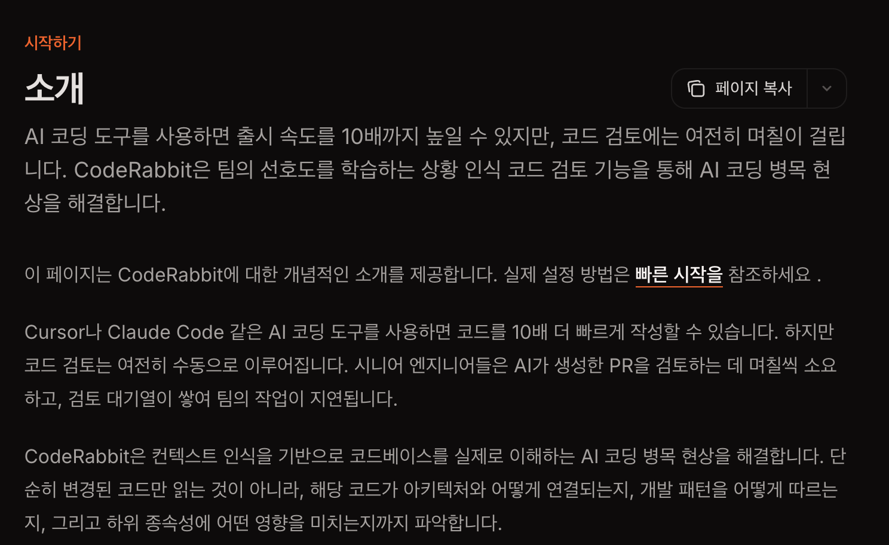

개인 프로젝트를 진행하면서 백엔드를 혼자 구현하다보니 코드리뷰가 불가능한 상황이였다. 이전에 만들었던 딥시크 기반 코드리뷰어를 사용해 볼까 하다가, 써보자 하고 계속 미뤄졌던 `code rabbit`서비스를 한번 도입해 보기로 하였다. 구현 과정에서 놓친 부분을 AI로 보완하고, 추가적인 학습 인사이트를 얻을 수있었던 경험을 글로 남겨보려고한다.

### 코드레빗이 뭔가요?

위으 [코드레빗 공식문서](https://docs.coderabbit.ai/overview/introduction)에 나와있는 내용이다. 간단히 말해 AI를 통해 코드 검토를 진행하는 **AI코드 리뷰어** 라고 할수있다.

