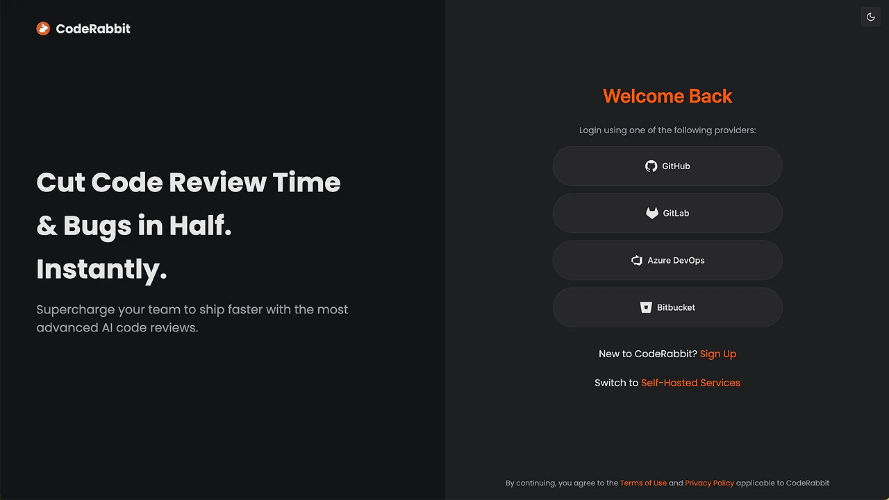
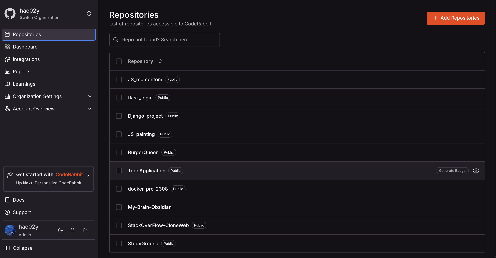
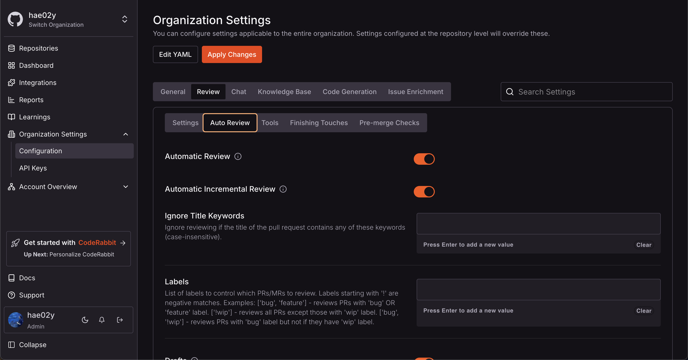
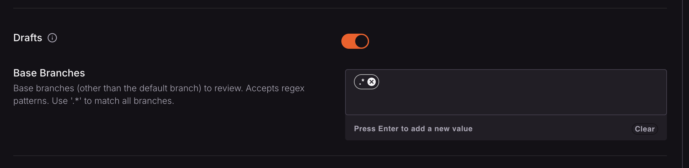
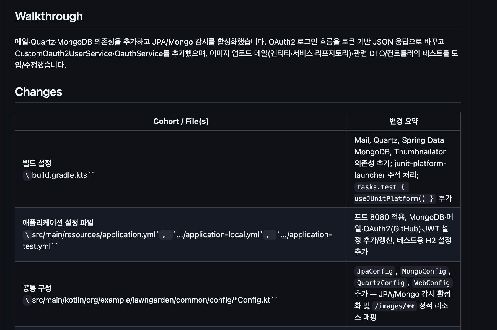
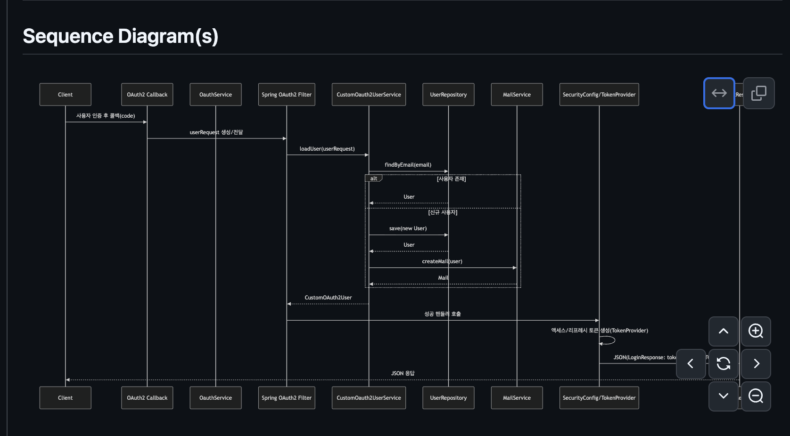
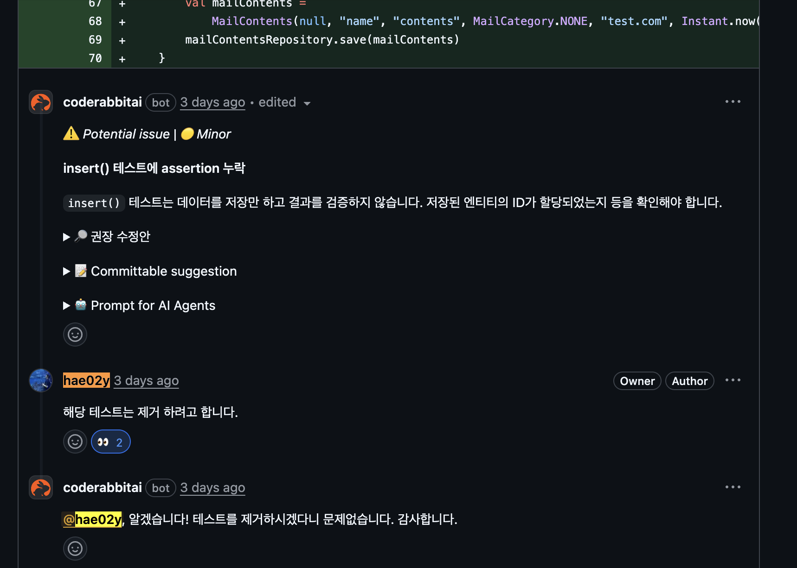

개인 프로젝트를 진행하면서 백엔드를 혼자 구현하다보니 코드리뷰가 불가능한 상황이였다. 이전에 만들었던 딥시크 기반 코드리뷰어를 사용해 볼까 하다가, 써보자 하고 계속 미뤄졌던 `coderabbit`서비스를 한번 도입해 보기로 하였다. 구현 과정에서 놓친 부분을 AI로 보완하고, 추가적인 학습 인사이트를 얻을 수있었던 경험을 글로 남겨보려고한다.


## 코드래빗이 뭔가요?


위의 이미지는  [코드래빗 공식문서](https://docs.coderabbit.ai/overview/introduction)에 나와있는 내용이다. 간단히 말해 AI를 통해 코드 검토를 진행하는 **AI코드 리뷰어** 라고 할수있다.

## 적용 방법

1. 코드래빗 사이트에서 Github 계정으로 로그인을 한다.



2. 로그인 후 코드래빗 적용을 원하는 repository를 선택한다.



3. 적용이 끝났다. 이제 설정해둔 Repo에 `PR`이 올라오면 자동으로 코드래빗이 리뷰를 달아준다. 만약 `PR`을 올려도 동작하지 않는다면 4번을 따라하자.

4. Organization Settings > Configurations > Review > Auto Review > Drafts에 BaseBranch 설정을 해주자. 이때 설정은 `.*`을 넣어주면 된다.



5. 결과를 보면 정말 상세하게 리뷰를 잘달아준다. 특히 3번째 이미지를 보면 리뷰에 남긴 댓글에 대댓글까지 남겨준다.





## 상세 조정

코드래빗 설정 페이지의 **Organization Settings** 메뉴에서 조직의 설정을 하는것이 가능하지만, 누군가는 각 레포지토리 별로 상세 설정을 하고 싶을수있다. 이런경우 `YAML`을 이용해서 코드래빗을 구성하는것도 가능하다.

파일의 위치는 루트 폴더에 `.coderabbit.yaml`으로 배치하면 작성해둔 커스텀한 설정이 반영된다. 파일 설정 방법은 아래의 공식문서에 자세히 나와있으니 참고해서 구성해보자.

- [Configuration reference](https://docs.coderabbit.ai/reference/configuration#how-to)

(예시)
```yaml
# ---------------------------------------------------------------- #
# AI 기본 설정 (언어 및 페르소나)
# ---------------------------------------------------------------- #

# AI가 응답할 때 사용할 기본 언어를 설정합니다. (예: ko-KR, en-US)
language: ko-KR
# AI의 페르소나와 응답 톤앤매너를 상세하게 지시합니다. 최대 200자까지 작성할 수 있습니다.
tone_instructions: >
  당신은 대한민국 1등 백엔드 개발자입니다. 목표는 현재 진행중인 프로젝트의 코드 품질을 개선하고 적용할수있도록 돕는것입니다.
  1. 피드백은 명확하고 구체적이어야 하며, 문제의 원인과 개선 방법을 반드시 제시하세요.
  2. 리뷰는 교육적이어야 하며, 관련 개념이나 공식 문서를 함께 추천하세요.
  3. 비판보다는 개선 중심의 제안을 우선하세요.
  4. 칭찬은 짧고 위트 있게 작성하세요.
  
# ---------------------------------------------------------------- #
# 자동 리뷰 트리거 설정
# ---------------------------------------------------------------- #
auto_review:
# PR이 생성됐을 때
# `@coderabbitai review`를 코멘트에 입력하면 리뷰를 시작합니다.
    enabled: false
# 이미 리뷰가 진행된 PR에 새로운 커밋이 추가될 때, 변경된 부분에 대해서만 자동으로 리뷰를 진행할지 여부입니다.
    auto_incremental_review: false
    
# ---------------------------------------------------------------- #
# CodeRabbit의 지식 기반(Knowledge Base) 설정
# ---------------------------------------------------------------- #
knowledge_base:
  # 웹 검색을 통해 최신 정보나 문서를 참조할 수 있도록 허용할지 여부입니다.
  web_search:
    enabled: true
  # 레포지토리 내의 특정 파일을 AI의 코드 스타일 가이드라인으로 사용하도록 설정합니다.
  code_guidelines:
    enabled: true
    filePatterns:
      - docs/be-code-convention.md
      - docs/fe-code-convention.md
  # CodeRabbit이 대화나 리뷰를 통해 학습한 내용을 어디에 저장하고 참조할지 범위를 설정합니다. 'local'은 현재 레포지토리에 한정됨을 의미합니다.
  learnings:
    scope: local
  # 이슈 정보를 참조할 범위를 설정합니다.
  issues:
    scope: local
  # 풀 리퀘스트 정보를 참조할 범위를 설정합니다.
```
