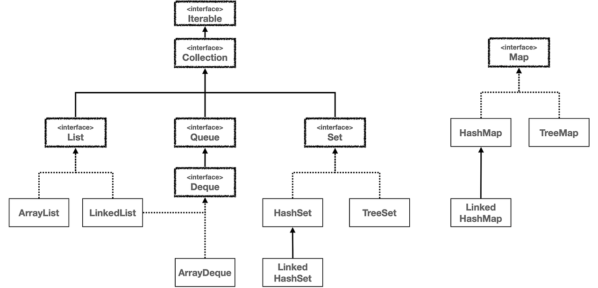
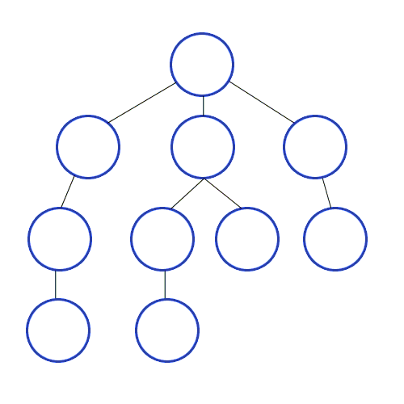
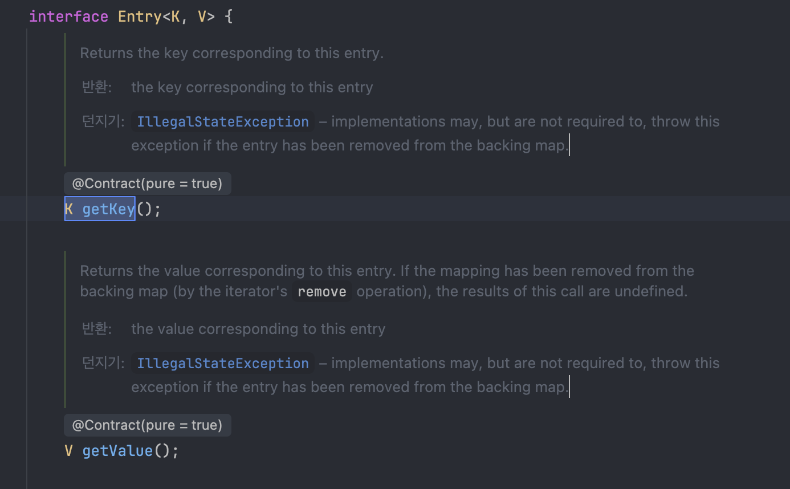
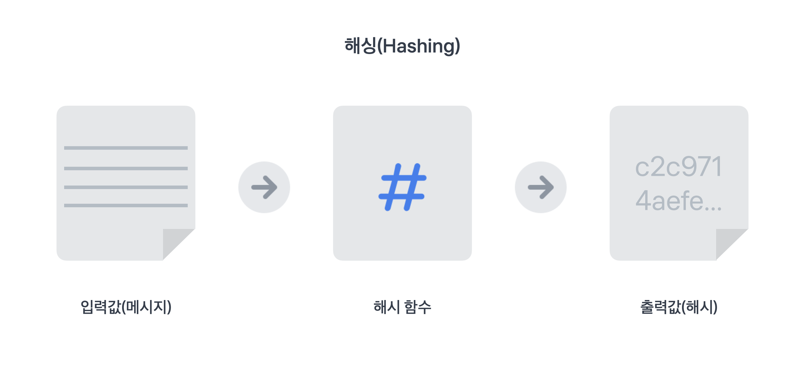
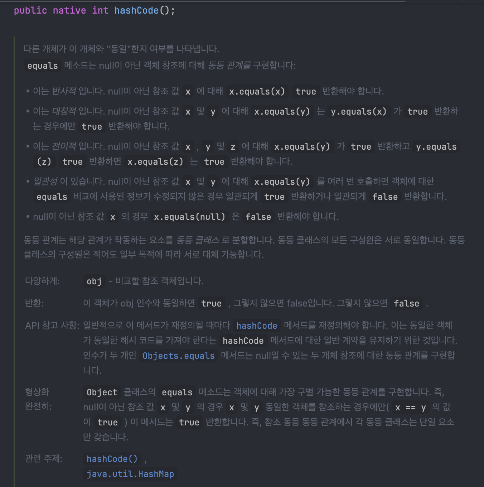
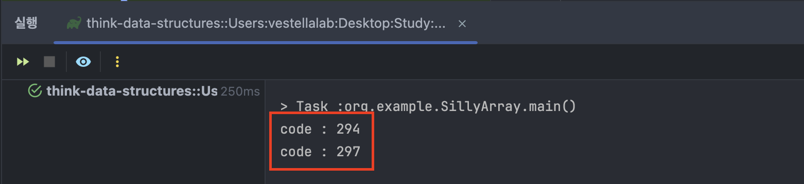

이 내용은 '자바로 배우는 자료구조 알고리즘' 책을 읽고 내용을 정리한 내용이다. 해당 내용에 대한 실습 및 예제 코드는 아래 깃허브 링크를 참고하면 된다.

[깃허브 Repo](https://github.com/hae02y/Blog-Code-Repo/tree/main/think-data-structures)

### LinkedList 클래스

ArrayList의 이점은 get, set 메서드에서 나온다. LinkedList는 심지어 이중연결리스트인 경우에도 선형 시간이 필요하다.

만약 프로그램의 실행시간이 get, set에 의존한다면 ArrayList는 좋은 선택이다, 실행시간이 시작, 끝 근처의 요소에 추가 삭제 연산에 의존한다면 LinkedListrk 좋은 선택이다.

이외에 고려할 요소는

1. 연산이 응용프로그램의 실행시간에 뚜렷한 영향을 미치지 않는다면 List 구현에 대한 선택은 의미없음
2. 작업하는 리스트가 매우 크지않으면 큰 성능차이를 얻기 어렵다. 작은 문제에서는 이차 알고리즘이 선형알고리즘보다 빠르기도 하고, 또 선형알고리즘이 상수시간보다 빠르기도 하다. 즉 작은 문제에서는 이러한 차이가 큰 의미를 두지 않는다.
3. 공간에 대해서도 잊지 말아야한다. ArrayList에서는 배열 기반으로 요소들은 한덩어리의 메모리안에서 나란히 저장되어 거의 낭비되는 공간이 없고, 컴퓨터 하드웨어도 연속된 공간에서 연산속도가 종종 더 빠르다. LinkedList에서 각 요소는 하나 혹은 두개의 참조가 있는 노드가 필요하고, 참조는 공간을 차지한다. 또한 메모리 여기저기에 노드가 흩어지면 하드웨어의 효율이 떨어진다.

### 성능 측정

JavaFX 라이브러리 사용해서 한번 그려보자.

### 트리순회

- 철학으로 가는길
- Jsoup 사용 크롤링
	- ref . [https://jsoup.org/download](https://jsoup.org/download)


Q: Stack과 같은 자료형은 List보다 더 적은 메서드를 가지는데 굳이 써야하는가?

1. 메서드 개수를 작게 유지하면, 코드의 가독성 향상, 오류 발생 가능성 감소
2. 자료구조에서 작은 API를 제공하면, 효율적인 구현이 쉬움. 스택을 구현하는 단순한 방법은 단일 연결 리스트를 사용. 요소를 스택에 push하면 리스트의 시작에 요소를 추가. pop하면 시작에서 요소를 제거. 연결리스트에서 시작에 요소를 추가 삭제 하는건 상수시간 연산이므로 구현이 효율적임
3. ArrayDeque나 Deque 인터페이스를 구현한 클래스를 사용하는것이 가장 좋은 방법


### 철학으로 가는길

#### Iterable 과 Iterator

Iterable, Iterator는 컬렉션을 순회하기위해 사용하는 두가지 중요한 인터페이스다.



#### Iterable

 자바에서 반복가능한 객체를 나타내는 인터페이스. 이를 구현한 클래스로는 for-each문을 사용하여 요소 순회가 가능. `Iterator<T>` iterator() : Iterable 인터페이스의 핵심 메서드로, 이를 통해 Iterator 객체를 반환한다. 이 메서드를 구현함으로써, 컬렉션 클래스는 반복 가능한 객체로 사용할 수 있게 된다.

```java
import java.util.ArrayList;
import java.util.List;

public class IterableExample {
    public static void main(String[] args) {
        List<String> list = new ArrayList<>();
        list.add("apple");
        list.add("banana");
        list.add("cherry");

        // for-each 문을 사용하여 순회
        for (String item : list) {
            System.out.println(item);
        }
    }
}
```

#### Iterator 인터페이스

 이터레이터는 컬렉션의 요소를 순차접근하기위한 인터페이스로 Iterator는 Iterable이 제공한 컬렉션을 직접 탐색하며, 각 요소에 접근할수있는 방법을 제공한다. Iterator를 사용하면 컬렉션의 각요소를 직접 제어하며 순회 가능하다.
 -  **boolean hasNext()** : 다음 요소가 있는지 확인한다. 요소가 남아 있으면 true, 아니면 false를 반환한다.
- **T next()** : 다음 요소를 반환하며, 현재 위치를 다음으로 이동시킨다.
- **void remove()** : 현재 Iterator가 가리키고 있는 요소를 제거한다. (선택적 메서드로, 모든 Iterator에서 반드시 구현해야 하는 것은 아니다)

```java
import java.util.ArrayList;
import java.util.Iterator;
import java.util.List;

public class IteratorExample {
    public static void main(String[] args) {
        List<String> list = new ArrayList<>();
        list.add("apple");
        list.add("banana");
        list.add("cherry");

        // Iterator를 사용하여 순회
        Iterator<String> iter = list.iterator(); // iterator 객체를 얻는다
        while (iter.hasNext()) {
            String item = iter.next();
            System.out.println(item);
        }
    }
}
```
위의 코드에서 iterator() 메서드를 호출하여 Iterator 객체를 얻고, while 문을 사용해 hasNext()로 다음 요소가 있는지 확인하면서 next()를 통해 요소를 가져온다.

둘의 차이점
- Iterable : 순회 할수있는 객체를 의미, Iterator() 메서드를 통해 Iterator를 생성, for-each를 통해 컬렉션을 간결하게 순회가능
- Iterator : 실제로 순회작업을 수행하는 객체로 컬렉션요소에 하나씩 접근 가능, 직접 요소를 순회하며 특정조건에 따라 요소를 제거하거나 순회 과정을 세밀하게 제어 가능

### DFS 구현 방법 2가지

- DFS는 깊이우선탐색으로 트리의 루트에서 시작하여 첫번째 자식노드를 선택하고 선택된 노드가 자식을 가지고 있다면 첫번째 자식을 다시선택, 반복후 자식이 없는 노드에 도착하면 부모노드로 거슬러 올라가 다음자식이 있다면 그쪽으로 이동하는 식으로 동작한다.

### 방법1. 재귀적 방법

메서드의 루트에서 시작해서 트리에 있는 모든 노드를 호출할때까지 반복된다. 아래 구현 코드를 보면 자식노드를 탐색하기전 `TextNode`의 내용을 출력하므로 전위순회에 해당한다.

```java
private static void recursiveDFS(Node node) {  
    if (node instanceof TextNode) {  
        System.out.print(node);  
    }  
    for (Node child: node.childNodes()) {  
        recursiveDFS(child);  
    }  
}
```


### 방법2. 반복적 방법

반복적 방법으로 구현을 할때는 `Stack` 자료구조를 통해 구현이 가능하다. 반복적인 방법으로 구현을 알아보기에 앞서서 스택이라는 자료구조를 아래에 간단히 정리해보자.

스택은 리스트와 유사한 자료구조형으로 요소의 순서를 유지하는 컬렉션이다. 스택의 `pop`메서드는 항상 최상단의 요소를 반환하므로 스택은 `LIFO` 자료구조 이다. 이에 반해 큐 자료구조는 `FIFO` 이다.  일반적인 규약에서 제공하는 스택의 메서드는 다음과 같다.

- `push` : 스택의 최상단에 요소를 추가
- `pop` : 스택의 최상단에 있는 요소를 제거하고 반환
- `peek` : 최상단 요소를 반환하지만 요소는 그대로 둠
- `isEmpty` : 스택이 비었는지 알려줌

```java
private static void iterativeDFS(Node root) {  
    Deque<Node> stack = new ArrayDeque<Node>();  
    stack.push(root);  
  
    while (!stack.isEmpty()) {  
  
        Node node = stack.pop();  
        if (node instanceof TextNode) {  
            System.out.println(node);  
        }  
  
        List<Node> nodes = new ArrayList<Node>(node.childNodes());  
        Collections.reverse(nodes);  
  
        for (Node child: nodes) {  
            stack.push(child);  
        }  
    }  
}
```

### 인덱스

> Index는 인덱스란 검색 속도를 향상시키기 위한 자료구조이다.

인덱스는 조회 연산이다. 가장 단순한 구현은 페이지의 컬렉션이다. 검색어가 주어지면 페이지의 내용을 반복 조사하여 검색어를 포함하는 페이지를 선택하는 방법이다. 하지만 실행시간이 모든 페이지의 전체 단어수에 비례하여 매우 느리다. 

#### Map 과 Set 자료구조

이보다 나은 대안으로 Map 자료구조를 활용해보자. Map은 키-값 쌍의 컬렉션으로 키와 키에 해당하는 값을 찾는 빠른 방법을 제공한다. 자바의 Map 인터페이스는 맵을 구현하는데 필요한 메서드를 정의한다. 자바 Map 인터페이스는 몇가지의 구현을 제공하는데 이중 **HashMap**, **TreeMap** 두 클래스를 집중적으로 알아볼 것이다.

- `get(key)` : 키를 조사하여 관련된 값을 반환
- `put(key,value)` :  Map에 새로운 키-값을 추가하거나 이미 있는 키면 값을 업데이트 한다.

LinearMap을 구현한뒤 HashMap, TreeMap과의 성능을 비교해보자. 그전에 `Entry`에 대해서 알아보자. 엔트리는 아래와 같이 설명할수있다.

> Java의 Map.Entry는 `Map` 인터페이스 내부에 정의된 중첩 인터페이스(Inner Interface)로, Map에 저장되는 키-값(Key-Value) 쌍 그 자체를 다루는 객체이다. `entrySet()` 메서드를 통해 Map의 각 요소를 쌍으로 순회하거나, 키와 값을 정렬 및 조작하는 데 주로 사용된다.



Entry는 단지 키와 값의 컨테이너로 Map클래스에 중첩되어 있으므로 같은 타입 파라미터인 K,V를 사용한다. LinearMap의 핵심 로직은 `findEntry()`, `equals()`에 있다. put, get, remove와 같은 메서드는 `findEntry`를 호출하여 구현한다. 

```java
public class MyLinearMap<K, V> implements Map<K, V> {  
    private List<Entry> entries = new ArrayList<Entry>();
    
    ...
}
```

```java
private Entry findEntry(Object target) {  
    for (Entry entry: entries) {  
        if (equals(target, entry.getKey())) {  
            return entry;  
        }  
    }  
    return null;  
    }  

private boolean equals(Object target, Object obj) {  
    if (target == null) {  
        return obj == null;  
    }  
    return target.equals(obj);  
}
```

equals 메서드의 실행시간은 target과 key에 의존하지만 엔트리 개수에 해당하는 n에는 의존하지 않는다. 즉 equals는 상수시간이다. 그리고 `findEntry` 메서드는 운좋으면 첫번째에 원하는 키를 찾을수도있지만, n(엔트리 개수)에 비례하므로 선형시간의 연산이된다. put,get,remove와 같은 메서드들이 `findEntry`를 사용한다고 했으므로, 이 메서드들은 **선형시간의** 연산이다. 전체적인 LinearMap의 구현은 [repository](https://github.com/hae02y/Blog-Code-Repo/blob/main/think-data-structures/src/main/java/org/example/MyLinearMap.java)를 확인해보자. 

이전에 작성한 MyLinearMap의 성능을 향상시킨 버전인 MyBetterMap 클래스를 만들고 테스트해보자. 먼저 엔트리를 하나의 커다란 List에 저장하는 대신 다수의 작은 리스트로 쪼개고, 각 키에 대해서 해시코드를 사용해서 어느 리스트를 사용할지 선택하는 방식으로 구현한다.

```java
public class MyBetterMap<K, V> implements Map<K, V> {  
    protected List<MyLinearMap<K, V>> maps;
    
    ...
}
```

MyBetterMap에서는 내장된 맵에 따라 리스트를 나누므로 각 맵별로 엔트리 개수가 줄어든다. 이부분이 findEntry 메서드와 이를 호출하는 메서드의 속도를 빠르게 해준다. 

내가 만든 MyLinearMap의 선형시간을 개선하기 위해 `Hashing`을 사용해보자. 해싱은 임의의 길이를 가진 데이터를 고정된 길이의 고유한 데이터로 변환하는 방법이다. 이함수는 Object 객체를 인자로 받아 해시코드라는 정수로 반환한다. 중요한 점은 같은 Object 객체에 대해서 항상 같은 해시코드를 반환해야한다. 이렇게 해시코드를 사용하여 키를 저장하면, 키를 조회할때 항상 같은 해시코드를 얻게 된다.

자바에서 모든 Object 객체는 `hashCode`라는 메서드를 제공하여 해시함수를 계산한다. MyBetterMap에서는`chooseMap()` 메서드에서 해시코드를 사용한다. 이 메서드는 키에 대한 적합한 하위 맵을 고르는 헬퍼 메서드이다.



```java
protected MyLinearMap<K, V> chooseMap(Object key) {  
    int index = key==null ? 0 : Math.abs(key.hashCode()) % maps.size();  
    return maps.get(index);  
}
```

hashCode 메서드를 호출해서 정수를 얻고, Math.abs 메서드를 호출해서 절대값을 만든뒤 나머지 연산을 통해 결과가 0에서 `map.size()-1` 사이의 값임을 보장한다. 이에따라 index는 항상 maps의 유효한 인덱스가 되고, chooseMap은 선택한 맵의 참조를 반환한다. 이에 대한 성능은 n개의 엔트리를 k개의 하위 맵으로 나누면 맵당 엔트리는 평균 n/k개가 된다. 키를 조회할때 해시코드를 계산해야하는데 이때 시간이 조금 추가된다. 그다음에 키에 맞는 하위맵을 검색한다. 이를 통해 MyBetterMap은 MyLinear맵에 비해 k배 빨라졌다. 하지만 실행시간은 여전히 n에 비례하므로 **선형시간**이다.

해싱에 대해서 조금더 깊이 알아보자. 해시함수의 근본적인 요구사항은 같은 객체는 매번 같은 해시코드를 만들어야한다는 것이다. 불변객체(Immutable Object)일때는 상대적으로 쉽지만, 가변객체(Mutable Object)일때는 좀더 고민이 필요하다.

불변 객체의 예시로 String을 캡슐화하는 SillyString을 정의해보자
```java
  public class SillyString {  
    private final String innerString;  
  
    public SillyString(String innerString) {  
        this.innerString = innerString;  
    }  
  
    public String toString() {  
        return innerString;  
    }  
  
    @Override  
    public int hashCode() {  
        int total = 0;  
        for(int i=0;i<innerString.length();i++) {  
            total += innerString.charAt(i);  
        }  
        return total;  
    }  
  
    @Override  
    public boolean equals(Object obj) {  
        return this.toString().equals(obj.toString());  
    }  
}
```

SillyString클래스는 equals, hashCode를 오버라이드 하여 동작한다. 제대로 동작하려면 equals메서드는 hashCode메서드와 일치해야한다. 이는 두객체가 같다면(equals메서드가 true를 반환하면) 두객체의 해시코드 또한 같아야한다. 이는 단방향으로 두객체의 해시코드가 같더라도 그들이 같은 객체일 필요는 없다.

위에서 구현한 해시함수는 정확하게 동작하지만 좋은 성능을 보장하진않는다. 왜냐하면 많은 서로다른 문자열을 위해 같은 해시코드를 반환하기 때문이다. 두 문자열에 같은 문자가 순서만 다르게 포함되어있다면 이들은 해시코드가 같아진다. 예시로 'ac', 'ca' , 'bb' 는 모두 같은 해시코드를 같는다.

많은 객체가 동일한 해시코드를 가지면 같은 하위 맵으로 몰리게 된다. 어떤 하위맵에 다른맵보다 많은 엔트리가 있으면 k개의 하위맵으로 인한 성능향상이 k보다 줄어들게 된다. 그래서 해시함수의 목표중 하나는 균등함이다. 즉 일정 범위에 있는 어떤 값으로 골고루 퍼지도록 해시코드가 생성되게 설계해야한다.

String 클래스는 불변이고, innerString 변수가 final로 선언되어 SillyString 클래스 또한 불변이다. 일단 SillyString 객체가 생성되면 innerString 변수는 다른 String 객체를 참조할수없고 이변수가 참조하는 String 객체도 변경할수없다. 즉 항상 같은 해시코드를 같게 된다. 하지만 **가변 객체**라면 어떨까?

```java
public class SillyArray {  
  
    private final char[] array;  
  
    public SillyArray(char[] array) {  
        this.array = array;  
    }  
  
    public String toString() {  
        return Arrays.toString(array);  
    }  
  
    @Override  
    public int hashCode() {  
        int total = 0;  
        for (int i = 0; i < array.length; i++) {  
            total += array[i];  
        }  
        System.out.println("code : " + total);  
        return total;  
    }  
  
    @Override  
    public boolean equals(Object obj) {  
        return this.toString().equals(obj.toString());  
    }  
    
    public void setChar(int i, char c) {
	    this.array[i] = c;
    }
}
```

SillyArray클래스는 위와같다. 인스턴스 변수로 String이 아닌 문자 배열을 사용하는데, SillyArray클래스는 setChar 메서드를 통해 배열에 있는 문자를 변경할수있다. 간단한 예제를 살펴보자.

```java
SillyArray array = new SillyArray("abc".toCharArray());  
MyBetterMap<SillyArray, Integer> map = new MyBetterMap<SillyArray, Integer>();  
map.put(array, 1);  
  
array.setChar(0, 'd');  //값 변경
map.get(array);
```



변경후 해시코드가 변경된다. 해시코드가 달라서 잘못된 하위맵을 조회할수도 있는것이다. 이러한 상황에서는 키가 맵에 있어도 찾을수없게된다. 일반적으로 해싱을 사용하는 자료구조에서 가변객체를 키로 사용하는것은 위험하다. 키가 맵에 있는동안 변형되지 않는다고 보장할수있거나 어떤 변화가 해시코드에 영향을 미치지않아야한다.


다음으로 **Set** 인터페이스에 대해서 알아보자. 교집합 연산이 필요한 경우 Set을 사용할수있다. Set은 실제 교집합 연산을 제공하지는 않지만 교집합연산과 다른 집합 연산을 효율적으로 구현 할수있는 메서드를 제공한다. 

- `add(element)` : 집합에 요소를 추가, 동일한 집합이 있다면 효과가 없음
- `contains(element)` : 주어진 요소가 집합에 포함되어 있는지 확인

자바는 **HashSet**, **TreeSet** 클래스로 Set인터페이스의 구현을 제공한다.
