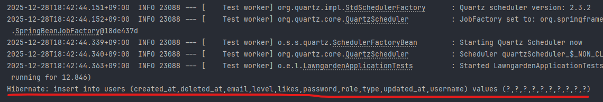
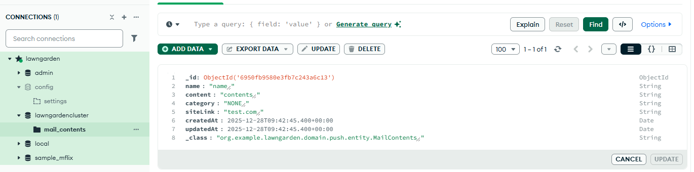

```java
//Config

@Configuration  
@EnableMongoAuditing  
class MongoConfig {  
}
```


```java
//Repository

interface MailContentsRepository : MongoRepository<MailContents, String> {  
}
```


```java 
//Entity(Document)
@Document(collection = "mail_contents")  
class MailContents(  
  
    @Id  
    val id : String? = null,  
  
    var name : String,  
  
    var content : String,  
  
    var category: MailCategory = MailCategory.NONE,  
  
    var siteLink: String,  
  
    @CreatedDate  
    val createdAt: Instant? = null,  
  
    @LastModifiedDate  
    val updatedAt: Instant? = null,  
    )
```


`yaml` 에서 설정을 할때 2가지 방식으로 가능하다. 나는 첫번째 방식인 `URI`를 통해서 연동을 진행했다.

```yaml
spring:  
  data:  
    mongodb:  
      uri: mongodb+srv://{id}:{password}@{uri}/{dbName}?retryWrites=true&w=majority
```

```yaml
spring:
	data:
    	mongdb:
        	host:
            port:
            user:
            password:
```


TestCode를 통해 DB에 insert를 진행하니 정상적으로 데이터가 저장된다. 

```kotlin
@Test  
@DisplayName("Insert 테스트")  
fun insert() {  
    val mailContents =  
        MailContents(null, "name", "contents", MailCategory.NONE, "test.com", Instant.now(), Instant.now())  
    mailContentsRepository.save(mailContents)  
}
```





이때 RDB는 서버 기동과 동시에 DDL을 통해 테이블과 스키마를 만들지만, MongoDB에서는 컬렉션을 미리 만들지 않고, 첫 `insert`가 진행되는 시점에서 자동 생성된다. 간단하게 정리해보자.

**RDB**
- 테이블 먼저 생성
- 그 다음에 INSERT 가능

**MongoDB**
- 컬렉션을 미리 안 만들어도 됨
- 첫 insert 시점에 자동 생성

