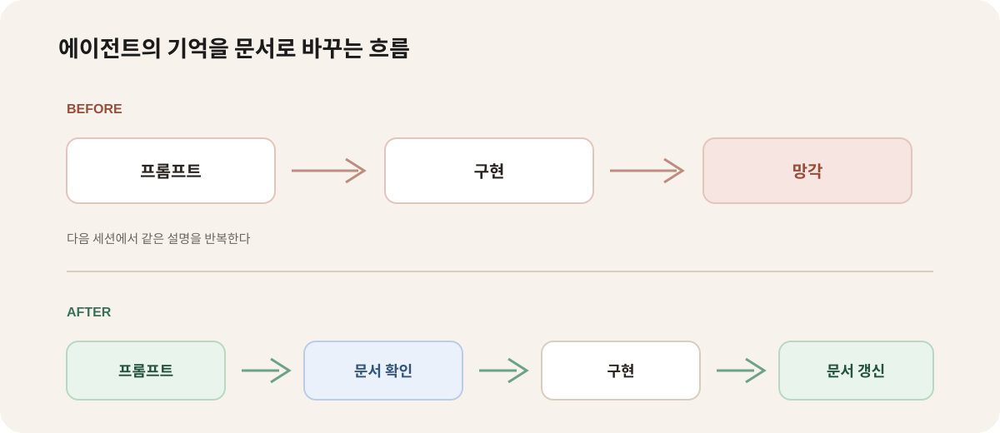

AI 에이전트와 여러 번 작업하다 보면 비슷한 장면을 만난다. 지난번에 결정한 내용을 다시 설명해야 하고, 이미 고친 문제를 다른 방식으로 되풀이하며, 프로젝트의 규칙을 매번 프롬프트에 붙여 넣는다. 에이전트가 똑똑하지 않아서만 생기는 문제는 아니다. 프로젝트가 무엇을 중요하게 생각하는지 읽을 수 있는 문서가 없기 때문에 생기는 문제다.

긱뉴스에서 소개된 Kevin Liao의 글 **“Agents Don’t Need Memory. They Need Documentation.”**은 이 문제를 정면으로 다룬다. 대화에서 잘라낸 조각을 임베딩해 필요할 때 검색하는 메모리보다, 사람이 읽고 고칠 수 있는 프로젝트 문서가 에이전트의 지속적인 작업에 더 적합하다는 주장이다. 이 글은 그 관점을 현재 블로그와 개발 작업에 적용해 본 기록이다.

## 대화 기억과 프로젝트 지식은 다르다

대화 기록에는 많은 정보가 들어 있지만, 그 정보가 모두 다시 사용하기 좋은 지식은 아니다. 어떤 결정은 임시로 내려졌고, 어떤 코드는 이미 바뀌었으며, 같은 주제에 대한 의견이 여러 번 바뀌었을 수 있다.

대화 조각을 검색하는 방식은 다음 질문에 약하다.

- 지금도 유효한 결정인가?
- 이 규칙이 적용되는 범위는 어디까지인가?
- 왜 이런 구조를 선택했는가?
- 이 문서를 누가 검토하고 갱신해야 하는가?

검색 결과가 문맥과 함께 나오지 않으면 에이전트는 오래된 내용을 현재의 규칙처럼 받아들일 수 있다. 검색되지 않은 중요한 정보는 존재하지 않는 것처럼 취급된다. 무엇보다 프로젝트를 처음 보는 에이전트는 어떤 질문을 해야 하는지조차 모를 수 있다.

그래서 “기억을 더 많이 저장하자”보다 먼저 해야 할 일은 **현재의 지식을 읽을 수 있는 형태로 정리하는 것**이다.

## 문서가 에이전트의 작업 공간이 되는 구조

프로젝트 문서는 에이전트에게 한 번 전달하고 끝나는 프롬프트가 아니다. 작업 전에는 참고하고, 작업 중에는 근거로 사용하며, 작업 후에는 바뀐 내용을 반영하는 작업 공간이다.



작업 흐름을 다음처럼 바꿀 수 있다.

```text
기존 방식: 프롬프트 → 구현 → 대화 종료
문서 방식: 프롬프트 → 문서 확인 → 구현 → 문서 갱신
```

이 차이는 단순히 파일을 하나 더 만드는 문제가 아니다. 에이전트가 다음 작업을 시작할 때 프로젝트의 현재 상태를 다시 읽을 수 있게 만드는 운영 방식의 변화다.

## 어떤 문서를 먼저 만들어야 할까

처음부터 거대한 위키를 만들 필요는 없다. 작업에 반복해서 필요한 정보부터 작게 시작하면 된다.

### 1. 프로젝트 지도

기능이 어느 디렉터리에 있고, 어떤 명령으로 실행하며, 배포는 어떻게 하는지를 적는다.

```md
# Project map

- `src/components`: 공통 UI
- `src/lib`: 데이터와 도메인 로직
- `blog`: 날짜별 Markdown 글
- `yarn typecheck`: 타입 검사
- `yarn build`: 배포 전 정적 빌드
```

### 2. 결정 기록

왜 특정 기술이나 구조를 선택했는지 남긴다. 나중에 에이전트가 기존 코드를 다른 패턴으로 바꾸려 할 때 가장 도움이 되는 문서다.

```md
# Decision: 글별 미디어 파일 관리

- 상태: 적용 중
- 결정: 이미지와 짧은 영상은 글 폴더에 둔다.
- 이유: 본문과 자산의 관계를 유지하고 이동을 쉽게 하기 위해서다.
- 주의: 긴 영상은 외부 플랫폼에 임베드한다.
```

### 3. 작업 규칙

코드 스타일, 검증 명령, 배포 순서처럼 매번 반복되는 기준을 적는다. 이 블로그의 `AGENTS.md`도 같은 역할을 한다. 작업을 시작하기 전에 읽어야 할 규칙과 끝난 뒤 실행할 검증 명령이 한곳에 모여 있다.

### 4. 기능별 설명

검색, SEO, Sitemap, PDF 출력처럼 다시 수정할 가능성이 있는 기능은 구현 위치와 주의점을 별도 문서로 남긴다. 코드만 읽어도 동작은 알 수 있지만, 코드를 그렇게 작성한 이유까지 자동으로 알 수 있는 것은 아니기 때문이다.

## 문서는 에이전트만을 위한 것이 아니다

문서 기반 작업의 장점은 에이전트가 더 잘 기억한다는 데서 끝나지 않는다. 사람이 검토할 수 있고, Git으로 변경 이력을 확인할 수 있으며, 새로 합류한 사람이 같은 문서를 읽고 작업을 시작할 수 있다.

특히 보안과 인증 업무에서는 이 차이가 크다. ISO 27001과 27701을 준비할 때도 정책의 존재보다 실제 운영 방법과 증적의 연결이 중요했다. 접근권한을 누가 승인하는지, 취약점 조치를 어디에 기록하는지, 개인정보 처리 흐름의 책임자가 누구인지가 문서에 명확해야 한다. 에이전트가 코드를 수정할 때도 같은 기준을 읽을 수 있어야 보안 요구사항이 구현 과정에서 빠지지 않는다.

문서는 다음 질문에 답할 수 있어야 한다.

- 무엇을 지켜야 하는가?
- 왜 그렇게 정했는가?
- 지금 실제로 그렇게 운영되고 있는가?
- 바뀌었다면 어느 문서와 코드를 함께 수정해야 하는가?

## 문서를 오래된 상태로 두지 않는 방법

문서가 많아지는 것보다 더 위험한 것은 틀린 문서가 남는 것이다. 그래서 문서에도 코드와 비슷한 관리 규칙이 필요하다.

1. 코드 구조나 정책이 바뀌면 관련 문서를 같은 작업 단위에서 수정한다.
2. 결정 기록에는 날짜와 상태를 남긴다.
3. 폐기된 문서는 삭제하기보다 `deprecated` 상태와 대체 문서를 남긴다.
4. PR을 검토할 때 코드 변경만 보지 말고 문서 변경이 필요한지도 확인한다.
5. 에이전트에게 작업을 맡긴 뒤 문서가 실제 결과와 일치하는지 사람이 확인한다.

문서 갱신을 에이전트에게 맡길 수는 있지만, 사실 여부를 승인하는 책임까지 넘길 수는 없다. 에이전트가 만든 요약이나 결정 기록도 결국 저장소의 다른 코드와 같은 검토 대상이다.

## 지금 바로 적용할 수 있는 작은 시작

오늘 바로 할 수 있는 일은 세 가지다.

- 프로젝트 루트에 실행·검증·배포 명령을 적은 `README` 또는 `AGENTS.md`를 둔다.
- 자주 다시 설명하는 결정 하나를 `docs/decisions/`에 기록한다.
- 다음 작업을 시작할 때 에이전트에게 코드를 먼저 수정하지 말고 관련 문서부터 읽게 한다.

이 정도만 해도 작업의 시작점이 달라진다. 에이전트가 과거 대화를 추측하는 대신 현재 프로젝트가 공개한 기준을 확인할 수 있기 때문이다.

## 결론

에이전트의 기억을 강화하는 가장 쉬운 방법은 더 많은 대화를 저장하는 것이 아니다. 프로젝트의 구조, 결정, 제약, 운영 방법을 사람이 읽고 고칠 수 있는 문서로 만드는 것이다.

AI가 코드를 빠르게 작성할수록 어떤 코드를 작성해야 하는지 설명하는 문서의 가치는 더 커진다. 구현 속도는 에이전트가 높일 수 있지만, 프로젝트가 무엇을 중요하게 여기는지 정하고 그 기준을 최신 상태로 유지하는 일은 여전히 팀의 책임이다.

## 참고 자료

- [GeekNews — 에이전트에게 필요한 것은 메모리가 아니라 문서다](https://news.hada.io/)
- [Kevin Liao — Agents Don’t Need Memory. They Need Documentation.](https://liao.gg/blog/agents-dont-need-memory)
