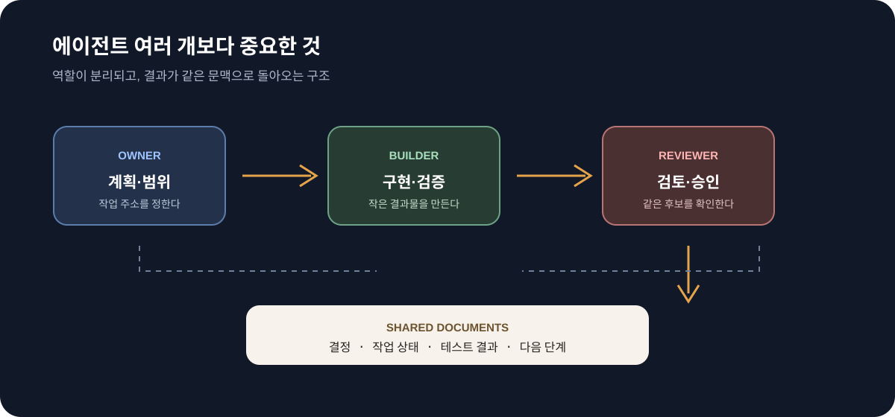

Claude Code와 Codex를 번갈아 사용하다 보면 언젠가 같은 질문을 하게 된다. 에이전트를 더 많이 띄우면 개발 속도가 정말 빨라질까? 답은 단순히 “그렇다”가 아니다. 에이전트가 각자 다른 터미널에서 같은 저장소를 바라보고 있으면 세션만 늘어날 뿐이다. 역할과 작업 경계, 공유 문맥이 없으면 서로의 결과를 덮어쓰거나 같은 조사를 반복한다.

오늘 긱뉴스에서 본 OpenRig는 이 문제를 정면으로 다루는 오픈소스 프로젝트다. OpenRig는 Claude Code, Codex, Pi 같은 코딩 에이전트를 YAML로 정의한 팀으로 묶고, 역할이 있는 지속적인 작업 공간과 공유 문맥을 제공한다. 여러 에이전트를 동시에 실행하는 도구라기보다, 여러 에이전트가 하나의 팀처럼 일하도록 운영하는 계층에 가깝다.

## 에이전트를 늘리는 것과 팀을 만드는 것은 다르다

에이전트 세 개를 실행한다고 자동으로 팀이 되지는 않는다.

```text
에이전트 여러 개 = 여러 개의 대화창
에이전트 팀      = 역할 + 작업 주소 + 공유 문서 + 검토 흐름
```

각 세션에 “이 기능을 구현해줘”라고 따로 지시하면 작업이 겹친다. 한 세션은 API를 바꾸고 다른 세션은 이전 API를 기준으로 화면을 만든다. 누가 최종 결정을 내리는지도 불분명하다. 이 상태에서 에이전트 수를 늘리면 생산성보다 조정 비용이 먼저 커진다.



팀으로 운영하려면 최소한 다음 네 가지가 필요하다.

- **역할**: 조사, 구현, 테스트, 리뷰 중 무엇을 맡는가
- **작업 주소**: 어느 저장소와 어떤 작업 큐를 기준으로 움직이는가
- **공유 문맥**: 결정, 규칙, 조사 결과를 어디에 기록하는가
- **완료 조건**: 누가 무엇을 검증해야 작업이 끝나는가

## OpenRig가 제안하는 운영 모델

OpenRig의 README는 에이전트 하나를 단순한 프로세스가 아니라 안정적인 역할을 가진 “seat”로 다룬다. 예를 들어 `dev-owner`는 구현을 담당하고, `dev-check`는 같은 후보 변경을 검토하는 식이다. 세션이 재시작돼도 역할과 작업 주소가 유지되므로, 매번 새로운 대화처럼 시작하지 않아도 된다.

이 모델에서 중요한 건 에이전트가 서로의 모든 대화를 보는 것이 아니다. 필요한 문서와 작업 상태를 같은 주소에서 읽는 것이다.

```text
요청
  ↓
owner: 범위와 구현 계획 기록
  ↓
builder: 코드 변경과 검증 수행
  ↓
checker: 동일 후보 변경 리뷰
  ↓
owner: 결과와 다음 작업 기록
```

이 흐름은 내가 블로그를 관리하는 방식과도 닮아 있다. 글을 작성할 때도 주제, 출처, 미디어 파일, 빌드 결과를 각각 흩어진 대화에 남기지 않고 저장소의 파일과 커밋으로 연결해야 다음 작업에서 다시 사용할 수 있다.

## 공유 문맥은 채팅방이 아니라 파일이어야 한다

멀티 에이전트에서 가장 쉽게 생기는 오해는 공유 문맥을 하나의 긴 채팅방으로 생각하는 것이다. 긴 대화는 검색하기 어렵고, 어느 내용이 최신인지 판단하기 어렵다. 반면 Markdown 문서는 사람이 직접 읽고 수정할 수 있으며 Git으로 변경 이력을 남길 수 있다.

실제로는 다음 정도의 구조만 있어도 시작할 수 있다.

```text
docs/agent/
├── project-map.md       # 주요 디렉터리와 실행 명령
├── decisions.md         # 중요한 선택과 이유
├── work-queue.md        # 현재 작업과 담당 역할
└── review-checklist.md  # 완료 조건과 검증 항목
```

문서에는 모든 대화를 넣지 않는다. 현재도 유효한 규칙과 결정, 다음 사람이 반드시 알아야 할 맥락만 남긴다. 작업이 끝나면 결과와 남은 위험을 갱신한다. 문서를 읽는 데 걸리는 시간이 짧아질수록 에이전트가 실제 구현에 쓸 수 있는 문맥이 선명해진다.

## PM 관점에서 보면 조정 프로토콜이 먼저다

PM 역할에서 멀티 에이전트를 도입할 때 먼저 정해야 하는 것은 어떤 모델을 쓸지가 아니다. 작업을 어떻게 분리하고 합칠지다.

### 작업을 겹치지 않게 자른다

한 작업은 하나의 결과물을 소유하도록 만든다. “인증 기능을 구현해줘”보다 “로그인 API의 실패 응답 규격을 문서화하고 테스트를 추가해줘”가 에이전트가 책임질 수 있는 크기다.

### 검토자를 별도로 둔다

구현을 만든 에이전트에게 곧바로 완료를 선언하게 하면 누락을 찾기 어렵다. 별도 리뷰 역할이 요구사항, 보안, 회귀 가능성을 확인해야 한다.

### 상태를 파일과 커밋으로 남긴다

작업이 끝났다는 말보다 커밋, 테스트 결과, 변경된 문서가 더 정확한 상태 표현이다. 에이전트 간 인수인계도 대화가 아니라 이 세 가지를 기준으로 해야 한다.

## 개발 보안에서는 에이전트 수보다 경계가 중요하다

ISO 27001과 27701을 준비하면서 개발 보안을 맡아 보니, 자동화가 늘어날수록 권한 경계와 증적이 더 중요해졌다. 여러 에이전트가 같은 저장소에 접근한다면 다음 질문에 답할 수 있어야 한다.

- 어떤 에이전트가 읽기만 할 수 있고, 어떤 에이전트가 파일을 수정할 수 있는가?
- 운영 환경이나 개인정보가 포함된 데이터에 접근할 수 있는가?
- 리뷰 없이 배포하거나 권한 설정을 바꿀 수 있는가?
- 작업과 승인 기록을 나중에 확인할 수 있는가?

에이전트 팀은 개발 속도를 높이는 도구이면서 새로운 변경 주체를 추가하는 일이기도 하다. 따라서 역할별 권한, 작업 로그, 리뷰 승인, 비밀값 접근 범위를 기존 개발 프로세스와 같은 수준으로 관리해야 한다.

## 작은 팀부터 시작하는 방법

처음부터 여러 모델과 복잡한 오케스트레이터를 도입할 필요는 없다.

1. 하나의 저장소를 선택한다.
2. `owner`와 `reviewer` 두 역할만 정의한다.
3. 작업 하나를 작은 결과물로 쪼갠다.
4. owner가 계획과 변경을 기록한다.
5. reviewer가 같은 후보 변경을 검토한다.
6. 테스트와 결정 기록을 함께 남긴다.

이 흐름이 안정된 뒤에 조사 전담, 문서 전담, 보안 검토 역할을 추가하는 편이 낫다. 역할이 많아도 작업 주소와 완료 조건이 없으면 팀이 아니라 병렬로 실행되는 터미널 목록에 머문다.

## 마무리

멀티 에이전트의 경쟁력은 몇 개를 띄울 수 있는지에 있지 않다. 각 에이전트가 자신이 맡은 일을 알고, 다른 에이전트의 결과를 읽을 수 있으며, 사람이 마지막 상태를 확인할 수 있는 구조에 있다.

Claude Code와 Codex를 함께 쓰는 것도 목적이 아니라 수단이다. 중요한 것은 모델을 섞는 행위가 아니라 역할과 문서를 통해 작업을 이어 가는 방식이다. 에이전트가 많아질수록 프로젝트에는 더 선명한 문서, 더 작은 작업 단위, 더 분명한 검토 경계가 필요하다.

## 참고 자료

- [GeekNews — OpenRig: Claude Code와 Codex를 팀으로 운영하는 멀티 에이전트 오케스트레이터](https://news.hada.io/)
- [OpenRig GitHub 저장소](https://github.com/mvschwarz/openrig)
