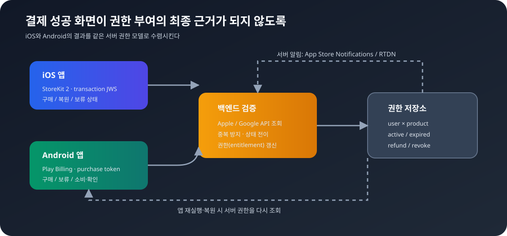

이번에 iOS와 Android 양쪽 인앱결제를 연동하면서 가장 크게 배운 점은 결제창을 띄우는 일이 핵심이 아니라는 것이다. 진짜 어려운 부분은 결제가 유효한지 확인하고, 사용자의 권한을 언제 부여하고 회수할지, 앱을 다시 설치해도 같은 권한을 복원할지를 끝까지 일관되게 처리하는 일이었다.

플랫폼마다 결제 SDK와 응답 형식은 다르지만, 서비스가 사용자에게 제공해야 하는 결과는 하나다. **이 사용자가 지금 이 상품을 사용할 수 있는가?** 이 글은 이번 경험을 바탕으로 양쪽 결제를 하나의 서버 권한 모델로 묶을 때 정리해둔 기준이다.

<figcaption>클라이언트의 결제 결과는 시작점이고, 최종 권한은 서버 검증과 상태 동기화로 결정한다.</figcaption>

## 결제 성공과 서비스 권한은 다른 값이다

앱에서 결제 콜백이 성공으로 돌아왔다고 바로 프리미엄 권한을 저장하면 처음에는 잘 동작하는 것처럼 보인다. 하지만 다음 상황에서 문제가 생긴다.

- 네트워크가 끊겨 콜백이 중복으로 전달된다.
- 사용자가 결제 직후 앱을 종료한다.
- 결제는 완료됐지만 서버 요청이 실패한다.
- 구독이 갱신되거나 취소·환불된다.
- 앱을 삭제했다가 다른 기기에서 다시 로그인한다.
- 악의적인 클라이언트가 성공 응답을 만들어 보낸다.

그래서 앱은 결제 결과를 서버에 전달하고, 서버가 플랫폼에 다시 확인한 뒤 권한을 바꾸도록 했다. 앱의 성공 화면은 사용자 경험을 위한 신호이고, 권한 부여의 근거는 검증된 거래 데이터다.

## 양쪽 플랫폼을 하나의 흐름으로 맞추기

내가 정리한 공통 흐름은 다음과 같다.

1. 앱이 플랫폼 스토어에서 상품 목록을 읽어 보여준다.
2. 사용자가 구매를 시작한다.
3. iOS는 거래 정보와 서명된 데이터를, Android는 구매 토큰을 반환한다.
4. 앱은 `platform`, `productId`, 사용자 식별자와 거래 데이터를 백엔드로 보낸다.
5. 백엔드가 해당 플랫폼 API로 거래를 검증한다.
6. 검증 결과를 바탕으로 권한을 멱등적으로 갱신한다.
7. 앱은 서버의 권한 상태를 다시 조회해 화면을 갱신한다.
8. 이후 갱신·취소·환불은 서버 알림으로 다시 동기화한다.

이렇게 해두면 iOS와 Android의 SDK가 달라도 서비스 코드가 바라보는 값은 `active`, `expired`, `revoked` 같은 권한 상태로 통일된다.

## iOS에서 신경 쓴 부분

StoreKit 2는 Swift 동시성 모델과 함께 상품, 구매, 거래, 권한을 다루고 거래를 서명된 JWS 형태로 제공한다. 클라이언트에서 서명을 확인하는 것도 필요하지만, 서비스 권한을 결정하는 서버에서도 거래의 진위와 상품, 환경, 만료 시점을 확인해야 한다.

서버 쪽에서는 App Store Server API와 App Store Server Notifications를 기준으로 잡았다. 특히 구독 상태가 바뀌는 일은 앱이 실행 중일 때만 발생하지 않는다. 갱신, 취소, 환불처럼 앱과 무관하게 일어나는 변화가 있으므로 알림을 받아 거래 상태를 다시 조회하고 권한을 갱신하는 구조가 안전하다.

## Android에서 신경 쓴 부분

Google Play Billing은 구매 결과에 구매 토큰이 포함된다. 토큰을 받은 뒤에는 서버에서 Google Play Developer API로 구매 상태를 확인하고, 유효할 때만 권한을 부여해야 한다.

여기서 특히 놓치기 쉬운 것이 **보류 중인 결제**다. 결제 플로우가 끝났다는 콜백만 보고 권한을 주면 안 된다. 보류 상태가 실제 구매 완료로 바뀐 뒤에 권한을 부여해야 한다. 구매가 완료된 뒤에는 상품 종류에 맞게 소비(consume)하거나 확인(acknowledge)해야 하며, 확인하지 않은 구매는 일정 시간이 지나면 환불될 수 있다.

Google Play의 실시간 개발자 알림(RTDN)도 최종 상태 자체라기보다 “상태가 바뀌었으니 API로 다시 확인하라”는 신호로 다루는 편이 좋다. 알림 payload만 저장하고 끝내지 않고, 토큰으로 최신 구독 상태를 조회한 뒤 우리 권한 상태를 갱신했다.

## 상품 ID는 플랫폼 ID와 서비스 상품을 분리한다

스토어 상품 ID를 서비스의 상품 이름처럼 그대로 사용하면 시간이 지날수록 관리가 어려워진다. iOS와 Android에서 상품 ID가 달라질 수 있고, 같은 상품도 월간·연간·프로모션 상품으로 늘어나기 때문이다.

그래서 내부에는 별도의 서비스 상품을 두고 플랫폼 상품을 매핑했다.

| 서비스 상품 | iOS 상품 ID | Android 상품 ID |
| --- | --- | --- |
| `pro_monthly` | 스토어에 등록한 iOS ID | 스토어에 등록한 Android ID |
| `pro_yearly` | 스토어에 등록한 iOS ID | 스토어에 등록한 Android ID |

이 매핑을 서버가 관리하면 클라이언트가 보내는 상품 ID를 그대로 권한 이름으로 신뢰하지 않아도 된다. 상품 가격과 표시 문구는 스토어에서 읽되, 어떤 권한을 부여할지는 서버의 매핑을 따른다.

## 거래와 권한을 같은 테이블로 만들지 않는다

거래는 여러 번 생길 수 있지만 권한은 현재 상태를 표현한다. 한 사용자가 여러 기기에서 복원할 수 있고, 구독은 갱신될 때마다 새로운 거래 기록을 남긴다. 따라서 다음처럼 분리하는 편이 추적하기 쉽다.

- **거래 기록**: 플랫폼, 상품 ID, 거래 ID 또는 구매 토큰, 원본 응답, 검증 시각, 상태
- **권한 기록**: 사용자, 내부 상품, 시작 시각, 만료 시각, 현재 상태, 마지막 검증 시각
- **이벤트 기록**: 앱 요청, 스토어 알림, 검증 결과, 오류와 재처리 횟수

권한 갱신의 키는 플랫폼별 거래 식별자로 잡았다. 같은 요청이 여러 번 들어와도 이미 처리한 거래라면 같은 결과를 돌려주는 멱등 처리가 필요하다. 네트워크 재시도와 서버 알림 재전송은 정상적인 흐름이므로 중복을 예외 상황으로만 취급하면 안 된다.

## 복원은 부가 기능이 아니라 기본 흐름이다

새 기기에서 로그인했을 때 사용자가 다시 결제하지 않고 권한을 가져오는 것이 복원이다. 앱에 “구매 복원” 버튼만 하나 추가하는 것으로 끝나지 않는다.

앱을 처음 열 때 서버 권한을 조회하고, 플랫폼의 구매 목록도 동기화해야 한다. 서버에는 사용자와 거래의 연결이 남아 있어야 하고, 현재 로그인한 사용자에게 연결할 수 있는지 정책도 정해야 한다. 로그아웃 후 다른 계정에 권한이 넘어가거나, 한 거래를 여러 계정이 주장하지 못하도록 검증 규칙을 명확히 두었다.

## 테스트는 성공 케이스보다 상태 전이를 봐야 한다

샌드박스와 테스트 트랙에서 단순 구매만 반복하는 것으로는 부족했다. 다음 흐름을 각각 확인해야 실제 운영에서 덜 당황한다.

- 정상 구매와 결제 취소
- 보류 중 결제 후 완료 또는 만료
- 구독 갱신과 갱신 실패
- 환불·취소·권한 회수
- 앱 강제 종료 직후 재실행
- 서버 요청 재시도와 같은 거래의 중복 전달
- 앱 삭제 후 재설치, 로그아웃 후 다른 기기에서 복원
- 테스트 환경과 운영 환경의 상품·엔드포인트 혼동

각 단계에서 “스토어에는 어떤 상태인가”, “서버 거래 기록은 무엇인가”, “사용자 권한은 무엇인가”를 함께 확인하면 원인을 빠르게 찾을 수 있다.

## 이번 연동에서 남긴 원칙

인앱결제는 결제 SDK 하나를 붙이는 작업으로 끝나지 않았다. 스토어가 보내는 거래를 검증하고, 그 결과를 권한으로 변환하고, 나중에 상태가 바뀌어도 다시 맞추는 작은 분산 시스템에 가까웠다.

결국 중요한 것은 플랫폼별 API를 많이 아는 것보다 다음 경계를 분명히 하는 일이었다.

- 앱은 구매를 시작하고 서버에 전달한다.
- 서버는 플랫폼에 검증을 요청하고 권한을 결정한다.
- 알림은 최신 상태를 다시 확인하게 하는 트리거다.
- 거래 기록은 감사와 재처리를 위해 남긴다.
- 권한은 멱등적으로 갱신하고 언제든 다시 계산할 수 있어야 한다.

다음에 상품이나 플랫폼이 늘어나더라도 이 경계를 유지하면 결제 코드가 서비스 전체로 번지는 일을 줄일 수 있다.

## 참고 자료

- [Apple StoreKit](https://developer.apple.com/storekit/)
- [Choosing a StoreKit API for In-App Purchases](https://developer.apple.com/documentation/storekit/choosing-a-storekit-api-for-in-app-purchases)
- [App Store Server API](https://developer.apple.com/documentation/appstoreserverapi)
- [App Store Server Notifications V2](https://developer.apple.com/documentation/appstoreservernotifications/app-store-server-notifications-v2)
- [Integrate Google Play Billing Library](https://developer.android.com/google/play/billing/integrate)
- [Google Play Billing real-time developer notifications](https://developer.android.com/google/play/billing/rtdn-reference)
- [Google Play subscription lifecycle](https://developer.android.com/google/play/billing/lifecycle/subscriptions)

이 글은 실제 연동 경험을 정리한 기록이며, 스토어 정책과 결제 약관은 상품과 시점에 따라 달라질 수 있으므로 출시 전에 각 플랫폼의 최신 문서를 함께 확인해야 한다.
