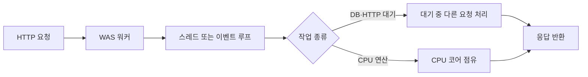
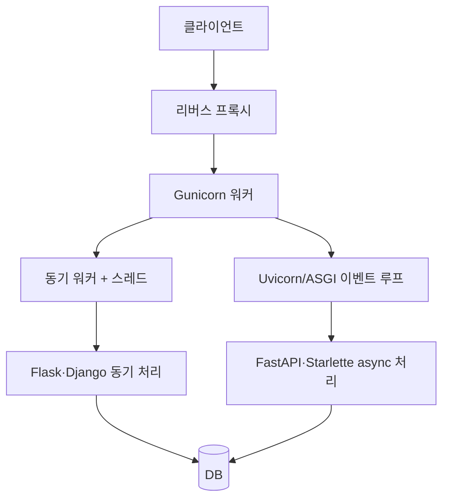

웹 애플리케이션의 성능을 이야기할 때 “스레드를 늘리면 빨라진다”, “Python은 GIL 때문에 느리다” 같은 말을 자주 듣는다. 하지만 이 문장만으로는 실제 요청이 어떤 단위를 거쳐 실행되는지 설명하기 어렵다.

WAS(Web Application Server)를 기준으로 보면 하나의 HTTP 요청은 대략 **프로세스 → 워커 → 스레드 또는 이벤트 루프 → 애플리케이션 코드 → DB·외부 API**를 통과한다. Java와 Python은 이 흐름을 구성하는 방법이 다르기 때문에 같은 “스레드”라는 단어도 운영 결과가 달라진다.

이 글에서는 CPU 작업과 I/O 작업을 나누고, Java와 Python의 실행 모델을 WAS 관점에서 비교한다. 예시는 특정 프레임워크의 정답이라기보다 요청 처리 구조를 이해하기 위한 최소 코드다.

## 먼저 동시성과 병렬성을 분리한다

- **동시성(concurrency)**: 여러 작업을 번갈아 진행하며 전체 대기 시간을 겹치는 것
- **병렬성(parallelism)**: 여러 CPU 코어에서 작업을 실제로 동시에 실행하는 것

다음 두 요청을 생각해보자.

```text
요청 A: DB 조회 90ms 대기 + JSON 변환 10ms
요청 B: 외부 API 80ms 대기 + JSON 변환 20ms
```

두 요청의 대부분은 대기다. 이때 한 실행 단위가 대기하는 동안 다른 요청을 처리하면 동시성이 올라간다. 반대로 이미지 압축이나 암호화처럼 CPU를 계속 사용하는 작업은 실제 CPU 코어에서 병렬로 실행할 수 있는지가 중요하다.



## WAS에서 스레드가 맡는 일

전통적인 thread-per-request 모델에서는 요청이 들어올 때 워커 스레드 하나가 요청의 시작부터 응답까지 코드를 실행한다.

```text
클라이언트
   ↓
웹 서버 또는 로드밸런서
   ↓
WAS 프로세스
   ↓
요청 스레드  ── DB 커넥션 풀
   ↓           └ 외부 API 연결
응답
```

요청 스레드가 DB 응답을 기다리는 동안 CPU를 사용하지 않더라도, 플랫폼에 따라 스레드와 스택 메모리는 계속 점유될 수 있다. 그래서 스레드 수를 무작정 늘리면 처리량이 오르기 전에 컨텍스트 스위칭, 메모리 사용량, DB 커넥션 고갈이 먼저 나타난다.

반대로 이벤트 루프 모델에서는 한정된 이벤트 루프가 소켓 I/O를 감시하고, 대기 중인 작업이 완료되면 콜백이나 코루틴을 다시 실행한다. 이 모델은 대기 시간을 잘 겹치게 만들지만, 이벤트 루프 안에서 오래 걸리는 CPU 연산을 실행하면 모든 요청이 함께 지연된다.

## Java: 플랫폼 스레드와 가상 스레드

Java의 전통적인 플랫폼 스레드는 보통 운영체제 스레드와 연결된다. 스프링 MVC와 서블릿 기반 WAS에서는 요청을 스레드 풀에서 하나 꺼내 처리하는 방식이 일반적이다.

```java
@GetMapping("/orders/{id}")
public OrderResponse getOrder(@PathVariable long id) {
    Order order = orderRepository.findById(id); // blocking I/O
    User user = userClient.fetch(order.userId()); // blocking I/O
    return OrderResponse.of(order, user);
}
```

이 코드는 동기식이라 읽기 쉽다. 대신 요청 스레드는 DB와 HTTP 응답을 기다리는 동안 묶인다. 플랫폼 스레드 풀을 200개로 설정해도 DB 커넥션 풀이 30개뿐이면 동시에 실제 조회를 수행할 수 있는 요청은 30개 근처에서 막힌다.

Java의 가상 스레드는 `java.lang.Thread` API를 그대로 사용하면서도 JVM이 많은 작업을 적은 수의 캐리어 플랫폼 스레드에 배치한다. 가상 스레드가 블로킹 I/O를 만나면 실행이 중단되고 캐리어 스레드는 다른 가상 스레드를 실행할 수 있다.

```java
try (var executor = Executors.newVirtualThreadPerTaskExecutor()) {
    Future<OrderResponse> future = executor.submit(() -> {
        Order order = orderRepository.findById(id);
        User user = userClient.fetch(order.userId());
        return OrderResponse.of(order, user);
    });

    return future.get();
}
```

가상 스레드는 요청마다 동기식 코드를 작성하면서 I/O 대기 동시성을 높이는 데 유리하다. 다만 CPU 연산을 더 빠르게 만드는 기능은 아니다. 긴 CPU 작업이나 동기화 구간이 캐리어 스레드를 계속 점유하면 가상 스레드의 이점이 줄어든다. Oracle 문서도 가상 스레드를 처리량 확장에 적합한 모델로 설명하며, 지연 시간이나 CPU 계산 자체를 빠르게 하는 기술로 설명하지 않는다.

### Java에서 함께 조정해야 하는 값

```text
WAS 요청 스레드 수       >= 동시에 처리할 요청 수
DB 커넥션 풀             <= DB가 감당할 수 있는 동시 쿼리 수
외부 API 연결·타임아웃    <= 상대 시스템의 제한과 장애 전파 범위
```

예를 들어 요청 스레드가 200개인데 DB 풀을 20개로 두면 나머지 요청은 DB 커넥션을 기다리는 큐가 된다. 이때 스레드 수를 더 늘리는 것은 해결책이 아니다. 타임아웃, bulkhead, 캐시, 쿼리 최적화로 병목을 줄여야 한다.

## Python: 스레드, 프로세스, asyncio

CPython의 기본 빌드에서는 GIL(Global Interpreter Lock) 때문에 한 프로세스에서 한 번에 하나의 스레드만 Python 바이트코드를 실행한다. 그래서 Python의 `threading`은 CPU 바운드 작업보다 네트워크·파일처럼 기다리는 시간이 많은 I/O 바운드 작업에 더 잘 맞는다.

```python
from concurrent.futures import ThreadPoolExecutor
import requests


def fetch(url: str) -> str:
    return requests.get(url, timeout=3).text


with ThreadPoolExecutor(max_workers=16) as pool:
    pages = list(pool.map(fetch, urls))
```

각 스레드가 네트워크 응답을 기다리는 동안 다른 스레드가 실행될 수 있다. 반면 순수 Python으로 큰 수를 계산하는 작업은 스레드 수를 늘려도 GIL 때문에 CPU 병렬성이 제한된다.

CPU 작업에는 프로세스 기반 병렬성이 더 직접적이다.

```python
from concurrent.futures import ProcessPoolExecutor


def render_thumbnail(path: str) -> bytes:
    # CPU를 많이 사용하는 이미지 변환이라고 가정
    return expensive_resize(path)


with ProcessPoolExecutor(max_workers=4) as pool:
    thumbnails = list(pool.map(render_thumbnail, image_paths))
```

프로세스는 메모리 공간이 분리되므로 GIL을 우회할 수 있지만, 프로세스마다 메모리와 초기화 비용이 생긴다. 결과를 프로세스 사이로 전달할 때 직렬화 비용도 고려해야 한다.

### Python WAS의 두 가지 요청 모델

Python 웹 애플리케이션은 배포 방식에 따라 요청이 들어가는 경로가 달라진다.



WSGI 기반 동기 앱은 워커 프로세스 또는 워커 스레드가 요청을 붙잡고 처리한다. ASGI 기반 앱은 `async def` 코루틴이 I/O에서 `await`를 만나면 이벤트 루프에 제어를 돌려준다.

```python
from fastapi import FastAPI
import httpx

app = FastAPI()


@app.get("/profile/{user_id}")
async def profile(user_id: int):
    async with httpx.AsyncClient(timeout=3) as client:
        response = await client.get(f"https://api.example.com/users/{user_id}")
    return response.json()
```

이 코드는 `await` 중에 같은 이벤트 루프가 다른 요청을 진행할 수 있다는 전제에서 효율적이다. 하지만 아래처럼 블로킹 함수를 그대로 호출하면 이벤트 루프를 멈춘다.

```python
@app.get("/bad")
async def bad_endpoint():
    data = requests.get("https://api.example.com", timeout=3)  # blocking
    return data.json()
```

동기 라이브러리를 꼭 써야 한다면 별도 스레드로 보내거나, 동기 엔드포인트로 분리하거나, 비동기 라이브러리로 교체해야 한다. `async def`라는 선언만으로 내부 호출이 비동기가 되지는 않는다.

## Java와 Python을 같은 표로 비교하기

| 관점 | Java 전통적 WAS | Java 가상 스레드 | Python WSGI/스레드 | Python ASGI/asyncio |
| --- | --- | --- | --- | --- |
| 요청 단위 | 플랫폼 스레드 | 가상 스레드 | 프로세스·스레드 | 코루틴·이벤트 루프 |
| I/O 대기 | 스레드 점유 | 가상 스레드 일시 중단 | 워커·스레드 점유 | `await`로 다른 요청 실행 |
| CPU 병렬성 | 멀티스레드 가능 | CPU 코어 수가 한계 | 기본 CPython 스레드 제한 | 이벤트 루프를 막으면 불리함 |
| 확장 축 | 스레드·프로세스·인스턴스 | 가상 스레드·DB 풀 | 워커 프로세스·스레드 | 이벤트 루프·워커 프로세스 |
| 주의점 | 풀 고갈·블로킹 | pinned 작업·외부 풀 고갈 | GIL·메모리 | blocking 호출·CPU 작업 |

Python 3.13부터는 GIL을 비활성화한 free-threaded 빌드가 제공되지만, 기본 설치와 모든 서드파티 확장을 자동으로 바꾸는 만능 해법은 아니다. 운영 환경에서는 사용 중인 Python 빌드와 패키지가 free-threading을 지원하는지 별도로 확인해야 한다.

## 부하 상황을 숫자로 생각해보기

평균 응답 시간이 100ms이고, 그중 80ms가 외부 API 대기라고 하자. 초당 1,000개의 요청이 들어오면 단순한 동시 요청 수 추정은 다음과 같다.

```text
동시 요청 수 ≈ 초당 요청 수 × 평균 응답 시간(초)
             ≈ 1,000 × 0.1
             ≈ 100개
```

이 100개가 모두 CPU를 쓰는 것은 아니다. 약 80ms 동안 외부 API를 기다린다. 따라서 I/O 대기를 효율적으로 겹칠 수 있는지가 핵심이다. 하지만 외부 API의 동시 연결 제한이 50개라면 애플리케이션의 스레드나 코루틴을 1,000개로 늘려도 외부 시스템에서 다시 막힌다.

실제 튜닝에서는 다음 지표를 함께 본다.

- WAS 워커·스레드 풀의 active, queue, rejection 수
- DB 커넥션 사용량과 대기 시간
- 외부 HTTP 커넥션 풀과 타임아웃 수
- CPU 사용률과 GC 또는 메모리 압박
- p50뿐 아니라 p95·p99 지연 시간
- 요청 취소 뒤에도 남아 있는 백그라운드 작업

## 어떤 모델을 선택할까

- **동기식 DB·HTTP 호출이 많고 코드 단순성이 우선**이면 Java 플랫폼 스레드나 Java 가상 스레드를 검토한다.
- **Python에서 I/O 호출이 많고 라이브러리까지 async를 지원**하면 ASGI와 `asyncio`가 자연스럽다.
- **순수 Python CPU 작업**이면 스레드보다 프로세스 워커, 작업 큐, 또는 네이티브 확장을 먼저 검토한다.
- **블로킹 라이브러리가 많은 Python 서비스**는 무리해서 async로 바꾸기보다 워커 프로세스와 스레드 수를 측정하며 운영하는 편이 안전하다.
- **어느 언어든** DB 풀과 외부 API 제한을 먼저 계산하고, 타임아웃과 취소 전파를 설계한다.

스레드 수와 워커 수는 성능의 목표가 아니라 자원 배분의 결과다. 요청의 대부분이 어디에서 기다리는지, CPU를 실제로 얼마나 사용하는지, 다음 시스템의 동시성 제한이 얼마인지 측정한 뒤 결정해야 한다.

## 참고 자료

- [Oracle Java 26 Virtual Threads](https://docs.oracle.com/en/java/javase/26/core/virtual-threads.html)
- [Java Thread API](https://docs.oracle.com/en/java/javase/26/docs/api/java.base/java/lang/Thread.html)
- [Python threading 공식 문서](https://docs.python.org/3/library/threading.html)
- [Python free-threading 공식 문서](https://docs.python.org/3/howto/free-threading-python.html)
- [Python 동시성 개요](https://docs.python.org/3/library/concurrency.html)

문서와 런타임 버전에 따라 기본값과 지원 범위가 달라질 수 있으므로 실제 배포 전에는 사용 중인 Java·Python·WAS·라이브러리 버전의 공식 문서를 함께 확인하는 것이 좋다.
