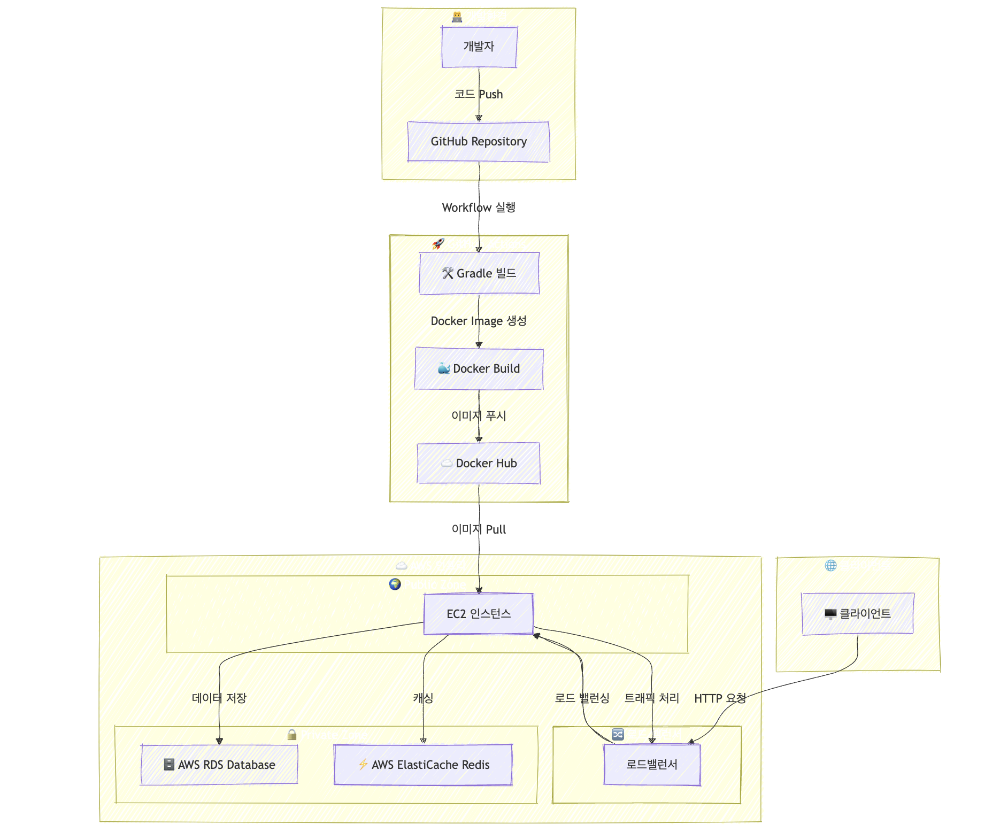

# 투게독

## 1. 프로젝트 개요

<aside>

**소개**

---

- **프로젝트명** : 투게독 - 반려동물과의 추억으로 우리만의 지도를 채워보세요!
- **기간** : 2024.01.03 ~ 2024.02.03 (10주) 
</aside>

### 핵심 기술 스택

- **Backend:** Java, Spring Boot, Spring Security, JPA, Hibernate
- **Database:** MySQL, AWS RDS, Redis
- **CI/CD & DevOps:** Docker, AWS EC2, S3, Github Actions
- **ETC :** JWT, OAuth 2.0 (Google), Google SMTP

### 개인 기여

- ##### **Backend (60%)**
	- **회원 도메인 개발 (100%)**
		- 사용자 등록, 조회, 수정, 삭제 기능 (JPA + Spring Boot)
	- **보안 설정 (100%)**
		- Spring Security를 활용한 비밀번호 암호화 및 JWT 인증 적용
	- **OAuth 2.0 연동 (100%)**
		- Google OAuth 로그인 및 기존 로그인 방식과의 통합
	- **이메일 인증 기능 (100%)**
		- SMTP를 활용한 인증 메일 발송 및 Redis 기반 인증 토큰 관리
	- **CI/CD 구축 (80%)**
		- Github Actions + Docker + AWS를 활용한 배포 자동화 구축
	- **팀내 문서 관리 (50%)**
		- API 설계 및 구현, 코드 리뷰, 성능 최적화 주도

---
## 2. 프로젝트 상세

### 아키텍처 설계
- ERD 설계를 진행하였습니다. 하단 이미지 처럼 ERD를 설계하였습니다.
	
    
- 서비스 아키텍처
	
    

### 문제 해결 과정
- **JWT 및 OAuth 2.0을 활용한 인증 시스템 구축**
    
    - JWT 토큰 기반 인증으로 무상태(State-less) 방식 구현
    - OAuth 2.0을 활용하여 Google 로그인 지원
    - `// 코드 삽입: JWT 인증 필터 및 OAuth 2.0 처리 코드`
- **Redis 기반 이메일 인증 시스템**
    
    - SMTP를 사용한 이메일 인증 및 Redis에 토큰 저장하여 일정 시간 내 확인 가능하도록 구현
    - `// 코드 삽입: Redis 활용 이메일 인증 코드`
- **CI/CD 자동화 및 배포 최적화**
    
    - Github Actions와 Docker를 이용한 자동 배포 시스템 구축
    - AWS S3 및 EC2를 이용한 배포 환경 구성
    - `// 코드 삽입: CI/CD 설정 파일`
- **트랜잭션 및 데이터 정합성 문제 해결**
    
    - JPA 트랜잭션 관리 및 `@Transactional`을 활용하여 데이터 정합성 유지
    - `// 코드 삽입: 트랜잭션 처리 코드`

---
## 3. 프로젝트 성과

### 결과 및 피드백
- **팀 구성:** **Frontend 3명, Backend 3명, 디자이너 1명**
- **역할:** Backend 담당 (회원 도메인, 보안, 배포, 문서 관리 등)
- **성과:** OAuth 2.0, JWT 기반 인증, Redis 최적화, CI/CD 구축 성공
- **피드백:** 코드 리뷰와 협업을 통해 개발 품질 향상

### 성과 지표
프로젝트의 핵심 기능이 정상적으로 동작하며, 주요 지표 분석 결과:
- API 응답 속도 평균 200ms 이하 유지
- OAuth 로그인 성공률 99% 이상
- 자동화된 배포 성공률 100%

[🔗 성과 체크리스트 보기](checklist.pdf)

---
## 4. 개인 소감 및 자료
### 느낀점
- 실무 수준의 OAuth 2.0, JWT 인증 시스템을 경험하며 보안과 사용자 인증 프로세스의 중요성을 배웠습니다.
- Github Actions를 활용한 CI/CD 구축 경험을 통해 배포 자동화의 필요성을 깨달았습니다.
- Redis와 RDS를 이용한 데이터 관리 및 성능 최적화에 대한 인사이트 확보하였습니다.
- 팀원들과의 협업을 통해 코드 리뷰와 PR 관리의 중요성을 체감하였습니다.

### 자료

  

    
    
    구현 이미지 보기
    
  

| 로그인 페이지                                                                                                                                                     | 회원가입 페이지                                                                                                                                                     |
| ----------------------------------------------------------------------------------------------------------------------------------------------------------- | ------------------------------------------------------------------------------------------------------------------------------------------------------------ |
|  |  |

| 피드 페이지                                                                                                                                                        | 피드 상세 페이지                                                                                                                                                    |
| ------------------------------------------------------------------------------------------------------------------------------------------------------------- | ------------------------------------------------------------------------------------------------------------------------------------------------------------ |
|  |  |

| 피드 생성 페이지                                                                                                                                                    | 펫 지도 페이지                                                                                                                                                     |
| ------------------------------------------------------------------------------------------------------------------------------------------------------------ | ------------------------------------------------------------------------------------------------------------------------------------------------------------ |
|  |  |

| 마이 페이지                                                                                                                                                         | 채팅 페이지                                                                                                                                                       |
| -------------------------------------------------------------------------------------------------------------------------------------------------------------- | ------------------------------------------------------------------------------------------------------------------------------------------------------------ |
|  |  |

---

