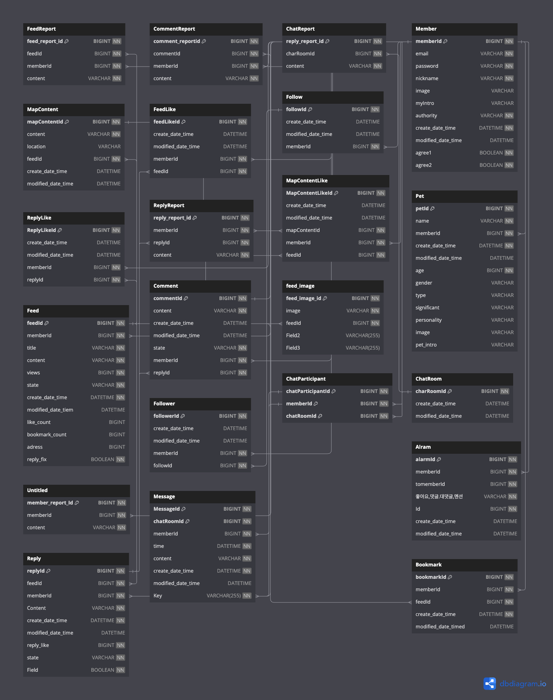

# 투게독

## 1. 프로젝트 개요

---

<aside>

**투게독**

---

- **소개** : 반려동물과의 추억으로 우리만의 지도를 채워보세요!
- **기간** : 2024.01.03 ~ 2024.02.03 (10주)
- **팀원** : 백엔드 3명 / 프론트엔드 3명 / 디자이너 1명 
</aside>

### 사용 기술 스택

 

  
  
   
   
  

## 2. 프로젝트 상세

---

### 주요기능 및 아키텍처
- ERD 설계를 진행하였습니다. 하단 이미지 처럼 ERD를 설계하였습니다.
	
    
- 아키텍처
    
    어쩌고~ㅋㅋ
    

### 문제 해결 과정

[프로젝트에서 직면한 도전 과제와 이를 해결하기 위한 접근 방법]

## 3. 개인 기여

---

### 기여한 기능 목록

- 회원 도메인 개발: 사용자 관리를 위한 기본적인 CRUD 기능을 구현.
- 보안 설정: Spring Security를 사용하여 애플리케이션의 보안을 강화. 사용자 인증 및 권한 부여 과정을 관리.
- OAuth 2.0 통합: Google OAuth 2.0을 통해 보다 안전한 사용자 인증 방식을 도입.
- 회원 인증 기능: 회원 가입 시 이메일을 통한 인증 절차를 추가. Redis를 사용하여 인증 토큰 관리 및 Google SMTP 서비스를 통해 인증 메일 발송.
- 현재는 해당 프로젝트를 마무리하고, 기존 팀원들 중 **추가로 구현**을 진행 할 인원들을 모아 **버전업을 진행**하고 있습니다. 또한 백엔드를 담당했던 팀원들과 코드 리뷰를 진행하였습니다.

### 역할 및 책임

[본인이 맡았던 역할과 책임에 대한 설명]

## 4. 프로젝트 성과

---

### 결과 및 피드백

<aside>

Frontend 3명, Backend 3명, 디자이너 1명이서 함께 진행한 프로젝트로 저는 Backend 역할을 담당하였습니다. 애플리케이션의 기본이 되는 보안과 멤버 도메인을 구현하였으며, 팀원들과 많은 소통을 통해 좋은 결과를 이끌어내었습니다.

</aside>

### 성과 지표

## 5. 개인 소감 및 자료

---

### 느낀점

[프로젝트를 통해 느낀 점, 개인적인 성장, 향후 개선할 점 등]

1. 추가 자료 기술 블로그: [관련 기술 블로그 링크] 기타 프로젝트: [다른 프로젝트 링크 또는 간단한 소개] 이렇게 구성하면 각 항목이 더 명확하고 전문적으로 보이며, 읽는 이에게도 흥미를 줄 수 있습니다. 또한, 각 섹션에 적절한 아이콘이나 그래픽을 추가하면 시각적으로도 더욱 매력적인 포트폴리오가 될 것입니다.

### 자료

---

