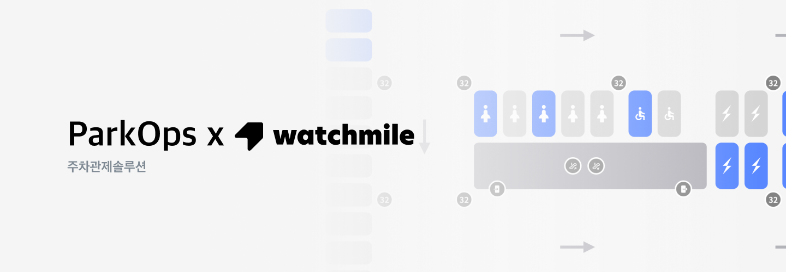

# [VEStellalab] ParkOps 개발

> ParkOps 대시보드는 AI 기반 실시간 주차 관제 시스템으로, CCTV 영상만으로 주차면 점유 여부를 정확하게 인식할 수 있는 기술력을 갖추고 있습니다. 다양한 차량 크기와 각도를 정밀하게 분석하며, 통합 플랫폼을 통해 여러 주차장을 실시간으로 관제할 수 있는 확장성과 효율성을 제공합니다. 대시보드의 기능적합성·보안성 등 총 9개 항목에서 우수 평가를 받아 GS 인증 1등급을 획득하였습니다.
> 

## **1. 프로젝트 소개**

- **프로젝트 명** : ParkOps - 실시간 주차장 관제 대시보드
- **개발 기간** : 2024.05 ~ 2024.11
- **참여 인원 :** 프론트엔드(1명) / 백엔드(1명) / AI(1명) / 디자이너(1명) / 기획(1명)

### 사용 기술 스택

- **Frontend:** React, Typescript, Axios, Tailwind, Redux, Nginx
- **Backend:** MySQL, Directus

### 개인 기여

- **Frontend 리드 및 설계**
    - Admin/Manager/Assistant/Viewer 역할별 권한 기반 UI·라우팅 설계 및 Redux 상태 관리로 접근 제어 구현
    - react-i18next 기반 다국어(i18n) 시스템 구축, 리소스 구조 설계 및 lazy load 적용으로 전환 최적화
    - Directus REST API를 통한 쿼리 작성 및 설계 진행으로 API 응답구조를 프론트 주체적 결정
    - Axios 인터셉터 기반 인증 처리, 공통 헤더 토큰 주입 및 실패 시 재요청 로직으로 안정성 확보
    - GS 인증 대응, 웹 접근성·보안 헤더·시맨틱 마크업 등 프론트 인증 요건 전반 구현
- **Backend (20%)**
    - 업체별 SVG 도면 데이터를 JSON 메타데이터로 정규화해 주차면 ID·층·존 정보와 함께 Directus에 업로드
    - Directus 연동 쿼리 명세 설계 및 테스트, 관리자·운영자 조건별 필드·관계 분기 로직 검증

---

## **2. 프로젝트 상세**

### 문제 상황 & 기술적 해결

1. **GS 인증 조건 충족**
    
    >GS 인증을 위해 웹 접근성(WA), 보안성, 성능 전반에 걸친 기술 기준 매칭 필요, 시맨틱 마크업 구조, 키보드 탐색 가능 여부, 로그인 상태에 따른 접근 차단 등 프론트 단에서 대응 필요
    
    - **기술적 해결**
        - 로그인 여부 및 Role 정보를 기반으로 접근 제한 (ProtectedRoute 및 리다이렉션 처리)
        - Nginx와 CSP 헤더를 통해 보안 정책 적용 및 HTTPS 리다이렉션
        - Lighthouse 기준 접근성 및 보안 점수 99점 확보
        
2. **Directus API의 구조적 한계**
    
    >Directus의 RESTful API는 조건 쿼리를 문자열 조합으로 구성해야 하며, filter, aggregate, fields, deep 등의 옵션을 동적으로 조합해야 하는 상황이 많았습니다. 운영자/관리자별로 다른 필터가 요구되었고, 이를 컴포넌트 내에서 하드코딩하기엔 유지보수가 어려웠습니다.
    
  
    - **기술적 해결**
    -    
        - 템플릿 기반 쿼리 빌더 유틸 함수를 자체 구현하여, 조건을 객체로 받아 자동으로 URL 쿼리 스트링 생성
        - 역할(role)에 따라 필터 조건이 달라질 수 있도록 `useDirectusQuery({ role })` 형태로 추상화하여 재사용성 확보
        - 복잡한 nested, deep 관계 쿼리도 템플릿화하여 읽기 쉬운 코드로 유지
    
3. **도면 포맷 불일치 및 다양한 주차면 구조 대응**
    >업체별 도면 형식, 좌표 기준, 주차면 ID 구조가 상이하여 일관된 방식으로 도면을 렌더링하기 어렵고,  단순한 사각형 표현만으로는 실제 면적이나 위치를 정확히 반영 불가
        
    - **기술적 해결**
        - 모든 업체 도면을 SVG 포맷으로 통일한 뒤, 주차면 정보를 JSON 메타데이터(ID, 좌표, 층, 존 등)로 추출
        - 주차면을 단순 rect가 아닌 `polygon` 기반 도형으로 표시하여, 실제 도면과 일치하는 형태로 시각화
        - 각 Polygon에 상태(free, in, unavailable)를 주입하여 상태별 스타일링 및 클릭 이벤트 바인딩
        - Directus CMS에 메타데이터를 업로드하여 공통 API로 렌더링되도록 표준화

4. **권한 기반 기능/화면 분기 필요**
    
    >RBAC에 따라 페이지 접근, 기능 사용 여부, UI 노출 요소가 달라야 했고, 이를 프론트엔드에서 전역적으로 제어할 필요 발생
    
    
- **기술적 해결**
    - 로그인 시 JWT에 포함된 Role을 추출하여 전역 상태로 저장
    - ProtectedRoute 컴포넌트를 통해 Role별 접근 제어 로직을 재사용
    - 메뉴, 버튼, 기능 노출 여부를 useRole() 훅을 통해 Role 기반으로 분기
    - 비인가 접근 시 리다이렉트 처리 및 메시지 출력으로 UX 향상

---

## **3. 프로젝트 성과**

### **결과 및 피드백**

- 국내 한국도로공사 / 해외 인도네시아 공항 주차장 ****등 실증 테스트 성공적으로 완료
- 천호 공영 주차장 대시보드 납품 진행, 영상 매칭, 점유 현황, 다국어UI 등 통합 기능의 완성도 고객사 긍정적인 평가

### **성과 지표**

- GS 인증 1등급 획득 (기능성, 보안성, 접근성 포함 9개 항목 전 항목 우수 평가)
- 관리자용 통합 대시보드 응답 속도 1초 이하 달성
- 실시간 점유 데이터 반영 정확도 97% 이상 (AI 시스템 연동 기준)

---

## **4. 개인 소감 및 자료**

### **느낀점**

이번 프로젝트는 단순한 프론트 UI 구현을 넘어, 직접 데이터 구조를 설계하고 API 쿼리를 생성하며, 도면 데이터를 시각적으로 해석하는 실질적 문제 해결 과정에 깊이 참여한 경험이었습니다. 특히 SVG 기반 시각화, REST 쿼리 자동화, 인증 대응, GS인증 준비 등 다양한 요구사항을 맞추는 과정에서 실제 서비스를 위한 프론트엔드 설계 및 품질 기준에 대해 실무적으로 체득할 수 있었습니다.

### 참고 자료

- 화면 추가
- [벤처 혁신 어쩌고](https://www.venturesquare.net/943478)
- [판교어쩌고](https://www.pangyotechnovalley.org/base/board/read?boardManagementNo=16&boardNo=2472&menuLevel=2&menuNo=53)